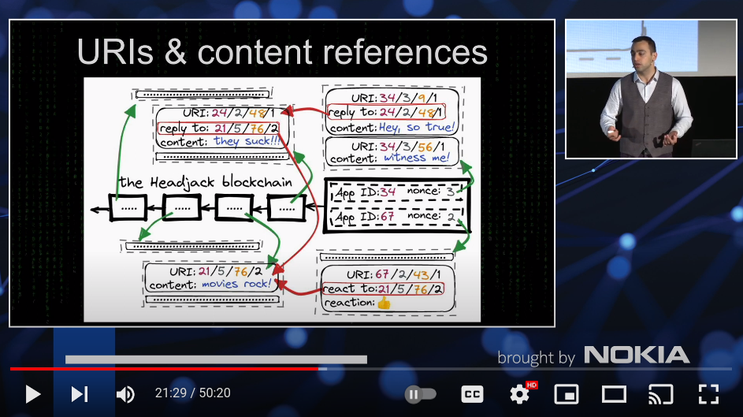
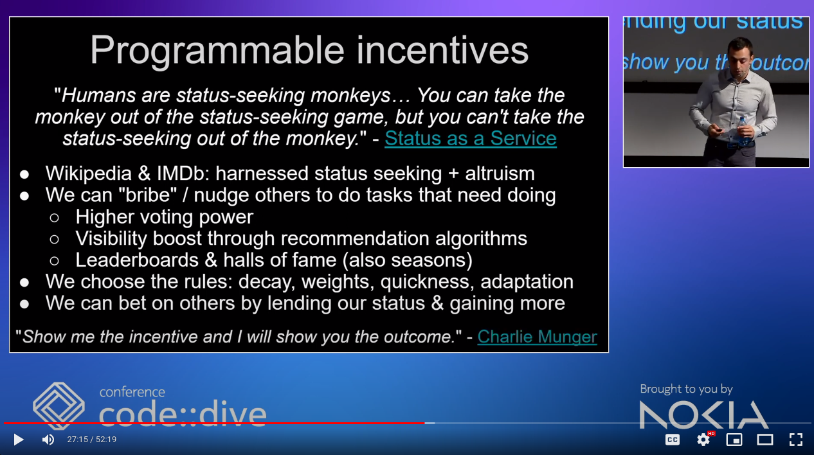

# Headjack - the base layer of cyberspace

https://onqtam.github.io/headjack/

# 2022 talk: **"Decentralized identity & content addressing at web-scale"**

# 2023 talk: **"Internet 2.0: The Global Brain"**

