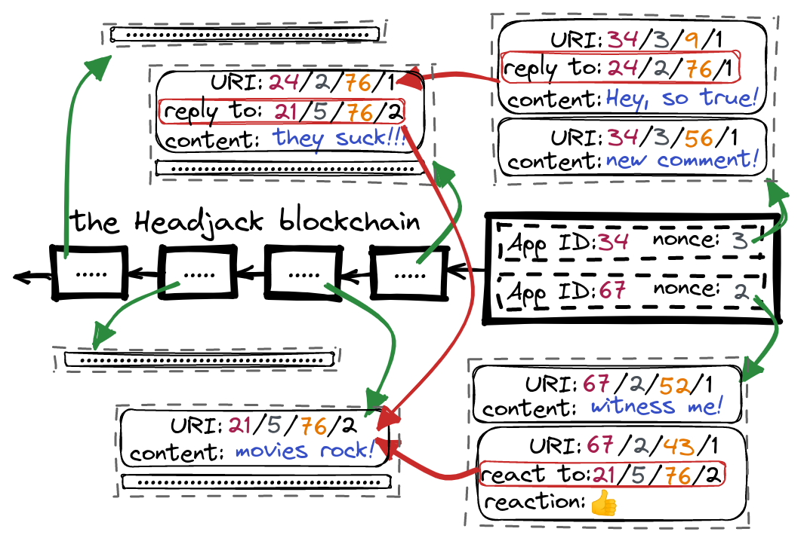
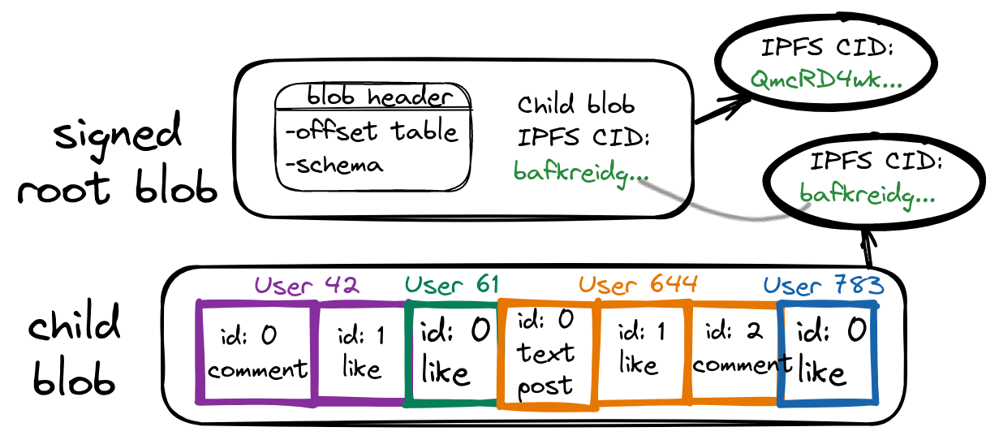

# Blob structure & addressing

Applications accumulate off-chain activity from users which they cryptographically anchor in batches with a [Merkle root](https://en.wikipedia.org/wiki/Merkle_tree) and they determine how often to do so (it doesn't have to be on every block) - those with little activity may submit only once per minute or even less often - the frequency is determined by platforms based on the volume of activity and the on-chain costs for publishing bytes. When enough activity has been collected it is packed in a blob and all the events generated since the last anchored batch are sorted & grouped by users in some deterministic way & schema (users based on index/name and user interactions based on the type/sequence).

<!-- <object width=100% data="images/blob_structure.svg"></object> -->

When a batch is finalized an application does the following:

1. It generates the blob header which contains the intra-blob index (offset table) for lookup of content of specific accounts.
2. A [Merkle root](https://en.wikipedia.org/wiki/Merkle_tree) that touches every event is deterministically constructed following a schema.
3. The [IPFS CID](https://docs.ipfs.io/concepts/content-addressing/) (hash) for the blob is generated and the IPFS blob is pinned & downloadable.

The only 2 things that are signed & submitted on-chain are thus the Merkle root and the IPFS CID for the next nonce (auto-increment counter) associated with the application account.

Applications maintain the logical order of events for the future batch in maps in order to provide intra-blob addressing even before it is fully constructed - as an example if a user posts an article and immediately after that comments on their post - the comment should be able to refer to the post which is not yet committed on-chain. Applications will also display activity by others that is not yet anchored and the interactions can still use the proper addressing when referring to the yet-to-be-anchored messages (the next nonce number is known in advance). Any type of interaction is addressable and sequenced in the blobs - including reactions (likes, etc).

# Optimal content delivery

The blobs may be in a hierarchy such that the on-chain IPFS hash points only to the "root" blob that contains the header and the actual indexed data could be in child IPFS blobs (whose [IPFS CID](https://docs.ipfs.io/concepts/content-addressing/) is contained in the root blob or header) so entities listening for events by specific accounts on Headjack may download only these headers and determine which "leaf" blobs they need to fetch for the data they are interested in (if any). Note that even private [intranet](https://en.wikipedia.org/wiki/Intranet) data may be anchored but not retrievable by the public if the blob IPFS CID is never published or pinned/hosted - unified addressing for public & private.

Applications are yet another on-chain account and they'll be able to associate a REST/RPC endpoint or any other means for direct contact by the rest of the applications so that they may ask for the yet unanchored messages and display them while they are still in the "mempool". They can also advertise the multiaddress of their IPFS nodes so that each successive blob of generated content that gets published can be downloaded by others instantly by manually connecting with IPFS’s [“swarm connect” functionality](https://medium.com/pinata/speeding-up-ipfs-pinning-through-swarm-connections-b509b1471986) - avoiding the use of the [DHT](https://en.wikipedia.org/wiki/Distributed_hash_table) for each new blob CID which may take tens of minutes. They can provide addresses to multiple IPFS nodes as a cluster for horizontal scaling and use [Pinset orchestration](https://ipfscluster.io/) - designed for Automated data availability and redundancy.

Applications may choose not to use IPFS at all - what they must do is anchor their blobs with a Merkle root and provide some on-chain advertised means to retrieve the data (example: REST/RPC endpoints in their account). We expect that IPFS will be the lowest common denominator and will always be used no matter what other solutions are also available.
