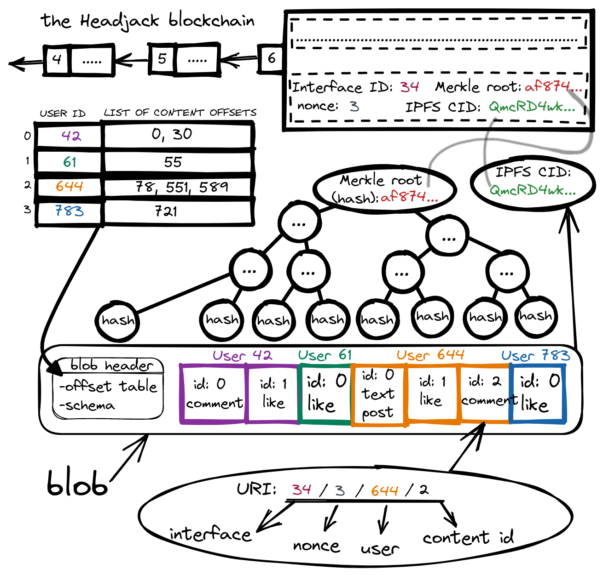

# Blob structure & addressing

Applications accumulate off-chain activity from users which they cryptographically anchor in batches with a [Merkle root](https://en.wikipedia.org/wiki/Merkle_tree) on-chain and they determine how often to do so (it doesn't have to be on every block) - those with little activity may submit only once per minute or even less often - the frequency is determined by applications based on the volume of activity and the on-chain publishing costs.

When enough activity has been collected it is time for the application to finalize the batch: it is packed in a blob and all the events generated since the last anchored batch are sorted & grouped by accounts in some deterministic way (perhaps accounts based on index and actions based on the type/sequence) with some schema with the following steps:

1. The intra-blob index (offset table) for lookup of content of specific accounts is generated.
2. A [Merkle root](https://en.wikipedia.org/wiki/Merkle_tree) that touches every event is deterministically constructed following a schema.
3. The [IPFS CID](https://docs.ipfs.io/concepts/content-addressing/) (hash) for the blob is generated and it is pinned for others to download.

The only 2 things that are signed & submitted on-chain are thus the Merkle root and the IPFS CID for the next nonce (auto-increment counter) associated with the application account.

<!-- <object width=100% data="images/blob_structure.svg"></object> -->

# Stable intra-blob addressing before publishing

Applications maintain the logical order of events for the future batch in maps in order to provide intra-blob addressing even before it is fully constructed - as an example if a user posts an article and immediately after that comments on their own post - the comment should be able to refer to the post which is not yet committed on-chain. Applications will also display activity by other accounts that is not yet anchored and the interactions can still use the proper addressing when referring to the yet-to-be-anchored messages (the next nonce number is known in advance). Any type of interaction is addressable and sequenced in the blobs - including reactions (likes, etc).
