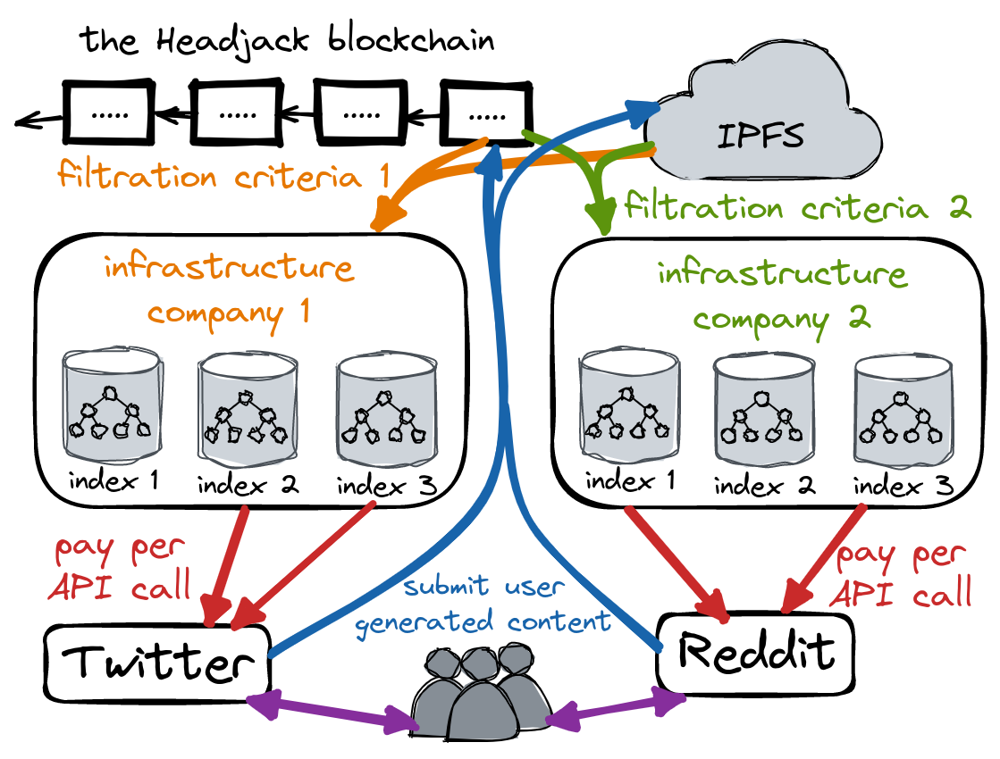

    

# Business models

# Ads

The goal is democratized access, competition & innovation - not the end of the ad model which is a pipe dream.

The goal is not to kill the ad model - it is to make everything authentic and allow for better UI and choice and enable the web to step on this

the ad model isn't going anywhere but we are in a "take it or leave" situation without choice - the goal is to fix that

> "Internet monetization is somewhat like a Soviet election: It doesn’t matter who clicks and where, it’s who counts those clicks that matters. The technology and business of that counting of clicks (and everything else you do online besides) goes by the dull-sounding name of attribution, and it determines the fate of trillion-dollar companies." - [source](https://www.thepullrequest.com/p/attribution-rules-the-world-and-itll)

> "A recent example of questionable attribution: I tweeted about my e-mountain bike, Jason Calacanis (of all people) saw it and asked about the model. Someone posted a review from bikeradar.com, and Jason (I don’t know if this is true) probably googled for it and maybe bought it. Who deserves the attributions credit? According to Google (surprise, surprise), it’ll be Google … and they’ll take all the credit, which is why Google is worth so much and Twitter so little." - [source](https://www.thepullrequest.com/p/attribution-rules-the-world-and-itll)

de-duplication through content addressing & adding traceability of content helps paint the picture what happened when and by who - aiding attribution. Infrastructure companies on which applications get deployed on can handle such tracking within them but since all the data is openly broadcasted competing services could offer alternative business models.

> "Whether it be circulation numbers for 19th-century newspapers (the start of the printed ads business), or Nielsen ratings for pre-cable TV that determined ads rates there, there’s never been a media ecosystem that didn’t have attribution." - [source](https://www.thepullrequest.com/p/attribution-rules-the-world-and-itll)

> "If you had to conjure some collective mechanism for storing aggregated data that was selectively shareable between publisher and advertiser, it would look much like a blockchain." - [source](https://www.thepullrequest.com/p/attribution-rules-the-world-and-itll)

^^ this can be done through verifiable computation & sharing indexes between publishers & advertisers within index infrastructure.

[This article](https://www.thepullrequest.com/p/attribution-rules-the-world-and-itll) posits that attribution has to go on-chain but Headjack offers an alternative - through the infrastructure companies.

such infrastructure 

The same infra company could have multiple sets of indexes with different filtration criteria

> "For as long as humans have crafted disembodied versions of their voices, whether it be Pompeiian graffiti or the latest tweet, there have been attempts to both guide user attention in some remunerative direction, and measure the effectiveness of that attention-gathering." - [source](https://www.thepullrequest.com/p/everything-is-an-ad-network)

> "The attention economy has always had its ledger and its cash register, and Web 3 will be no different."

# Client attribution

the way for a startup application to get noticed

the persistent URL of content is an advertisement of the application by itself
similar to twitter's client attribution

platforms that can't properly display a message type natively will direct users to the application that published it

Ads themselves are not the root evil - it's the lack of choice & ability to exit in the current monopolistic world due to the benefits of vertical integration in the current host-centric paradigm

# IDMs & storage - the new cloud

https://twitter.com/ZeMariaMacedo/status/1554041365754945537

<!--
the open nature of data leads to a shared data network effect where anyone can train ML models at scale with high quality data
https://mattturck.com/the-power-of-data-network-effects/

creators will need to shift how they monetize because there won't be platform lock-in & attribution :/
or actually the application attribution for content naturally leads to users checking it out - creators can and should be paid to generate content through them and based on virality of content they could get paid out? omg.

Value chain

point of view: creating an application without the ability to lock-in users is daunting - but what if most aspects of an application are commercialized & offered as a service so creating a new application is just the frontend? Substack lets you leave & take your subscribers with you - that's a conscious choice and they have decided to compete on the quality of service

Todo: takerate - what it is for other platforms and how it fits in headjack beyond youtube

TODO: think about creator monetization and how google currently gets the lions share of the ad revenue
What if some platforms don't freely provide the content but just anchor it and provide APIs like embedding youtube?

How to create a view of the discussion with only paid subscribers?

== transition from web2 to web3
traditional web2 companies/apps/websites will be able to gradually transition and anchor their content into this namespace - cost of entry would be marginal and the first to do so would get indexed and start getting shown in search results in this ecosystem first
No other solution has a seamless way to address content on http and bridge with traditional dns

copyright infringement is beneficial for youtube
https://www.youtube.com/watch?v=4IaOeVgZ-wc

platform attribution - advertising 
Application names that were used to publish content can serve as advertising (application attribution) for the platform that was chosen by a user when content is viewed through other applications because the original URIs will be shown and users will be able to click to view each piece of content through the originating application if they choose to (if they've never heard of it before & are curious or if their current application doesn't fully support a given message type).

==> discoverability of new applications!

There will be a marketplace for every vertical - we need to democratize specialization & competition

Markets, markets everywhere!
algorithmic transparency & choice
https://www.ribbonfarm.com/2019/02/28/markets-are-eating-the-world/

business models - who will host the content?
how does The Graph fit into this?! omg?!

incentive for infrastructure companies to do proper filtration of bots - apps can leave for other infrastructure - whereas within twitter there has been conflict of interest for executives as their bonuses counted on counts of users - so why diagnose the bot problem really? TODO: source - or be more vague and don't directly point to twitter

a challenge would be content licenses...

    - Your startup idea cant afford the infrastructure to process 100mb/s of ephemeral data? Pay a service a small fee for a subset of data you’re interested in for your PoC

    - Market for intermediate processed results & indexes so that not everyone needs to reinvent the wheel and build the same set of algorithms and infrastructure over and over again - creating a market for the information pipeline by division of labor & specialization. Any intermediate data structure could be checked for validity based on the inputs - albeit slow. Test but verify - opaque processing rules. No more algorithmic black boxes. Batch processing - web-scale services do that all the time and plenty of work is done on results that are minutes or even hours outdated

-->
