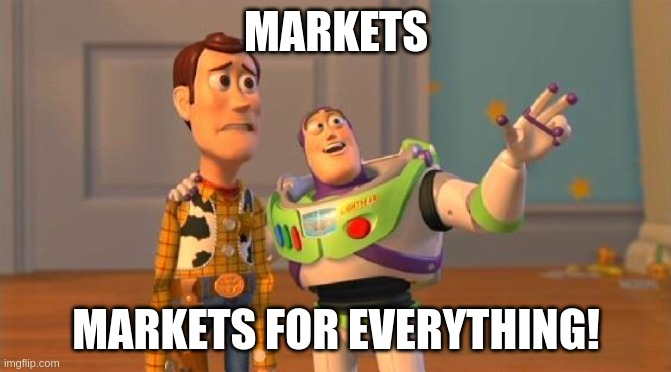
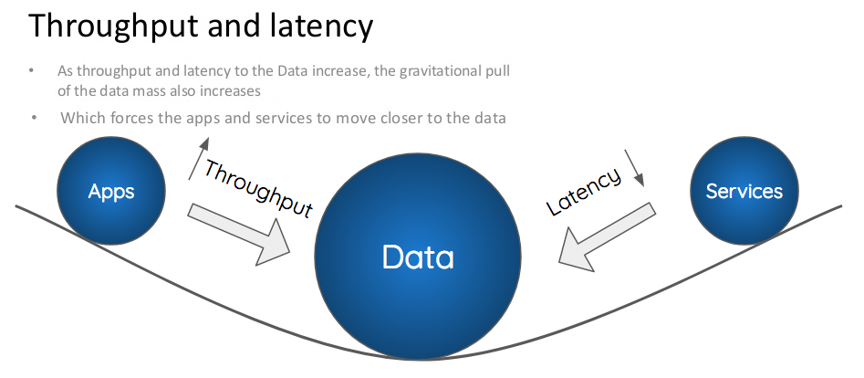

    

# Business models

Let's see how the current digital economy could be translated & reimplemented on top of Headjack.

<!-- toc -->

# Why build if [vendor lock-in](https://en.wikipedia.org/wiki/Vendor_lock-in) isn't possible?

Freedom can be a competitive advantage: [Substack](https://en.wikipedia.org/wiki/Substack) lets you leave & take your subscribers with you (an email list) - a conscious choice to compete on the quality of service. **But they are an outlier**.

Headjack's fundamental premise is that it unlocks many possibilities & value to users because the barrier to entry for services would be much lower and they could be composable & interoperable which would lead to greater innovation, quality, choice & freedom. So given that users would benefit more in this ecosystem and that their attention is finite & will be spent either way - it stands to reason that there is money to be made in an even bigger pie! But competition will look different.

> "The whole is greater than the sum of its parts." - [Aristotle](https://www.goodreads.com/quotes/20103-the-whole-is-greater-than-the-sum-of-its-parts)

# Unbundling the media stack with markets

> "There’s only two ways I know of to make money– bundling, and unbundling." - [Jim Barksdale](https://hbr.org/2014/06/how-to-succeed-in-business-by-bundling-and-unbundling)

The rule book will be different - instead of [vertically integrated](barriers_to_entry.md#vertical-integration-vs-marketscompetition) services with tons of employees that reinvent the wheel, companies would specialize and compete on different layers of the stack. [Markets Are Eating The World](https://www.ribbonfarm.com/2019/02/28/markets-are-eating-the-world/) - there will be one for each of these:
- Storage & retrieval of historical events, data & results of batch processes.
- Indexing at scale and even custom indexing by specific criteria.
- Training of AI models for recommendation systems, feeds, etc.
- Ad serving engines that match users with ones that would be relevant to them.
- Computed views (aggregate metrics) such as counts of likes & other interactions.
- Content moderation & safety labelers (malware/copyright/offensive/spam) producing lists with flagged accounts, specific pieces of content or even entire applications.
    - Their output could be used not just for the final presentation layer but also before indexes, models & computed views are created as they could be gamed with spam.
- Custom types of [data streams](data_legos.md#event-streams), [event subscriptions](data_legos.md#notifications--subscriptions), and anything else one could think of!

    

Creating a new social application would require just a bit of frontend code by a few developers with all the heavy lifting of infrastructure, data storage & processing, content moderation, ad serving & recommendation engines being provided by pay-as-you-go services through APIs. The ([data](https://mattturck.com/the-power-of-data-network-effects/)) network effects will be shared by every actor in the ecosystem. Launching a proof of concept would be trivial and new business models & use cases (no ads for social) would be enabled.

<!-- source: https://www.tigosolutions.com/feedstory/1030 -->

- mention alchemy in business models page about infra companies
https://www.alchemy.com/
https://twitter.com/_n_x_y_z_/status/1580136531552915456
https://n.xyz/

It will take some time for markets to mature and the dust to settle once specialization & competition are democratized, but then prices will be low and the efficiency & quality of services high.

# Attribution

TODO: re-read from "A recent example"
https://www.thepullrequest.com/p/attribution-rules-the-world-and-itll

> "Ads are the cave art of the twentieth century." - [Marshall McLuhan](https://www.goodreads.com/quotes/210959-ads-are-the-cave-art-of-the-twentieth-century)

The goal is democratized access, competition & innovation  - not the end of the Ad model which is a pipe dream - it isn't going anywhere. The current problem is that we don't have alternatives and that there's no transparency.

> "For as long as humans have crafted disembodied versions of their voices, whether it be Pompeiian graffiti or the latest tweet, there have been attempts to both guide user attention in some remunerative direction, and measure the effectiveness of that attention-gathering." - [source](https://www.thepullrequest.com/p/everything-is-an-ad-network)

> "The attention economy has always had its ledger and its cash register, and Web 3 will be no different." - [source](https://www.thepullrequest.com/p/everything-is-an-ad-network)

!! on data brokers
https://themarkup.org/privacy/2021/04/01/the-little-known-data-broker-industry-is-spending-big-bucks-lobbying-congress

> "Attribution is the accounting layer of the entire user-acquisition stack: social media, organic community building, referral programs or (gasp!) even ads, they’re all just inputs to attribution. It's much more than just bean-counting, though the bean-counting is important. It’s the capital ‘T’ Truth that the entire ecosystem depends on." - [source](https://blog.spindl.xyz/p/why-spindle)

> "Internet monetization is somewhat like a Soviet election: It doesn’t matter who clicks and where, it’s who counts those clicks that matters. The technology and business of that counting of clicks (and everything else you do online besides) goes by the dull-sounding name of attribution, and it determines the fate of trillion-dollar companies." - [source](https://www.thepullrequest.com/p/attribution-rules-the-world-and-itll)

Let's examine the following example:

> "A recent example of questionable attribution: I tweeted about my e-mountain bike, Jason Calacanis (of all people) saw it and asked about the model. Someone posted a review from bikeradar.com, and Jason (I don’t know if this is true) probably googled for it and maybe bought it. Who deserves the attributions credit? According to Google (surprise, surprise), it’ll be Google … and they’ll take all the credit, which is why Google is worth so much and Twitter so little." - [source](https://www.thepullrequest.com/p/attribution-rules-the-world-and-itll)

This entire flow could be tracked 

Furthermore, attribution services could credit accounts that retweet content and add more interactions with it with some of the profits

de-duplication through content addressing & adding traceability of content helps paint the picture what happened when and by who - aiding attribution. Infrastructure companies on which applications get deployed on can handle such tracking within them but since all the data is openly broadcasted competing services could offer alternative business models.

> "Whether it be circulation numbers for 19th-century newspapers (the start of the printed ads business), or Nielsen ratings for pre-cable TV that determined ads rates there, there’s never been a media ecosystem that didn’t have attribution." - [source](https://www.thepullrequest.com/p/attribution-rules-the-world-and-itll)

> "If you had to conjure some collective mechanism for storing aggregated data that was selectively shareable between publisher and advertiser, it would look much like a blockchain." - [source](https://www.thepullrequest.com/p/attribution-rules-the-world-and-itll)

^^ this can be done through verifiable computation & sharing indexes between publishers & advertisers within index infrastructure.

[This article](https://www.thepullrequest.com/p/attribution-rules-the-world-and-itll) posits that attribution has to go on-chain but Headjack offers an alternative - through the infrastructure companies.

It is inevitable that mass media & aggregation will be handled by centralized services that can save user details in logs - what we could do is make a market for user data and make it easier to opt out of such data harvesting with alternatives & a way for whistleblowers to prove if a contract hasn't been honoured.

composable media - pick a recommender algo, search, UI

the history of actions and tracked events would be private and shared only between infra platforms and ppl paying for ads?

Identity wants to emerge
Over the long run, any stable joinable key becomes an identity as it accumulates more correlated information about you.
We see this today in the ads ecosystem, where data brokers and cross-site advertising networks use data joining to correlate information about you and track you around the internet. Email addresses, cookies, IP addresses, advertising identifiers—anything that is unique and stable can be used for data joining.
https://subconscious.substack.com/p/soulbinding-like-a-state

what if people jump between apps but aren't logged in some of them? chain is broken.

ad fraud
https://www.forbes.com/sites/augustinefou/2021/01/12/show-me-dont-tell-me-that-im-wrong-on-this
https://www.youtube.com/watch?v=gZIXI-eY8OM

read about ad tracking & GDPR:
https://whotracks.me/blog/gdpr-what-happened.html
https://stratechery.com/2018/facebook-lenses/

applications could strategically choose which infrastructure companies they use in order to provide the best attribution for accounts

The ad business needs competition:
https://www.wired.com/story/google-antitrust-ad-market-lawsuit/

TODO: grafika kato tazi:
https://bucketeer-e05bbc84-baa3-437e-9518-adb32be77984.s3.amazonaws.com/public/images/388a0504-f0a1-4994-b1ab-a1084aee9008_3453x1949.png

Users could advertise a wallet for micro payments for attribution - or could be handled by their IDMs

> "Advertising will not go away—it never does—but who profits from it will change radically." - [source](https://www.thepullrequest.com/p/everything-is-an-ad-network)

# Advertising

google currently gets the lions share of the ad revenue

> "For every 1,000 ad views, advertisers pay a certain rate to YouTube. YouTube then takes 45% and the creator gets the rest." - [source](https://www.businessinsider.com/how-much-money-youtube-creators-influencers-earn-real-examples-2021-6)

> "Your take rate is my opportunity" - [@cdixon](https://twitter.com/cdixon/status/1425645842552086532)

https://a16zcrypto.com/wp-content/uploads/2022/05/Screen-Shot-2022-05-16-at-10.43.30-PM-1024x582.png

> "You know something is profoundly wrong with our economy when Big Tech has a higher take rate than the mafia." - [U.S. Congressman Ritchie Torres](https://www.goodreads.com/quotes/11251272-you-know-something-is-profoundly-wrong-with-our-economy-when)

One reason Headjack would win is because there will be no wallet fragmentation - users will mostly have 1 account.

<!--
Headjack only facilitates addressing but doesn't store anything besides the history of keys and authorizations - all content is off-chain and for example GDPR compliance will affect all services but not Headjack itself (Not sure if this is true). An excellent read on the topic: [The right to never be forgotten](https://www.thepullrequest.com/p/the-right-to-never-be-forgotten).

must read about this:
https://en.wikipedia.org/wiki/Contextual_integrity
-->

Ads themselves are not the root evil - it's the lack of choice & ability to exit in the current monopolistic world due to the benefits of vertical integration in the current host-centric paradigm

TODO: re-read
https://www.thepullrequest.com/p/the-right-to-never-be-forgotten

https://mobiledevmemo.com/app-tracking-transparency-codex-guide-to-idfa-deprecation-and-skadnetwork/

https://mobiledevmemo.com/how-apple-might-break-fingerprinting-in-ios-16/

google:
    Apple ATT / SKAdNetwork

attribution is tricky
https://bucketeer-e05bbc84-baa3-437e-9518-adb32be77984.s3.amazonaws.com/public/images/3d79eda8-590c-4984-97b1-799a21d7b0f7_3734x1183.png
https://www.thepullrequest.com/p/everything-is-an-ad-network

# Application attribution

All content is published through applications and the creator's choice for which one to use is forever embedded in the content URIs. This can serve as advertising for applications because even when a URI is viewed through competing ones, the original source should be displayed and there ought to be a way to view it through the original one - especially if the [message type](messages.md) is not supported.

This can be a powerful way for new applications to get discovered - they can even pay creators to use them in order to attract new users and have their names in the URIs of content **forever**.

# Identity managers - the new storage cloud

[IDMs](IDM.md) will be the central hub to store all user preferences, social graph, DMs, progress on long-form media, personal notes & bookmarks, etc. But also pictures, videos and many other types of data - the one-stop shop for all things identity. There'll be plenty of ways to provide free tiers and yet monetize for more heavy & advanced use. Anyone will be able to host their own IDM.

IDMs could also provide a [feed](algorithms_feeds_aggregation.md#feeds--home-pages) & a home page similar to current social networks with the most "relevant" content for users and even serve ads, but there'll be a lot more configuration options & choice because all IDMs will be in competition with each other & users will be able to migrate.

# Creator monetization

creators will need to shift how they monetize because there won't be platform lock-in & attribution :/
or actually the application attribution for content naturally leads to users checking it out - creators can and should be paid to generate content through them and based on virality of content they could get paid out? omg.

# Video, long-form media & streaming

Let's take YouTube for example: currently it is & does many things at once: storage & streaming of video, a recommendation system, serving ads, social features, subscriptions, etc.

In the brave new world of Headjack it would be completely unbundled

TODO:
- is the video hash uploaded?
- embedded player required?
- serving ads or just charging apps for the data streams?

What if some platforms don't freely provide the content but just anchor it and provide APIs like embedding youtube?

separate content hosting & delivery from the recommendation system and the serving of ads

streaming

# The future of influencer marketing

Currently, companies cannot target you directly with ads without the social media platforms as middlemen - but with open data, any company could analyze the world and decide what their target audience is.
Currently, Coca-Cola targets audiences with the same ad but with some precision - imagine if they could directly target individuals with tailor-made ads based on them - what if an algorithm picks up that you're gay and coca cola send you an ad with a shirtless male (if you're male) - point taken from Yuval Noah Harari here: https://youtu.be/j0uw7Xc0fLk?t=260

Imagine influencers being able to use algorithms to generate synthetic versions of themselves pitching different products to different people and having the application infrastructure serve different versions to different people based on who they are. The influencer is the magnet and the algorithms are the tailors. This is the future whether we like it or not. The good thing about an unbundled media stack is that some services will let you avoid ads for a subscription fee.

Influencer marketing is the end game

# The first mover advantage & the transition

No other solution has a seamless way to address content on http and bridge with traditional dns

traditional web2 companies/apps/websites will be able to gradually transition and anchor their content into this namespace - cost of entry would be marginal and the first to do so would get indexed and start getting shown in search results in this ecosystem first

<!--

Privacy-first Ad Exchanges — Brave’s Themis uses zero-knowledge proofs to construct a decentralized, on-device ad exchange. The guarantees around attribution and fulfillment are trust-minimized and user privacy is treated as a first class citizen. Can other companies develop high quality privacy preserving ad-exchange experiences?
https://multicoin.capital/2023/01/11/the-web3-growth-stack/
https://brave.com/themis/

- really think about the youtuber money flows in business models

Business models - what can IDMs charge for - archive content more than 5gb

business model: develop open source with a license for commercial use that requires payment - that's ok

perhaps not possible:
Starting today, Twitter will share ad revenue with creators for ads that appear in their reply threads
https://twitter.com/elonmusk/status/1621544497388875777

Twitters revenue does not go to its users - 0 attribution for them

"Linking to the primary source should be the norm!"
https://twitter.com/VitalikButerin/status/1588710604935958528
"The only links they want you clicking are to other articles on the same site"
https://twitter.com/timo_quinn/status/1588711124345950210

make a diagram how the advertising money flows in youtube between the different actors and how it would flow in headjack
SANKEY DIAGRAM !!!
https://developers.google.com/chart/interactive/docs/gallery/sankey

a challenge would be content licenses...

copyright infringement is beneficial for YouTube
https://www.youtube.com/watch?v=4IaOeVgZ-wc

-->
