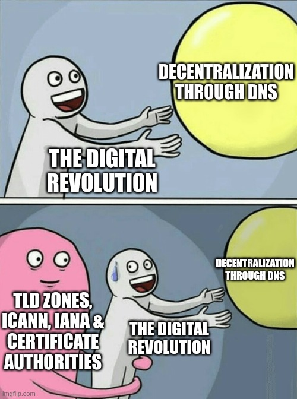

# Can't be evil

<!-- toc -->

██████████████████████████████████████████████████████████████████
# security & can't be evil
██████████████████████████████████████████████████████████████████

- point: improved security - the hacking of high-profile accounts and posting on their behalf is almost impossible with the right opsec
https://twitter.com/VitalikButerin/status/1576275977352536065
https://twitter.com/tayvano_/status/1611131230074073088
https://twitter.com/0x796/status/1611332890209419264
https://twitter.com/0x796/status/1611371424945512460
https://haveibeenpwned.com/
https://twitter.com/SimpleLogin

can't be evil - restore account from point

freedom of speech vs freedom of reach

Privacy is a human right.

Cant be evil - raising the bar for censorship - accountability and exit

Move the decentralization point from the design page to the cant be evil page

SSI
Heads of state
compromising important accounts and posting on their behalf - if their opsec is good enough (with keypairs)

can't be evil - provenance, immutability
History should be immutable

UPDATE - Wikipedia is blocked in Pakistan now.
https://twitter.com/disclosetv/status/1621843921578991616

> "The rise of transparent, impartial, autonomous code in these mission critical areas is incredibly important as trust in institutions [continues decling](https://www.edelman.com/sites/g/files/aatuss191/files/2022-01/2022%20Edelman%20Trust%20Barometer%20FINAL_Jan25.pdf) globally." - [source](https://www.syncracy.io/writing/writing-meditationsonmayhem)

> "Rule of law and property rights in the digital domain are unreliable with powerful centralized intermediaries at the helm and there are serious political and economic consequences." - [source](https://www.syncracy.io/writing/writing-meditationsonmayhem)

> "Companies make promises. Protocols make guarantees." - [source](https://www.syncracy.io/writing/writing-meditationsonmayhem)

Reveal Reddit's secretly* removed content. Search by username or subreddit (r/):
https://www.reveddit.com/

write about security and how there will be competition for services that keep your data private and we will get eventually the best possible services

██████████████████████████████████████████████████████████████████
# Centralization of DNS & certificate authorities
██████████████████████████████████████████████████████████████████

> "The Domain Name Server (DNS) is the Achilles heel of the Web." - [Tim Berners-Lee](https://www.brainyquote.com/quotes/tim_bernerslee_373104)

<!-- https://twitter.com/matthew_d_green/status/1604153242505584640 -->

ledger of record page - this can obsolete certificate authorities in the use of TLS
https://en.wikipedia.org/wiki/Certificate_authority
host-centric page - reliance on certificate authorities
https://en.wikipedia.org/wiki/Public_key_infrastructure
Public key infrastructure is inherently centralized

TODO: read these:
https://theinternetprotocolblog.wordpress.com/2023/01/17/reflections-on-certificates-part-1/
https://theinternetprotocolblog.wordpress.com/2023/02/12/reflections-on-certificates-part-2/

> "According to Netcraft in May 2015, the industry standard for monitoring active TLS certificates, "Although the global [TLS] ecosystem is competitive, it is dominated by a handful of major CAs — three certificate authorities (Symantec, Comodo, GoDaddy) account for three-quarters of all issued [TLS] certificates on public-facing web servers." - [Wikipedia](https://en.wikipedia.org/wiki/Certificate_authority)

The internet is decentralized as much as its weakest links which are DNS & certificate authorities

By July 2022 just 3 certificate authorities (IdenTrust, DigiCert & Sectigo) are responsible for [3 quarters of the entire market](https://w3techs.com/technologies/overview/ssl_certificate).

Certificate authorities should be a thing of the past.

Furthermore, content served by a website through HTTPS (so using SSL) cannot be cached & cryptographically frozen in time because if the certificate is revoked then there's no way to actually prove the order of events - when was the data signed (cannot rely on internal timestamps) and until when was the certificate valid. Headjack fixes this by anchoring all off-chain events with a merkle proof on-chain & sequences what's relevant.

> "In a separate disclosure unrelated to Snowden, the French Trésor public, which runs a certificate authority, was found to have issued fake certificates impersonating Google in order to facilitate spying on French government employees via man-in-the-middle attacks." - [wikipedia](https://en.wikipedia.org/wiki/Global_surveillance_disclosures_(2013%E2%80%93present))

yet more CENTRALIZATION in checking for the validity of certificates:
reliance on OCSP which is vulnerable to DDoS, replay attacks 
turtles all the way down - CAs delegate other entities to be OCSP responders
Also if a MITM attack is possible then 
If an attacker has compromised the private key of a server and is doing a MITM attack then OCSP requests will also be going through them - rendering OCSP an unreliable means of mitigating HTTPS server key compromise.
> "Because most clients will silently ignore OCSP if the query times out, OCSP is not a reliable means of mitigating HTTPS server key compromise." - [Wikipedia](https://en.wikipedia.org/wiki/Online_Certificate_Status_Protocol#Criticisms)

OCSP also leaks browsing behavior
https://en.wikipedia.org/wiki/Online_Certificate_Status_Protocol

our activity is being tracked when not using a VPN - even if using https we leak to the network which big tech service we are contacting & using

    

<!-- the digital revolution
decentralization through DNS
TLD zones,
ICANN, IANA,
certificate
authorities
https://imgflip.com/memegenerator/Running-Away-Balloon -->

DNSSEC was introduced to fight a wide range of DNS-related attacks but it also requires the use of certificates & a trusted third party.

The world is built on top of chains of trust which rely on certificate authorities
https://en.wikipedia.org/wiki/Chain_of_trust
https://en.wikipedia.org/wiki/Root_certificate

The internet is under U.S. control

https://whois.icann.org/en/domain-name-registration-process

██████████████████████████████████████████████████████████████████
# Black boxes & algorithmic bias
██████████████████████████████████████████████████████████████████

The recommendation algorithms & the social graph are the architecture of virality - the dynamics of amplification & interaction dictate how ideas surface, propagate, compound & evolve. The people writing the algorithmic feeds are the most powerful in the world - [@naval](https://youtu.be/3qHkcs3kG44?t=3616).

Ephemeral experiences such as search suggestions & results leave no trace and it's extremely hard to prove bias as [Dr. Robert Epstein](https://en.wikipedia.org/wiki/Robert_Epstein#Contributions_to_Internet_Studies) would [attest](https://open.spotify.com/episode/4q0cNkAHQQMBTu4NmeNW7E) - there is 0 accountability.

> "But we believe the issue of advertising causes enough mixed incentives that it is crucial to have a competitive search engine that is transparent and in the academic realm." - [the original Google search engine whitepaper](https://perma.cc/8GDJ-K6AX)

Does such a search engine exist today? Competition & a lower barrier to entry are direly needed.

> "The search button on the browser no longer provides an objective search, but a commercial one." - [Tim Berners-Lee](https://www.azquotes.com/quote/1389809)

The explicit user preferences such as subscriptions & the social graph (following/connections) are routinely discounted in our feeds in favor of algorithm recommendations - platforms optimize for engagement & attention and not for utility & value to end users. We all respond to outrage & enjoy the occasional viral cat video but we should be able to tune & filter what gets shown to us. Have you ever heard a YouTuber tell you to hit the notification bell in addition to subscribing?

> "I'm in an ongoing relationship with a moody, sensitive, grudge-holding, and generally crazy girlfriend called the Twitter algorithm. Everything will be going fine and then suddenly I'm getting the cold-shoulder and I don't even really know what I did and just have to wait it out." - [Tim Urban](https://twitter.com/waitbutwhy/status/1506755880578166788)

> "The companies that do the best job on managing a user's privacy will be the companies that ultimately are the most successful." - [Fred Wilson](https://www.azquotes.com/quote/317282)

> "The solution to government surveillance is to encrypt everything." - [Eric Schmidt](https://www.azquotes.com/quote/689572)

> "Transparency in government leads to reduced corruption." - [Julian Assange](https://www.azquotes.com/quote/1341903)

> "Every War in the past 50 Years is a Result of Media Lies" - [Julian Assange](https://www.azquotes.com/quote/850875)

> "The amount of control you have over somebody if you can monitor internet activity is amazing." - [Tim Berners-Lee](https://www.azquotes.com/quote/171763)

> "Under observation, we act less free, which means we effectively are less free." - [Edward Snowden](https://www.azquotes.com/quote/685660)

> "Arguing that you don't care about privacy because you have nothing to hide is no different than saying you don't care about free speech because you have nothing to say." - [Edward Snowden](https://www.azquotes.com/quote/1335561)

> "Privacy is the power to selectively reveal oneself to the world." - [A Cypherpunk's Manifesto by Eric Hughes, 9 March 1993](https://www.activism.net/cypherpunk/manifesto.html#:~:text=Privacy%20is%20the%20power%20to%20selectively%20reveal%20oneself%20to%20the%20world.)

Can’t be evil - tiktok in 2022 was running in russia without the ability to view foreign content and russians could not post content about the war

Cant be evil - search result manipulation and bias

when youtube removes a video of yours - it should still be available by you. It should still have an ID if you wish it so
Reuploading elsewhere with a different ID breaks all links in the graph

new: AI voice-cloning tech is making phone scams frighteningly believable.
https://twitter.com/pranshuverma_/status/1632397925908111360

3 strikes with the last one because of your recent video? BAM - entire channel gone with everything else

