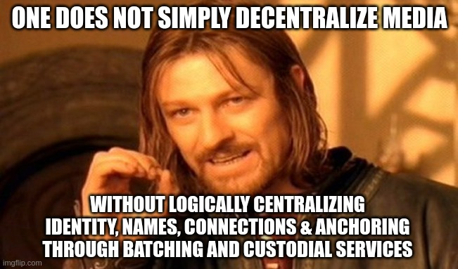

# Headjack vs the competition

This chapter focuses only on the disadvantages of some of the more high-profile competing solutions in the space. Most of the issues are solved in Headjack due to its [guiding principles & design goals](principles.md). This page doesn't list any of their positives as it would be too long (so not exhaustive by any means) but many of them have served as an inspiration for Headjack in one way or another.

<!-- Corrections for any inaccuracies are welcome! -->

<!-- If Bluesky, Farcaster and DSNP had a baby with some special MKUltra spice it would be Headjack -->

<!-- toc -->

# Comparison table

This is the subjective understanding of Headjack's team - many of the claims lack official sources.

<table class="competition_comparison">
<tr>
    <td style="width:16%"></td>
    <td><b>Headjack</b></td>
    <td><b><a href="competition.md#farcaster">Farcaster</a></b></td>
    <td><b><a href="competition.md#dsnp-frequency--project-liberty">DSNP</a></b></td>
    <td><b><a href="competition.md#bluesky">Bluesky</a></b></td>
    <td><b><a href="competition.md#tbd">TBD</a></b></td>
    <td><b><a href="competition.md#cyberconnect">CyberConnect</a></b></td>
    <td><b><a href="https://lens.xyz/">Lens</a></b></td>
</tr>
<tr>
    <td style="background-color:grey" colspan="8"><b>blockchain-related properties</b></td>
</tr>
<tr>
    <td><b>Scalability</b></td>
    <td style="background-color:green">can handle billions - <a href="numbers.md">proof</a></td>
    <td style="background-color:#88ff00">~10 million - will need to move to its own rollup for more. Also its p2p implementation is extremely limiting</td>
    <td style="background-color:yellow"></td>
    <td style="background-color:green">centralized consortium of servers</td>
    <td style="background-color:grey"></td>
    <td style="background-color:grey"></td>
    <td style="background-color:red">Content is on-chain - not just accounts. Even a dedicated EVM rollup won't be enough</td>
</tr>
<tr>
    <td><b>Users paying for TX fees & linking identity to financial accounts by default</b></td>
    <td style="background-color:green">blockchain costs are paid for by services by default</td>
    <td style="background-color:yellow">Ethereum L1 costs initially planned for subsidy by services</td>
    <td style="background-color:yellow"></td>
    <td style="background-color:green">centralized consortium of servers - no TXs</td>
    <td style="background-color:#88ff00">The anchors (on-chain Merkle roots) get batched with others</td>
    <td style="background-color:yellow"></td>
    <td style="background-color:yellow"></td>
</tr>
<tr>
    <td><b>Blockchain TX fee stability & predictability</b></td>
    <td style="background-color:green"><a href="numbers.md">as scalable as necessary => no congestion</a></td>
    <td style="background-color:red">Ethereum L1 - will need to migrate to its own rollup in the future</td>
    <td style="background-color:grey"></td>
    <td style="background-color:green">centralized consortium of servers - no TXs</td>
    <td style="background-color:#88ff00">Bitcoin TX fees are low due to low economic activity</td>
    <td style="background-color:grey"></td>
    <td style="background-color:grey"></td>
</tr>
<tr>
    <td><b>Block time for anchoring key operations</b></td>
    <td style="background-color:green">Ethereum ZK rollup with multiple blocks in one L1 slot</td>
    <td style="background-color:yellow">Ethereum</td>
    <td style="background-color:#88ff00">Polkadot</td>
    <td style="background-color:green">centralized consortium of servers</td>
    <td style="background-color:red">Bitcoin</td>
    <td style="background-color:yellow">Ethereum</td>
    <td style="background-color:green">Polygon PoS</td>
</tr>
<tr>
    <td><b>Can use "custodial" hosted services while retaining ultimate control</b></td>
    <td style="background-color:green"></td>
    <td style="background-color:grey"></td>
    <td style="background-color:grey"></td>
    <td style="background-color:grey"></td>
    <td style="background-color:grey"></td>
    <td style="background-color:grey"></td>
    <td style="background-color:grey"></td>
</tr>
<tr>
    <td><b>Contains a name registry & can replace DNS eventually</b></td>
    <td style="background-color:green">yes</td>
    <td style="background-color:green">yes, also works with ENS</td>
    <td style="background-color:red">no, but will probably introduce one</td>
    <td style="background-color:red">no - uses <a href="https://github.com/bluesky-social/adx/blob/main/docs/architecture.md#identifiers">email-like usernames</a> resolved with <a href="https://webfinger.net/">Webfinger</a></td>
    <td style="background-color:red">no</td>
    <td style="background-color:red">no, probably works with ENS</td>
    <td style="background-color:red">no, probably works with ENS</td>
</tr>
<tr>
    <td><b>Decentralization for the most important parts</b></td>
    <td style="background-color:#88ff00">Ethereum ZK rollup with external data availability (validium)</td>
    <td style="background-color:green">Ethereum</td>
    <td style="background-color:#88ff00">Polkadot - not big enough set of validators</td>
    <td style="background-color:red">centralized consortium of servers</td>
    <td style="background-color:green">Bitcoin</td>
    <td style="background-color:green">Ethereum</td>
    <td style="background-color:yellow">Polygon PoS</td>
</tr>
<tr>
    <td style="background-color:grey" colspan="8"><b>Data availability, storage, retrievability & addressing</b></td>
</tr>
<tr>
    <td><b>Human-readable & persistent URIs for data without any hashes</b></td>
    <td style="background-color:green"></td>
    <td style="background-color:red">URIs full of <a href="https://github.com/farcasterxyz/protocol/pull/1/files">hashes</a> (most probably)</td>
    <td style="background-color:red">URIs full of <a href="https://spec.dsnp.org/DSNP/Identifiers.html?highlight=uri#dsnp-content-uri">hashes</a></td>
    <td style="background-color:red">URIs full of <a href="https://github.com/bluesky-social/adx/blob/main/docs/architecture.md#data-layout">hashes</a> - <a href="https://github.com/multiformats/cid">CIDs</a> for IPLD objects</td>
    <td style="background-color:red">most probably using hashes</td>
    <td style="background-color:red">URIs full of <a href="https://cerscan.com/testnet-clay/stream/kjzl6cwe1jw1474gby1buhqw8xbnvfmfphpvrs0n01n6jls9kvdx7hu41w0sp1m">hashes</a></td>
    <td style="background-color:red">URIs full of <a href="https://lenster.xyz/posts/0x05-0x04f4">hashes</a></td>
</tr>
<tr>
    <td><b>Multiple ways to query for a URI's document</b></td>
    <td style="background-color:green;text-align:left;"><a href="store_and_retrieve.md#how-to-retrieve-data-for-a-random-uri">multiple ways:</a> &nbsp;1) the user &nbsp;2) <u><b>the source application</b></u> &nbsp;3) the original IPFS batch blob &nbsp;4) the p2p network with the URI hash &nbsp;5) any archive</td>
    <td style="background-color:yellow;text-align:left;">&nbsp;1) user's Hub &nbsp;2) the p2p network &nbsp;3) any archive</td>
    <td style="background-color:yellow;text-align:left;"></td>
    <td style="background-color:grey;text-align:left;"></td>
    <td style="background-color:grey;text-align:left;"></td>
    <td style="background-color:grey;text-align:left;"></td>
    <td style="background-color:grey;text-align:left;"></td>
</tr>
<tr>
    <td><b>Reliance on a p2p network for delivering fine-grained messages</b></td>
    <td style="background-color:green">Headjack is pure addressing - storage & retrieval are orthogonal</td>
    <td style="background-color:red">using a gossip-based pubsub protocol between peers</td>
    <td style="background-color:grey"></td>
    <td style="background-color:grey"></td>
    <td style="background-color:grey"></td>
    <td style="background-color:grey"></td>
    <td style="background-color:grey"></td>
</tr>
<tr>
    <td><b>Push vs pull for fetching new content</b></td>
    <td style="background-color:green">both - events are broadcasted & individual items can also be requested</td>
    <td style="background-color:red">pull only - requires polling a user's Hub for anything new</td>
    <td style="background-color:grey"></td>
    <td style="background-color:grey"></td>
    <td style="background-color:grey"></td>
    <td style="background-color:grey"></td>
    <td style="background-color:grey"></td>
</tr>
<tr>
    <td><b>Self-authenticating documents</b></td>
    <td style="background-color:green">proofs are validated by the blockchain</td>
    <td style="background-color:yellow">need to talk to Ethereum <b>AND</b> the host-certified user directory which can disappear OR change</td>
    <td style="background-color:yellow">merkle roots <a href="https://github.com/LibertyDSNP/frequency/issues/105">not present</a></td>
    <td style="background-color:green">proofs are validated by the transparency log</td>
    <td style="background-color:grey"></td>
    <td style="background-color:grey"></td>
    <td style="background-color:grey"></td>
</tr>
<tr>
    <td><b>Incentive layer & DA for key rotation/revocation & registries</b></td>
    <td style="background-color:green"></td>
    <td style="background-color:yellow">Long-term Ethereum L1 might introduce state rent</td>
    <td style="background-color:grey"></td>
    <td style="background-color:grey"></td>
    <td style="background-color:grey"></td>
    <td style="background-color:grey"></td>
    <td style="background-color:grey"></td>
</tr>
<tr>
    <td style="background-color:grey" colspan="8"><b>Ease of use for developers</b></td>
</tr>
<tr>
    <td><b>Can leverage existing Web2 authenticating infrastructure</b></td>
    <td style="background-color:green">Can leverage all existing OAuth code</td>
    <td style="background-color:grey"></td>
    <td style="background-color:grey"></td>
    <td style="background-color:grey"></td>
    <td style="background-color:grey"></td>
    <td style="background-color:grey"></td>
    <td style="background-color:grey"></td>
</tr>
<tr>
    <td><b>Easy to work with mental model vs high cognitive load & complexity</b></td>
    <td style="background-color:#88ff00">A bit more complexity compared to Web2</td>
    <td style="background-color:grey"></td>
    <td style="background-color:grey"></td>
    <td style="background-color:grey"></td>
    <td style="background-color:grey"></td>
    <td style="background-color:grey"></td>
    <td style="background-color:grey"></td>
</tr>
<tr>
    <td><b>Ease of indexing & building responsive UI</b></td>
    <td style="background-color:green">can be as performant as Web2 and not constrained by block time</td>
    <td style="background-color:grey"></td>
    <td style="background-color:grey"></td>
    <td style="background-color:grey"></td>
    <td style="background-color:grey"></td>
    <td style="background-color:grey"></td>
    <td style="background-color:grey"></td>
</tr>
<!-- <tr>
    <td>-</td>
    <td style="background-color:green">-</td>
    <td style="background-color:grey">-</td>
    <td style="background-color:grey">-</td>
    <td style="background-color:grey">-</td>
    <td style="background-color:grey">-</td>
    <td style="background-color:grey">-</td>
    <td style="background-color:grey">-</td>
</tr> -->
</table>

<a id="footnote-1-ref" href="#footnote-1">[1]</a>
<a id="footnote-2-ref" href="#footnote-2">[2]</a>

   1. X. <a href="#footnote-1-ref">&#8617;</a> 

   2. X. <a href="#footnote-2-ref">&#8617;</a>

<!--
Value capture potential as a line
The winner take all singleton is the easiest mentally
-->

# What other projects get wrong

A list of problems with the contenders in the decentralized identity/media space:

- No credible path to [web-scale](principles.md#web-scale-blockspace--the-unix-philosophy) - some will hit a wall even at 1 million users. Most are vague around their scalability & data structures and don't put it [front and center](numbers.md) - obfuscating the most important bit. Instead of focusing on NFTs & developer APIs, start with the data and work up from that.
    <!-- > "It is the mark of a charlatan to explain a simple concept in a complex way." - [@naval](https://twitter.com/naval/status/752796426208325632) -->

<!-- Fake it till you make it is not a viable strategy with the wrong foundation. -->

- Complexity & lack of clarity - distributed systems engineers should easily figure out how they work & what the limitations are. Why build on something that others are probably having a hard time understanding as well and may not be around in the future?
    > "Developers care about risk." - [Haseeb](https://haseebq.com/why-decentralization-isnt-as-important-as-you-think/)

    > "For the simplicity on this side of complexity, I wouldn't give you a fig. But for the simplicity on the other side of complexity, for that I would give you anything I have." - [Oliver Wendell Holmes](https://www.goodreads.com/quotes/44564-for-the-simplicity-on-this-side-of-complexity-i-wouldn-t)

- Too financialized & trying to do too much - profiles & posts as NFTs, microtransactions, marketplaces, fan coins, tipping, content creator incentives.
    > "However, a downside I’ve observed in social networks where content is monetized is that user behavior becomes transparently driven by monetary incentives in ways that feel less genuine. This applies to influencer culture on Instagram as well, but cryptocurrency social networks bake it in from the start." - [Jay Gerber](https://medium.com/decentralized-web/blockchain-social-networks-c941fb337970)

    > "The question remains: is the future of social media truly intrinsically linked to NFTs or is it a red herring?" - [@mattigags](https://wrongalot.substack.com/p/the-next-big-crypto-narrative)

- Users shouldn't need to use a token, use a wallet, or self-host to benefit from decentralized identity & an open social graph. Most people will always use custodial services.
    > "People don’t want to run their own servers, and never will." - [Moxie](https://moxie.org/2022/01/07/web3-first-impressions.html)

- Linking online identity to public financial accounts on Ethereum/Solana/etc will have unintended consequences - a bad default.

- Federated ones lack [logical centralization](https://medium.com/@VitalikButerin/the-meaning-of-decentralization-a0c92b76a274) which leads to fragmentation and [no discoverability](https://github.com/mastodon/mastodon/issues/9529).

- Some are solving just identity & the graph - without easy & persistent [content addressing](addressing.md).

- Social media is about aggregated views at scale - not p2p and direct comms.
    > "The emphasis of a social network is on "propagation" aka, propaganda." - [didibus](https://news.ycombinator.com/item?id=25735773)

- Some use chains such as Ethereum for [logical centralization](https://medium.com/@VitalikButerin/the-meaning-of-decentralization-a0c92b76a274) & store vector commitments (Merkle roots) for events around [key management](https://blog.ceramic.network/key-revocation-in-self-certifying-protocols/) (rotations, authorizations, sessions & revocations) but the data availability problem for whatever is committed is unsolved.
    - The complexity is not encapsulated - there are many open questions, edge cases & failure scenarios and it would inevitably lead to assumptions & trust.
    <!-- - Many focus just on the latest keypairs and don't sequence the signed actions throughout time  - much harder to prove that content generated with an older keypair was indeed legitimate at the time of creation and generated back in time instead of fraudulently constructed later on if the keypair is compromised. -->
    - Some anchor to Bitcoin but the time to finality matters a lot for UX - 10-minute block times with probabilistic finality is horrendous.

- Some lack an economic incentive layer.
    > "Show me the incentive and I will show you the outcome." - [Charlie Munger](https://quotefancy.com/quote/1561882/Charlie-Munger-Show-me-the-incentive-and-I-will-show-you-the-outcome)

<!-- What you don't want is for these identifiers to be fractured between many platforms with different standards & formats. -->

# [Farcaster](https://www.farcaster.xyz/)

<!--
https://farcasterxyz.notion.site/farcasterxyz/Farcaster-v2-43b105e4699847518b1d89996c20d564
-->

<!-- 

!!!!!

With Farcaster, content is directory-certified and cannot be fully self-authenticating because if the directory to which the on-chain account points to goes away - so does the credibility for any piece of data by that account - no way to cache proofs. Furthermore, directories can be tampered with and currently it's up to the p2p network to keep track if any malicious changes happen

farcaster - their model can work even without the p2p nodes - aggregators can be built that talk directly to host directories

farcaster can be built on top of Headjack but not everything that can be built on Headjack can on Farcaster

Farcaster is the best team in the space.

-->

Their architecture: [link](https://github.com/farcasterxyz/protocol). The account registry is on a blockchain and everything else is off-chain.

- Registry on Ethereum L1 - for new accounts, name/host changes & key management.
    - No plans on moving to an L2 or their own chain. Also, state rent could eventually be introduced to Ethereum which would lead to further costs & complexity.

- Keypairs & wallets required - harder mass adoption. Authorizations still [require a signature from the root key](https://github.com/farcasterxyz/protocol#45-signer-authorizations).

- Revocations invalidate all prior activity from a delegate:

    > "Unfortunately, this means that all messages signed by that signer will be lost since we cannot tell which ones were signed by the attacker." - [source](https://github.com/farcasterxyz/protocol#71-signer-compromise)

    - [Root signer revocations](https://github.com/farcasterxyz/protocol#46-root-signer-revocations) are even more impactful.

<!-- - Cast timestamps are self-reported and can be manipulated - no true cryptographic total ordering - which leads to a lot of complexity in the node software. Not sure what happens to old casts that were signed with obsolete keypairs and how the history of keys is handled. -->

<!-- message ordering, timestamps & authenticity can be manipulated which requires more logic in the software to keep track of previous hashes
https://github.com/farcasterxyz/protocol#message-ordering -->

- The [p2p network](https://github.com/farcasterxyz/protocol#5-peering)'s ability to scale by passing around granular casts is questionable - they are already discussing possible flooding and nodes having to shadow ban and flag accounts based on behavior.

<!-- TODO: problem with farcaster - you cannot save content from others forever with authentic proofs if the person removes completely their history of key changes & content signatures. Correct? -->

<!-- Directly polling accounts & their hosts for new events is more scalable but has tradeoffs compared to broadcasting messages & ingesting them into DBs & indexes (pull vs push). -->

- Focus is on [partial views of the network](https://github.com/farcasterxyz/protocol#47-sharding) as opposed to mass scale aggregation & indexing - although that could easily be implemented.

- [Cast URIs](https://github.com/farcasterxyz/protocol/pull/1/files) will look something like `farcaster://id:8789213729/cast:0xf00b4r` which is less readable than what Headjack will be offering with [its addressing](addressing.md).

Overall good intuition about the concept of [sufficient decentralization](https://www.varunsrinivasan.com/2022/01/11/sufficient-decentralization-for-social-networks) (putting only what is absolutely necessary on a blockchain) but the p2p node implementation takes on too much [responsibility, complexity & assumptions](https://github.com/farcasterxyz/protocol#7-security-considerations) (consensus, CRDTs, trees, ordering, flooding & replay attacks, etc.) and is lacking in other areas.

<!-- perhaps the best product team in the space and a good attempt to bootstrap a community -->

# [DSNP](https://www.dsnp.org/), [Frequency](https://www.frequency.xyz/) & [Project Liberty](https://www.projectliberty.io/)

Frequency (a Polkadot parachain) is the first implementation of DSNP (Decentralized Social Networking Protocol - [whitepaper](https://github.com/LibertyDSNP/papers/blob/main/whitepaper/dsnp_whitepaper.pdf)) as a standalone blockchain and has had the most influence over Headjack's design but the two have diverged in some key respects - the biggest of which are scalability, content addressability, UX & choosing Polkadot. Some of the problems with them:

- No names within the project - just integer IDs for accounts. Content addressing URIs are based on hashes without connection to the batch # / service that published it - example: `dsnp://78187493520/0x1234567890abcdef0123456789abcdef0123456789abcdef` ([source](https://spec.dsnp.org/DSNP/Identifiers.html#dsnp-content-uri)). Addressing content is much worse compared to Headjack's [human-readable & persistent URIs](addressing.md).

- Delegating applications to be able to post on behalf of users (analogous to authorization in Headjack) happens on-chain but requires a signature from the user (bulky - limiting throughput). New applications (& revocation) require the user to have access to their keys. Hierarchical delegation would allow for UX comparable to Web2 and would even allow for users without keypairs at all but DSNP doesn't have that - Headjack does. <!-- https://discord.com/channels/969001918460469250/969308056208961606/996417552962043924 -->

- [100m$ of funding](https://philanthropynewsdigest.org/news/project-liberty-launched-with-100-million-from-frank-mccourt) (so far) from just 1 person - [Frank McCourt](https://www.youtube.com/watch?v=xgPZnOulBCE) - no other capital & connections to reputable investors & influencers from either the crypto or tech space - generating hype & booting up the network effect might be very hard. They've been around since 2019.

# [Bluesky](https://en.wikipedia.org/wiki/Bluesky_(protocol))

Their architecture: [link](https://github.com/bluesky-social/adx/blob/main/docs/architecture.md)

- Email as username ==> resolve to a [DID](https://www.w3.org/TR/did-core/) with [WebFinger](https://webfinger.net/)
    - Centralization point - relies on DNS for the part after `@`.

- **Consortium** of nodes & a transparency log manage the DID registry.
    - Centralization point (not just [logical](https://medium.com/@VitalikButerin/the-meaning-of-decentralization-a0c92b76a274)) - users can be kicked off.
    - This should have been a credibly neutral & self-sustaining blockchain.

- Content addressing with hashes (versus Headjack's [human-readable & persistent URIs](addressing.md)).

- Requires the use of keypairs which is worse UX compared to Headjack and would hinder mass adoption - although they do talk about [custodial solutions](https://github.com/bluesky-social/adx/blob/main/docs/architecture.md#root-private-key-management).

<!-- - When users post content they update their Personal Data Repositories managed by their Personal Data Servers (PDS) which play somewhat similar roles to [Farcaster](#farcaster)'s managed hosts and Headjack's [IDMs](IDM.md). -->
<!-- - Since such events aren't publicized anywhere, whoever is interested will have to be proactively polling for updates and sending requests. -->
<!-- - Users can lose their interest graph if the PDS they are using loses their data. -->
<!-- - The Personal Data Repositories would be a lot less compact than Headjack because accounts and links between them are not simple integers and every piece of data and relationship comes along with a signature. -->

Overall a solid effort and could work - some similarities to [Farcaster](#farcaster) but the DID registry is centralized by a consortium and the usernames are email-like (DNS - centralization point) instead of handled by the DID registry. Neither solution anchors content like Headjack does.

# [TBD](https://www.tbd.website/)

Jack Dorsey's new ["web5"](images/meme_web5.jpg) project - [slides](https://docs.google.com/presentation/d/1SaHGyY9TjPg4a0VNLCsfchoVG1yU3ffTDsPRcU99H1E), [announcement](https://twitter.com/namcios/status/1535302090360250368).

- Only anchors DID events to Bitcoin with vector commitments (Merkle roots) using [ION](https://github.com/decentralized-identity/ion) & the [Sidetree](https://medium.com/decentralized-identity/the-sidetree-scalable-dpki-for-decentralized-identity-1a9105dfbb58) protocol.
    - 10-minute block times with probabilistic finality. Factor in the loading times for the anchored content around key management that's on IPFS - not great at all if you want to log in/authorize a service or revoke access quickly.

- The ION DID network is [not incentivized](https://github.com/decentralized-identity/ion/blob/master/docs/Q-and-A.md#q-what-are-the-availability-guarantees-of-ion) (just like IPFS) and the anchored content around key management, rotations & revocations depends on the current cluster of ION nodes. They state not having a consensus mechanism as a plus - which is debatable - logical centralization, uptime, adequate finality & DA guarantees matter a lot when dealing with identity.

- Doesn't have a human-readable global name registry - lacks discoverability.

- Doesn't have human-readable content addressing.

- Focus is on users self-hosting their own data, running software locally & handling keypairs.

- Developing their own Decentralized Web Nodes (DWN) software that would be relaying messages p2p - can't handle [web-scale](principles.md#web-scale-blockspace--the-unix-philosophy) on such a granular level and aggregation is not even in the picture.

# [CyberConnect](https://cyberconnect.me/)

Built on the [Ceramic protocol](https://github.com/ceramicnetwork/ceramic/blob/main/SPECIFICATION.md) & [network](https://ceramic.network/).

- Requires the use of keypairs & wallets.

- Every user has their own Ceramic data stream on top of IPFS - it is yet to be proven that the DHT & p2p layers can scale to hundreds of millions or billions of people.

- The persistence of the social graph is handled by pinning IPFS data on nodes operated by them without any cryptoeconomic incentive for the data availability - it will grow into the tens/hundreds of terabytes for web-scale (Twitter scale: 400M users with 700 connections on average) - especially because they don't have a compact integer-based representation and everything is based on big individually signed actions. The upcoming Ceramic blockchain does not seem to be geared towards storage incentivization and will not be the solution to that.

    > "Long-term data retention on CyberConnect is guaranteed through Ceramic’s blockchain anchoring and a custom data pinning service." - [source](https://blog.ceramic.network/building-the-social-graph-infrastructure-for-web3-0/)

# [DeSo](https://www.deso.org/)

- It requires wallets & users to pay for every interaction.

- It puts everything on-chain and their plans to scale are with bigger blocks & sharding (see ["Phase 4: Sharding"](https://docs.deso.org/about-deso-chain/readme)) which is simply not practical for the [true scale of the public web](principles.md#web-scale-blockspace--the-unix-philosophy).

- It financializes as much as possible (creator coins, etc.).

- Their initial growth was fueled by huge sums of VC money but by now it has [flatlined](https://www.openprosper.com/stats/deso-dashboard). It did reach [1.66$ billion market cap](https://www.coingecko.com/en/coins/deso) on the 2nd of October 2021 shortly after being listed.

# Others

For details about ActivityPub, Matrix, Diaspora, Mastodon, Secure Scuttlebutt, Solid & others please refer to the excellent [ecosystem review](https://twitter.com/bluesky/status/1352302821140549632) by the Bluesky project. Other good resources include:
- [Decentralized Social Networks](https://medium.com/decentralized-web/decentralized-social-networks-e5a7a2603f53) - Jay Gerber
- [Blockchain Social Networks](https://medium.com/decentralized-web/blockchain-social-networks-c941fb337970) - Jay Gerber
- There are [many other projects](https://mirror.xyz/shreyjain.eth/TyBzMOegl3rMNxpAFoJ36MjE0pGfdLcrVCBgy-x3qS8) in this space.

<!-- 

    

 -->

<!-- one does not simply solve media
without logically centralizing identity, names, connections & anchoring through batching and custodial services
https://imgflip.com/memegenerator/One-Does-Not-Simply -->

<!-- 

    

 -->

<!-- trust centralized companies with your identity & data
use blockchains, self-host all your data, and sign every action
manage many keypair wallets and isolate risk
use a blockchain with hierarchical trust & don't require keypairs by default
https://imgflip.com/memegenerator/Expanding-Brain -->

<!-- 

    

 -->

<!-- TRUSTLESS
manage keypairs & sign actions
BETTER TRUST
hierarchical trust & account management without keypairs by default
https://imgflip.com/memegenerator/Drake-Hotline-Bling -->

<!-- 

    

 -->

<!-- better trust & familiar UX
normal people
using keypairs & signing actions trustlessly
https://imgflip.com/memegenerator/112528910/Guy-checks-out-red-dress-girl -->
