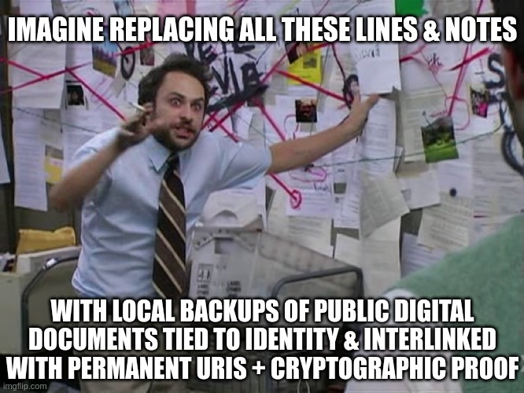

# History 2.0: cryptohistory

<!-- toc -->

██████████████████████████████████████████████████████████████████
# cryptohistory
██████████████████████████████████████████████████████████████████

The highest standards of history are permanence and authenticity

> "We're in the stage where ML model-generated text is going to accelerate the rate of data accumulating on the internet and lower the average quality. This data deluge will degrade trust and user experience across a variety of platforms, increasing pressure on moderation and curation. Combine these trends with accelerating progress in AI and it will be near impossible for one individual to track the changes happening in their own information ecosystem." - [GPT4: The quiet parts and the state of ML](https://robotic.substack.com/p/gpt4-review?utm_source=twitter&utm_campaign=auto_share&r=68gy5#:~:text=We%27re%20in%20the,own%20information%20ecosystem.)

> "I have been to the darkest corners of government, and what they fear is light." - [Edward Snowden](https://www.azquotes.com/quote/577721)

> "Those who cannot remember the past are condemned to repeat it." - [George Santayana](https://en.wikiquote.org/wiki/George_Santayana#:~:text=infancy%20is%20perpetual.-,Those%20who%20cannot%20remember%20the%20past%20are%20condemned%20to%20repeat%20it.,-This%20famous%20statement)

the future of status and prestige is authentic computable context & reputation on top of immutable cryptohistory

- point: with AI being democratized - authenticity & a ledger of record will be more important than ever.

> "If the news is fake, imagine history" - [@AmuseChimp](https://twitter.com/naval/status/1322646025811554304)

> "So what do we do about this world we are living in where content can be created by machines and ascribed to us? I think we will need to sign everything to signify its validity. When I say sign, I am thinking cryptographically signed, like you sign a transaction in your web3 wallet." [Fred Wilson, AVC, 2022, “Sign Everything”](https://avc.mirror.xyz/JpTblGUpDMA7SMS6HYdoYgbQE9H_a_wYq330pit_aRU)

> "It's not about fact checkers, it's about checkable facts." - [@balajis](https://twitter.com/balajis/status/1616198733032742912)

The importance of history cannot be understated. This chapter could never do it justice so please refer to Balaji's book and the second "History as Trajectory" chapter.
https://thenetworkstate.com/prologue
It's a book more about history than anything else
It's a book mostly about history

> "Cryptohistory is Cryptographically Verifiable Macrohistory" - [Balaji's The Network State](https://thenetworkstate.com/microhistory-and-macrohistory#cryptohistory-is-cryptographically-verifiable-macrohistory)

The value of permanence & self-authenticating documents - not host-centric/host-certified or anything else - truly self-authenticating!
SBF deleted a tweet that would incriminate him
https://twitter.com/jonwu_/status/1590099766712549376
https://twitter.com/AutismCapital/status/1590888993226653697
The only way to make something truly self-authenticating in perpetuity is to timestamp it. Anchor it. Sequence a set inclusion commitment on-chain.

<!--
https://en.wikipedia.org/wiki/Non-repudiation

Leaving an authentic digital footprint and path

> "human society benefits massively from a timestamped ledger which is as complete as possible. Inclusion of events in the ledger should not be subject to any censorship pressure." - [@sreeramkannan](https://twitter.com/sreeramkannan/status/1586960579952246785)

> "While it is not possible to bring this hardness to physical history, let us all try to build this timestamped *digital* event history which is as complete as possible, so we can get a new source of "hardness" that did not, and could not, exist before." - [@sreeramkannan](https://twitter.com/sreeramkannan/status/1586960584964440064)

> "We’ll need cryptographically signed information to know what’s true as institutional trust falls and AI-generated content rises." - [@balajis](https://twitter.com/balajis/status/1604532312301252609)

the Deepfake Singularity is here
EMBED THIS VIDEO
https://www.youtube.com/watch?v=F4G6GNFz0O8
https://twitter.com/seikatsu/status/1603666625709981696

-->

# History 2.0: the ledger of record

In the current web documents are [host-certified](host_centric.md#the-host-centric-web--its-decay) and we refer to data by location instead of contents. Here we'll expand on problems with the status quo and list the benefits of building a [web of trust](https://en.wikipedia.org/wiki/Web_of_trust) at web-scale through [data-centric](host_vs_data_centric.md) addressing & [self-authenticating](https://en.wikipedia.org/wiki/Self-authenticating_document) documents tied to identity.

<!-- toc -->

# Authenticity

We'll be able to computationally verify the authenticity of any document & tie it to an identity as long as we also have the proofs for it - giving birth to the [ledger of record](https://twitter.com/balajis/status/1459140902144729088) where argument from cryptography begins superseding argument from authority.

Anyone might have saved a specific document (& updates to it) locally along with the necessary proofs for authenticity even if most infrastructure no longer stores/serves it. There is a `1 of N` guarantee which allows documents that someone wants buried to be passed around with proofs and resurface in the public at a later point - improving accountability.

<!-- 
TODO:
In such an environment controversial and false claims are much easier to prove.
If even intranets and corps move to this addressing then whistpeblowing will be much more authentic. This is the mechanism for the biggest crimes to bubble up

The ability to do specific verifiable attribution to where a harm is coming from can increase our capacity to serve justice
Forced transparency !!!

https://en.wikipedia.org/wiki/Akashic_records

# History 2.0

> "Cryptographically verifiable history is the next step after written history" - [@balajis](https://youtu.be/VeH7qKZr0WI?t=10089)

We could establish global [common knowledge](https://en.wikipedia.org/wiki/Common_knowledge_(logic)) through authenticity, reputation, and the ledger of record.

Another important aspect in improving coordination is to build applications that will help in forming common knowledge:

"The great privilege of the elites of the future will be to erase the computer information about them and assume their private identity again." - Marshall McLuhan

> "Common knowledge is often important for coordination. For example, a group of people might want to speak out about an issue, but only feel comfortable doing so if there’s enough of them speaking out at the same time that they have safety in numbers." [Vitalik](https://vitalik.ca/general/2022/06/12/nonfin.html)

no mentioned "fact" shall remain unanchored/unreferenced - that's what stable URIs and intra-document addressing are for

> "We are choked with news and starved of history." - [Will Durant](https://www.goodreads.com/quotes/8716601-we-are-choked-with-news-and-starved-of-history)

> "Perhaps better history needs better databases." - [@balajis](https://twitter.com/balajis/status/1434110543564996612)
-->

# The global [Git](https://en.wikipedia.org/wiki/Git)

Headjack is a global [version control system](https://en.wikipedia.org/wiki/Version_control) with different data availability tradeoffs - storage and retrievability are not guaranteed. If someone processes everything that's linked to the blockchain they'd be able to track the creation and changes of each document - both the edits from the original authors and the forks & references from others, and also the sequence of authorizations that update who has authority to edit a document. All events are cryptographically sealed in time with on-chain commitments and the history cannot be tampered with.

We should be able to view the changes of any document with a diff view - similarly to what [The Internet Archive provides](https://blog.archive.org/2019/10/18/the-wayback-machine-fighting-digital-extinction-in-new-ways/) (see [this as an example](https://web.archive.org/web/diff/20170118202526/20170120040337/https://www.ice.gov/speeches)) but with a lot more control and a wide range of different visualization tools - example: a slider for filtering/jumping through time [like in Discourse](
https://meta.discourse.org/t/change-right-gutter-to-vertical-timeline-topic-controls/44096).

> "The public’s interest in seeing what’s changed—or at least being aware that a change has been made and why—is as legitimate as it is diffuse. And because it’s diffuse, few people are naturally in a position to speak on its behalf." - [source](https://www.theatlantic.com/technology/archive/2021/06/the-internet-is-a-collective-hallucination/619320/)

We ought to rebuild everything on top of this [ledger of record](cryptohistory.md#authenticity) - including Wikipedia (no more dead links!), open source code, science and peer review - under one global interlinked namespace where any public event is referencable so that others can comment on it.

# The history of document updates

Today's web puts authenticity & certification of documents in the [hands of hosts](host_centric.md#the-host-centric-web--its-decay) which can [do whatever they want](https://news.ycombinator.com/item?id=27690525) and rarely provide the option to see previous versions if edits have been made. The [Internet Archive](https://en.wikipedia.org/wiki/Internet_Archive) is hardly a mainstream tool which doesn't provide any cryptographic authenticity guarantees and can be compromised.

> "It is really tempting to cover for mistakes by pretending they never happened. Our technology now makes that alarmingly simple" - [source](https://www.theatlantic.com/technology/archive/2021/06/the-internet-is-a-collective-hallucination/619320/)

> "Society can’t understand itself if it can’t be honest with itself, and it can’t be honest with itself if it can only live in the present moment. It’s long overdue to affirm and enact the policies and technologies that will let us see where we’ve been, including and especially where we’ve erred, so we might have a coherent sense of where we are and where we want to go." - [source](https://www.theatlantic.com/technology/archive/2021/06/the-internet-is-a-collective-hallucination/619320/)

In Headjack updates to URIs are broadcasted but the previous versions remain - applications ought to display the latest state but should allow browsing the entire history of changes - like using Git.

# Deduplicating documents & traceability

An open paradigm with content addressing where data is shared between services would enable us to de-duplicate re-uploads as long as they are the same documents in terms of bytes because of the open nature of data - based on their hash. We'll be able to see when something first appeared & the discussion will be much less fractured between platforms and posts - leading to greater depth.

We'll be able to more easily [address parts of documents](names_and_paths.md#addressing-within-content) and share ranges of entire videos without having to re-upload them as separate clips which breaks the contextual link. If this becomes as easy as (or even easier than) it currently is to crop & re-upload, then it will become the norm - we'll all prefer not losing the context. In this paradigm [deepfakes](https://en.wikipedia.org/wiki/Deepfake) will be easier to spot & fight - tracing the source of content authentically to identity is important & desirable.

TODO: regarding deepfakes - only official statements could be traced - unofficial leaks will still be unprovable

# Verifiable credentials

Entities can sign messages that attest facts about other accounts - the creation of such [verifiable credentials](https://en.wikipedia.org/wiki/Verifiable_credentials) doesn't have to happen on-chain - they can be issued off-chain with a message that's only anchored on-chain and has a URI. [`"issuance is common, revocation is rare"`](https://vitalik.ca/general/2022/06/12/nonfin.html#modifying-and-revoking-attestations) - later revocations & updates can be handled in one of 2 ways:
- On-chain revocation/updates: if the attestations are uniquely numbered with a counter from the issuer using a [nonce](https://en.wikipedia.org/wiki/Cryptographic_nonce), then the Headjack state can be extended to support a special `revocation list` field in which the chain can record revocations at specific blocks - then the validity of said attestations will be checkable with a single query to the blockchain state. For updates there would be a second list and in order to check the validity for an attestation after an update has been recorded for its nonce, users would need to fetch the off-chain anchored message corresponding to the update at the block at which it was flagged. The blockchain may charge periodic fees for state rent for these lists.
- Fully off-chain: in which case there will be some liveness assumptions around the issuer for checking if an attestation has been revoked/updated.

<!-- TODO: POAP
https://www.google.com/search?q=poap&oq=poap&aqs=chrome..69i57j0i512l9.912j0j7&sourceid=chrome&ie=UTF-8 -->

# Reputation systems

https://twitter.com/apolynya/status/1651394338012766208

<!--
https://twitter.com/gainzy222/status/1607114941567471621
-->

> "Reputations will be of central importance, far more important in dealings than even the credit ratings of today." - [The Crypto Anarchist Manifesto](https://groups.csail.mit.edu/mac/classes/6.805/articles/crypto/cypherpunks/may-crypto-manifesto.html)

We don't need oracles, tokens, automatic on-chain settlement & markets through smart contracts to build reputation systems for predictions & promises - all we need is to immutably sequence predictive messages that are authentically linked to identity and plot the results - the open nature of the data would disincentivize platforms to display it incorrectly which is enough - we trust block explorers after all.

Take the [Tipranks](https://www.tipranks.com/) platform as an example - we can generalize it for anyone in the world - not just for certified financial advisors. The reality is that millions of people are effectively guilty of shilling, despite some preficing it with the infamous [`"this is not financial advice"`](https://twitter.com/DegenSpartan/status/1552968186605490176). We can self-regulate the crypto & financial industries bottom-up in a decentralized way - steps:
1. come up with the base set of extensible prediction message types
2. build the tools that plot predictions versus a price feed
3. demand that influencers use the specific types of messages for predictions
4. refuse to listen to accounts that don't use that format and build the habit to check track records before listening to someone - this can (and will) become a social norm
5. let the [chips fall where they may](https://twitter.com/TSLAgang/status/1433896307702353921)

Message types can be in an extensible inheritance hierarchy and have "fallback" translation mechanisms defined in their on-chain schema for platforms that don't support specific leaf types. As an example: on-chain schema `42` can have the following template for serialization: `"{asset} has an {probability} chance of being {above_or_below} {price} by {date}"`, and thus a basic application that encounters `{message_type: "42", asset: "$BTC", date: "2025.02.12", above_or_below: "above", price: "100000$", probability: "80%"}` could render `"$BTC has an 80% chance of being above 100000$ by 2025.02.12"`. Or there could be a message type with spline curves. This way the system can evolve even if applications move at different pace and there's no consensus on the evolution of messages - it will naturally happen. Rigidness and/or lack of consensus for such standards has been the bane for many open systems.

The argument that specialized message types are unnecessary because AI will eventually be able to classify things properly is mute - lets get something that is unambiguous and working now - structure is good. The use case for reputation goes beyond finance.

<!-- Perhaps the reputation system can be abused - by making 100 accounts and building different prediction timelines throughout time and then using only the winners - this page should be treated just as a starting point and isn't trying to provide all the answers. -->

> "Finally, self-authenticating data provides more mechanisms that can be used to establish trust. Self-authenticated data can retain metadata, like who published something and whether it was changed. Reputation and trust-graphs can be constructed on top of users, content, and services. The transparency provided by [verifiable computation](https://en.wikipedia.org/wiki/Verifiable_computing) provides a new tool for establishing trust by showing precisely how the results were produced. We believe verifiable computation will present huge opportunities for sharing indexes and social algorithms without sacrificing trust, but the cryptographic primitives in this field are still being refined and will require active research before they work their way into any products." - [bluesky](https://blueskyweb.xyz/blog/3-6-2022-a-self-authenticating-social-protocol)

# Science, peer review & [DeSci](https://future.com/what-is-decentralized-science-aka-desci/)

aseem malhotra - statins overperscribed and how were the original studies carried out in terms of excluding those with side effects and what the actual efficacy really is

ancel keys

https://www.nytimes.com/2016/09/13/well/eat/how-the-sugar-industry-shifted-blame-to-fat.html

https://www.npr.org/sections/thetwo-way/2016/09/13/493739074/50-years-ago-sugar-industry-quietly-paid-scientists-to-point-blame-at-fat

> "Corollary 5: The greater the financial and other interests and prejudices in a scientific field, the less likely the research findings are to be true." - [Why Most Published Research Findings Are False, by John P. A. Ioannidis](https://journals.plos.org/plosmedicine/article?id=10.1371/journal.pmed.0020124#:~:text=Corollary%205%3A%20The%20greater%20the%20financial%20and%20other%20interests%20and%20prejudices%20in%20a%20scientific%20field%2C%20the%20less%20likely%20the%20research%20findings%20are%20to%20be%20true.)

https://en.wikipedia.org/wiki/Why_Most_Published_Research_Findings_Are_False
https://journals.plos.org/plosmedicine/article?id=10.1371/journal.pmed.0020124
https://www.ncbi.nlm.nih.gov/pmc/articles/PMC1182327/
TODO: read this paper ^^

what if DeSci was part of this giant global graph/brain? observation, experimentation, and the testing of theories against the evidence obtained - with an immutable trail behind

> "Peer review has become circular onanism." - [Max Borders](https://www.aier.org/article/tyrannies-of-hyperreality/#:~:text=peer%20review%20has%20become%20circular%20onanism.)

TODO:
DeSci isn't about a token and a DAO that funds X research - it's reproducible research interwoven with a global identity & reputation semantic network

How about the science of addiction - that was initially entirely focused around the chemistry and ignored the psycjvology? Isolated rats in cages with just 2 options: cocaine and clean water. Rat park came later - a lot later - with almost no compulsive use and overdose

We should fuse science with social media - but a new and improved version of social media

How many more foundational studies that underpin our model of the world are completely wrong?

The demonization of saturated fat was started by scientists who were paid off about 50k$ - our entire modern food pyramid is influenced by that
Ancel Keys

Jupiter notebooks for decentralized social science?

> "Society, business & money are downstream of technology, which is itself downstream of science. Science applied is the engine of humanity." - [@naval](https://twitter.com/naval/status/790443306886926337)

Open source code is compiled, ran & verified by many independent actors - we should fix the [replication crisis](https://en.wikipedia.org/wiki/Replication_crisis) in science and push towards more [reproducible research](https://www.coursera.org/learn/reproducible-research).

> "More than 70% of researchers have tried and failed to reproduce another scientist's experiments, and more than half have failed to reproduce their own experiments." - [source](https://www.nature.com/articles/533452a)

> "Imagine if we optimized for number of independent replications over number of citations." - [@balajis](https://twitter.com/balajis/status/1337598439266250752)

Papers can be split into text, data, code & results with all of them referencable with stable URIs & cryptographically tied to identity, reputation & [open peer review](https://en.wikipedia.org/wiki/Open_peer_review). There will always be an element of trust for the input data coming from the physical world but the digital part can be locally verifiable & [replicable](https://twitter.com/balajis/status/1556579944754384897). Citations could become [function calls / imports](https://twitter.com/balajis/status/1309497397236477952) so that we can trace the dependency graph in science and focus on re-testing the most important bits - we might [save a billion or two and avoid lost decades](https://www.science.org/content/article/potential-fabrication-research-images-threatens-key-theory-alzheimers-disease). We then could easily change the data in one paper and see the ripple effects for everything that depends on it. Let's build the digital chain of custody for papers, science & facts.

> "Composable science is reproducible science." - [@balajis](https://twitter.com/balajis/status/1555458319070167040)

<!-- https://twitter.com/manveerbasra_/status/1555405612506157056 -->

<!-- https://www.nature.com/articles/d41586-022-03256-9 -->

TODO: bringing real-world data on-chain

If we onboard the worlds information and build reputation systems, we will have solved the oracle problem of bringing facts & events to the blockchain. Example: the result of a ufc fight - no longer need an oracle as ufc itself will post the result in an unambiguous way

    

<!-- imagine replacing all these lines & notes
with local backups of public digital documents tied to identity & interlinked with permanent URIs + cryptographic proof
https://imgflip.com/memegenerator/92084495/Charlie-Conspiracy-Always-Sunny-in-Philidelphia -->