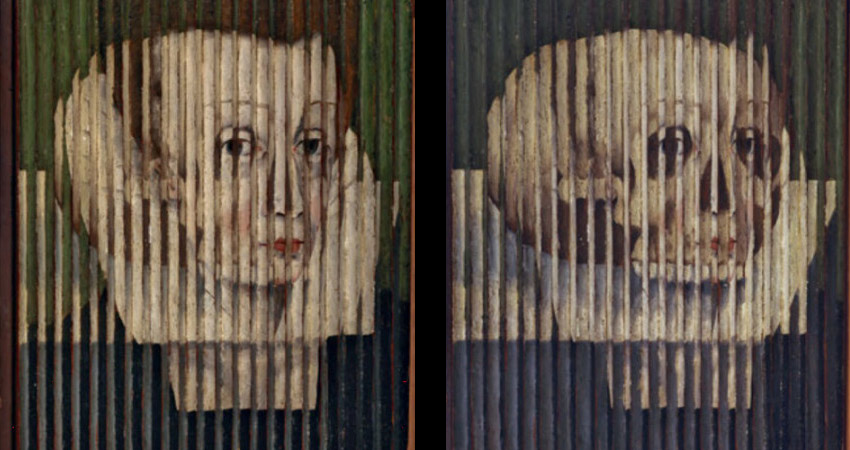

# Event streams & data legos

> "Composability is to software as compounding interest is to finance" - [@cdixon](https://twitter.com/cdixon/status/1451703067213066244)

<!-- toc -->

# Same data - different views

> "Data is the center of the universe; applications are ephemeral." - [The Data-Centric Manifesto](http://datacentricmanifesto.org/)

The public conversation shouldn't be fractured between platforms such as Twitter, YouTube & Reddit - instead it should be one but viewed through different lenses (based on moderation / indexing / visualization). The Twitter view of a discussion is basically the same as just the top level comments (without the children) in a Reddit thread. Segregated discussion in the open web serves nobody - there should be canonical IDs for events & information that we can all refer to. It doesn't make sense that comments can be arbitrarily disabled for some document on one platform (YouTube) but enabled on another one where a URL from the first is shared. All content could be interlinked, deduplicated, referencable, quotable, commentable & shareable.

<!-- Why arent pinterest and instagram just two different views? -->

<!-- Linkedin is literally an attestation network that allows the curation of your skills. Imagine if we merged all the web - you could effectively build your resume based on your public successes and expertise - expertise which is provable. Open global science -->

<!-- view all actions by an account on any platform -->

> "When identities become portable, backends become liquid" - [@balajis](https://twitter.com/coconidodev/status/1504850437727571974)

<!-- source of image: https://world3d.com/2020/06/the-history-of-lenticular/ -->

# Event streams

<!-- Our minds filter out inconsequential sensations by default but we may tune them in with focus - we should have even greater levels of control in the digital realm. The stream of events for whatever we are interested in needs the most sophisticated filtering and configuration possible and anyone should be able to plug into the global event bus and develop new tools. -->

In an open data environment anything could become an event stream as long as someone is willing to pay for the processing costs (filtration, transformation, storage):
- edits to a specific document identified by a URI
- references/mentions of an account/entity/word/URI in public documents
- any other type of filtration criteria - thresholds, exclude lists, etc.
- complicated streams can be constructed by transforming/joining others - similar to Kafka

If someone implements speech-to-text and starts transcribing audio episodes and publishing the output it would immediately become available to anyone and would automatically end up being parsed, indexed & pushed through data pipelines. Composability. This is not possible with closed platforms - even if someone was willing to pay the processing costs.

https://openai.com/blog/whisper/
https://news.ycombinator.com/item?id=32927360

# Notifications & subscriptions

Twitter decided that it needs to boost engagement and forced "recent tweet" notifications on us [without the ability to turn them off](https://www.reddit.com/r/Twitter/comments/qwvhhb/how_do_you_disable_recent_tweets_from_x/) - that needs to stop - explicit preferences should be honored.

> "Notifications are just alarm clocks that someone else is setting for you." - [@naval](https://twitter.com/NavalismHQ/status/1556179585347112961)

When identity is decoupled from the presentation layer we could have IDMs that align with our needs - we could fine-tune how and when we want to be notified. The incentive for an IDM is not to suck all of our attention (as opposed to applications that usually serve ads) - there are other ways to monetize. We'd be able to set a threshold or filter on anything. Subscriptions can be granular & multidimensional for any type of event stream - like `"show me everything from X unless from application A or message type T"`. Some IDMs could even offer the feature to show notifications only in specific time ranges of the day - for those addicted to dopamine hits.
