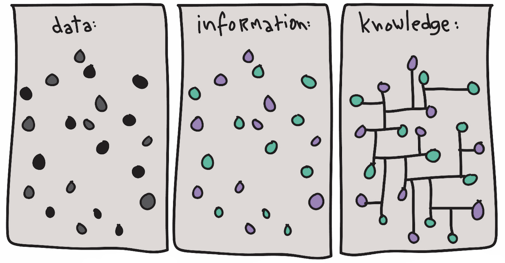

# Web 3: the [Giant Global Graph](https://en.wikipedia.org/wiki/Giant_Global_Graph)

<!-- toc -->

██████████████████████████████████████████████████████████████████
# a
██████████████████████████████████████████████████████████████████

██████████████████████████████████████████████████████████████████
# The [Semantic Web](https://en.wikipedia.org/wiki/Semantic_Web) (a.k.a. the original "Web3")
██████████████████████████████████████████████████████████████████

https://twitter.com/Golden
https://golden.com/blog/golden-raises-40m-series-b/

The biggest hurdle for its adoption has been the [host-centric](host_centric.md#the-host-centric-web--its-decay) paradigm and the hoarding of data in silos with no incentive for exporting & interoperability - Headjack changes that through [data-centric addressing](host_vs_data_centric.md) & broadcasting by default. While there will always be companies that enrich & tag data privately with their own ontologies and vocabularies to construct knowledge graphs for themselves, with open data by default and persistent URIs that always point to the same documents anyone will be able to broadcast similarly annotated versions of content with new URIs and relate them to the originals in a stable way for reuse by others. We can give birth to the public [Giant Global Graph](https://en.wikipedia.org/wiki/Giant_Global_Graph) outside of large centralized systems such as Google and Facebook. Machine learning for processing unstructured data has its place but it can only go so far - structuring through the use of different [message types](messages.md) and further annotations will make everything a lot more machine-readable.

<!--  -->

<!-- source:
https://www.theifactory.com/news/gaining-wisdom-from-data/
https://www.theifactory.com/wp-content/uploads/2019/01/Data-Wisdom.jpg
-->

> "If you want to find the secrets of the universe, think in terms of energy, frequency and vibration." - [Nikola Tesla](https://www.goodreads.com/quotes/361785-if-you-want-to-find-the-secrets-of-the-universe)

> "If you want to find the secrets of the Metaverse, think in terms of identities, events & graphs/relations." - [Nikola Tesla](https://www.goodreads.com/quotes/361785-if-you-want-to-find-the-secrets-of-the-universe)

> "The Semantic Web is an extension of the current web in which information is given well-defined meaning, better enabling computers and people to work in cooperation." - [Semantic Web Points, W3C](https://www.w3.org/2001/sw/EO/points#:~:text=Semantic%20Web%20Points-,The%20Semantic%20Web%20is%20an%20extension%20of%20the%20current%20web%20in%20which%20information%20is%20given%20well%2Ddefined%20meaning%2C%20better%20enabling%20computers%20and%20people%20to%20work%20in%20cooperation.,-The%20following%20is)

> "Letting your data connect to other people's data is a bit about letting go in that sense. It is still not about giving to people data which they don't have a right to. It is about letting it be connected to data from peer sites. It is about letting it be joined to data from other applications. It is about getting excited about connections, rather than nervous." - [Giant Global Graph, Tim Berners-Lee](https://web.archive.org/web/20160713021037/http://dig.csail.mit.edu/breadcrumbs/node/215#:~:text=Letting%20your%20data,rather%20than%20nervous.)

> "In the long term vision, thinking in terms of the graph rather than the web is critical to us making best use of the mobile web, the zoo of wildy differing devices which will give us access to the system. Then, when I book a flight it is the flight that interests me. Not the flight page on the travel site, or the flight page on the airline site, but the URI (issued by the airlines) of the flight itself. That's what I will bookmark. And whichever device I use to look up the bookmark, phone or office wall, it will access a situation-appropriate view of an integration of everything I know about that flight from different sources. The task of booking and taking the flight will involve many interactions. And all throughout them, that task and the flight will be primary things in my awareness, the websites involved will be secondary things, and the network and the devices tertiary." - [Giant Global Graph, Tim Berners-Lee](https://web.archive.org/web/20160713021037/http://dig.csail.mit.edu/breadcrumbs/node/215#:~:text=In%20the%20long,the%20devices%20tertiary.)

web 3.0 is a graph of identities & events in the cloud - beyond the confines of the host-centric web
web 3.0 is the original idea of the semantic web - the original web 3.0

ontology/taxonomy vs the knowledge graph
https://www.youtube.com/watch?v=7rn3P-RlN3s

accounts have their own concept/noun space with identifiers from 1 and upwards
others can define ontologies that use those concepts
others can make equivalence maps between ontologies & concepts

Social media 1.0 is a capitalistic artifact of gradient descent. Social media 2.0 is the Metaverse where data has no boundries

What if wikipedia was a common knowledge graph with different possible views for it?
Wikipedia 2.0 will be a crowdsourced knowledge graph

with common shared knowledge graphs we could do impact analysis for event prioritization and also root cause analysis and other graphs that perhaps represent someone's essay/thoughts could refer to the main shared graph - acting as an extension to it that can be considered in the context of the whole & analyzed

the semantic web is about replacing the statistical ranking and sporadic links in the web with something actually meaningful and unambiguous & semantic

not facts/concepts/rules - assertions!

what if we could crowdsource something like Cyc?
https://www.youtube.com/watch?v=kwYaj-1EVJ0

the semantic web was held back by the host-centric model and the lack of stable decentralized identities to which we could link/join data

reviving the semantic web

example: schema.org and their "identifiers" for relationships:
https://schema.org/knows
but this could be just 2 numbers: 1234:651

Episodes & other creations should get their concept id

The RDF format & the use of URIs means that most keys are long strings beholden to the host-centric model

Ontologies are a formal way to describe taxonomies and classification networks, essentially defining the structure of knowledge for various domains: the nouns representing classes of objects and the verbs representing relations between the objects.

Due to the scale-free effect there will be a power law distribution for the IDs being used - there will be a convergence - just like imdb movie ids are used in many places

The Metaverse is an MMO (massively multiplayer online) freeform information network - a giant global graph - a metabrain
https://en.wikipedia.org/wiki/Massively_multiplayer_online_game

massively multiplayer online relational database

There will be SQL interfaces on top of all of the data

think in terms of relations & joinability

https://en.wikipedia.org/wiki/Semantic_network

The metaverse is where your entire digital trail resides and underneath that is identity

concepts! not nouns
https://en.wikipedia.org/wiki/Concept

open graph protocol is an extremely simple ontology for semantic data
The embedded facebook like button in external pages makes use of OGP and is the largest generator of RDF triplets out there. The more you've annotated the content - the easier it is for Facebook to make sense of the data.
There's a difference from "they liked something on that page" from "they liked this specific shoe from a store sold by X"
With OGP, only entities like Facebook and the website owner get the structured data - with Headjack such public actions could be available for anyone to use - we'd get a lot more innovation & experimentation in algorithms that make use of the public data

The semantic web on top of extremely long & verbose host-centric URIs was bad
