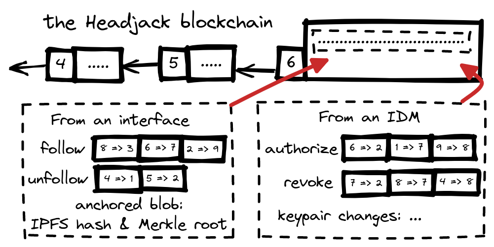
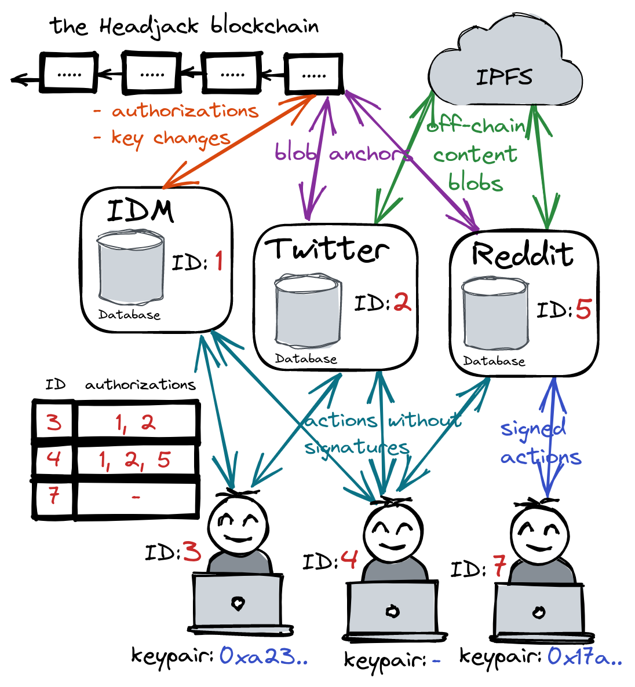

# Identity & authorization

There are 3 types of roles in Headjack (although a single entity may play all 3):
- Normal accounts - represented by an integer ID on-chain - keypair association is optional.
- [IDMs](IDM.md) - a superset of normal accounts - required to have a keypair - can manage other accounts by submitting changes for them (name handle, updating keypairs) & acting as [SSO](https://en.wikipedia.org/wiki/Single_sign-on) - authorizing interfaces to post on behalf of users (& ability to revoke the authorization). They will also be responsible for handling DMs as discussed [here](IDM.md#dms).
- Interfaces - a superset of normal accounts - required to have a keypair - they are the media presentation layer. Users can authorize them through the use of an [IDM](IDM.md) to post on their behalf without having to explicitly sign every interaction (follow, post, comment, react).

All authorizations are represented & submitted on-chain as simple integer pairs (`2131 => 83253, 6331 => 14415`) that get aggregated in compact blobs & signed in bulk by [IDMs](IDM.md) - achieving a very high signal-to-noise ratio (few signatures) ==> improving the throughput in the valuable block space.

With this foundation we achieve the following range of usage scenarios:

- Costs for using the blockchain can be shifted to [IDMs](IDM.md) & interfaces with business models to support that - users won't care that there's an underlying token (they'll always be able to interact with it directly through the mempool & pay for transactions if they wish).
- Users won't need wallets & keypairs - risky and cumbersome with multiple devices. Most will create accounts through [IDMs](IDM.md) & use email/pass or Web2 [SSO](https://en.wikipedia.org/wiki/Single_sign-on) (`"login with Google"`) which will create on-chain integer IDs for them without associated keypairs - "owned" by the custodian. Users will be able to "log in" to interfaces using their IDM as [SSO](https://en.wikipedia.org/wiki/Single_sign-on) for Headjack which will authorize the interface with a few bytes on-chain to post actions on behalf of users - all without requiring a single signature by the user - neither on-chain for the identity/authorizations (tiny bits of data - just integers & bit flags submitted by the [IDM](IDM.md)) nor for their off-chain content (posts, comments, reactions).
- Users can revoke permissions to interfaces and even retroactively invalidate activity generated on their behalf by an interface by saying `"discard activity generated through interface Y from block X forward"` through a small on-chain message published by their IDM because everything is sequenced. This is acceptable because in this blockchain [such data is non-financial](https://twitter.com/VitalikButerin/status/1530268923848839173) and fake activity has smaller consequences - it is still an enormous improvement compared to the current Web2 status quo.
- At any point in time users can regain full sovereignty over their identities by binding a keypair through their [IDM](IDM.md). Then they'll be able to cut that IDM off (revoke access) & even retroactively invalidate actions from it through another IDM or direct on-chain transactions.
- Users can be completely anonymous by directly creating an identity with a keypair & paying for an on-chain transaction. They'll be able to use [IDMs](IDM.md) without having to sign with email/pass or a Web2 [SSO](https://en.wikipedia.org/wiki/Single_sign-on) - not revealing anything.
- Interfaces will be usable by users that don't use an [IDM](IDM.md) but all their off-chain activity (posts, comments, reactions) will need explicit signatures.

So at the core of it all is just sequencing relations between integers & Merkle roots for content.

In practice, we expect that only cypherpunks & people that have something to lose (big audience/reputation) will go through the trouble to manage a keypair. Almost everyone will use [IDMs](IDM.md) - even most crypto natives don't want to explicitly sign every action and have their keys in hot wallets ready to get hacked. This way 99.9% of the user activity on-chain (mostly authorizations) ends up going through authorized services and gets batched in a compact way - requiring only that the service signs the aggregated payload and thus reducing the amount of signatures on-chain.

The vast majority of users will be lightweight: consumers & curators of content (through interactions & reactions) with very little creation on their part and little to no audience. At any point in time, they could shift to a more vocal role and start caring about archiving their off-chain data and not relying on the good grace of the infrastructure that sits beneath interfaces.

> "The internet is the computer but it's missing identity and [acls](https://en.wikipedia.org/wiki/Access-control_list)." - [koalaman](https://news.ycombinator.com/item?id=25734612).

Key & session management (rotation, authorization & revocation) [require](https://blog.ceramic.network/key-revocation-in-self-certifying-protocols/) ordering that is [logically centralized](https://medium.com/@VitalikButerin/the-meaning-of-decentralization-a0c92b76a274). It is compatible with any type of [DID](https://www.w3.org/TR/did-core/) - anything could be associated with an integer ID. The on-chain authorization has incredible synergy with the human-readable & persistent [addressing](addressing.md) for off-chain content.
