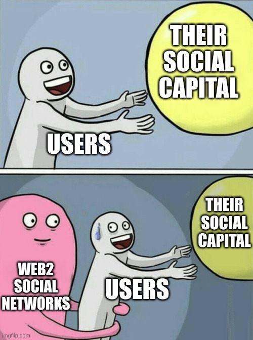

# Incentives & algorithms

<!-- toc -->

██████████████████████████████████████████████████████████████████████████████
# problems
# incentives & the status quo
██████████████████████████████████████████████████████████████████████████████

> "Legacy structures of information control have dominated the first decades of the Internet. The evidence suggests that this situation must change." - [The End Of Propaganda - The Consilience Project](https://consilienceproject.org/the-end-of-propaganda/#:~:text=Legacy%20structures%20of%20information%20control%20have%20dominated%20the%20first%20decades%20of%20the%20Internet.%20The%20evidence%20suggests%20that%20this%20situation%20must%20change.)

> "According to technical legal definitions provided by psychologists, so-called “persuasive technologies”—especially social media—have crossed the threshold from persuasion to coercion." - [Social Media Enables Undue Influence - The Consilience Project](https://consilienceproject.org/social-media-enables-undue-influence/#:~:text=according%20to%20technical%20legal%20definitions%20provided%20by%20psychologists%2C%20so%2Dcalled%20%E2%80%9Cpersuasive%20technologies%E2%80%9D%E2%80%94especially%20social%20media%E2%80%94have%20crossed%20the%20threshold%20from%20persuasion%20to%20coercion.)

The public commons are gatekept and harvested by a select few platforms - we need to democratize access to what is public already

fragmentation

The great attention misallocation

today's media is an attention hijacker - one that shows us what is salient to us, but not necessarily what's true

Current social media is garbage- garbage in, garbage out

We as a society dont know ourselves en masse - only a few companies are in that position

Context switching is terrible for the brain - Twitter is an ADHD/ADD machine

We're the cattle and the platforms are our ranchers
The media incentive alignment problem: what we're allowed to do with public data with no programmatic access to it
"realigning incentives"
By severing the connection between identity management and media we can better align the incentives of these systems - our IDMs would not be harvesting our attention and we could tune the addictiveness & notifications

the host-centric model allows for platforms to own our content, which leads to misaligned incentives:
time spent: user disempowerment - everything is AI controlled & recommender systems all the way down - attention maximization
time well spent: user empowerment in being able to control what they want to see & how much of it

> "He who controls identity controls the (social) world." - [Jordan Hall](https://deepcode.substack.com/p/sovereignty-as-a-service#:~:text=He%20who%20controls%20identity%20controls%20the%20(social)%20world.)

YouTube recently removed the option to sort the videos of a channel by oldest first - because why not - because they can.

the great attention misallocation - we all think certain issues don't get enough coverage or that other types of content get oversized & undeserved attention - we need to take control of the architecture of virality and the first step is actually having a choice.

VERTICAL INTEGRATION:
    Youtube now has posts like twitter where you talk to your subscribers - why a separate network ?! why are all these platforms reinventing the same features ?!

    Why does spotify need to build video streaming to compete with youtube?

when twitter decide engagement is low they shove down your throat nonsense algorithmic "recent tweets" notifications you can't turn off - that's what it has devolved into. "See less often" from the dropdown menu does nothing. Misaligned incentives.

> "Unfortunately, you cannot turn off recent tweets. This is because the feature drives up “user engagement”, which is a key metric that shareholders pay attention to." - [source](https://thisinterestsme.com/recommended-tweets/)

██████████████████████████████████████████████████████████████████████████████
# Ultimate scarcity: time & attention
██████████████████████████████████████████████████████████████████████████████

`"Attention Is All You Need"`
"attention is all we have"

> "Our minds are hurt more often by overeating than by hunger." — Petrarch

> “To be everywhere is to be nowhere.” ― Seneca

> "What information consumes is rather obvious: it consumes the attention of its recipients. Hence a wealth of information creates a poverty of attention, and a need to allocate that attention efficiently among the overabundance of information sources that might consume it." - Herbert A. Simon

██████████████████████████████████████████████████████████████████████████████
# recommender algorithms
██████████████████████████████████████████████████████████████████████████████

Algorithms could use this liquid interest network to amplify and prioritize certain people on the loud speaker - I bet Daniel Schmat would rank quite high - something the youtube algo wouldnt do

██████████████████████████████████████████████████████████████████████████████
# section 230 and empowering the user to choose
# Recommender algos, choice & section 230
██████████████████████████████████████████████████████████████████████████████

we should shift curation from explicit moderation by people to tagging & filtration preferences by the consumer

TODO: integrate these 2 (about the move from social/interest graph to recommendation algorithms):
https://twitter.com/jonwu_/status/1587462349018972161
https://twitter.com/alexeheath/status/1552401066444013568

choice vs algorithmic recommendation

recommender algorithms incentivise clickbait. Explicit follow graphs incentivise quality & explicit recommendations by people you follow

recommender systems & search engines should NOT give you "other things you might be interested in" interleaved with the results for a specific query just to get you more engaged - but that's something YouTube is doing. You didn't ask for that but you got it

misaligned incentives

on attention:
https://gurwinder.substack.com/p/the-intellectual-obesity-crisis

the 2 sides of "the consumer is always right":
- the brain stem one - whatever they engage the most with is the right thing
- the frontral cortex one - whatever they explicitly choose is the right thing

# Vertical integration vs markets/competition

Platforms do almost everything in-house in a closed way as providing access to third-party companies to their data to solve specific problems is hard due to complications around data privacy/regulation and the need to safeguard their competitive advantages & trade secrets.

This leads to:
- lack of cooperation, interoperability, duplicated effort & stifled innovation
- competition for scarce talent which leads to sub-par solutions
- company bloat & inefficiencies
    - companies are harder to manage as they are way bigger than what they could be
    - bigger size demands higher revenue - pricing out many business models
- differences in functionality between platforms => complexity for users

Contrast that to open protocols & exportable data where anyone can specialize, innovate & provide the best possible service for a specific vertical & sell it to others. The move from [host to data-centric](host_vs_data_centric.md) addressing and open blockchains enable [interoperability](https://balajis.com/yes-you-may-need-a-blockchain/) and composability.

# Growth, network effects & monopolies

Social media platforms are growth-at-all-costs stories because the goal is to achieve a network effect first and become a monopoly with a [MOAT](https://www.investopedia.com/ask/answers/05/economicmoat.asp) at which point the user [value extraction](https://twitter.com/cdixon/status/1473859531343949824) and cannibalization of ecosystems built on top of APIs can ramp up ([1](https://www.siliconrepublic.com/enterprise/twitter-apis-ending), [2](https://nordicapis.com/twitter-10-year-struggle-with-developer-relations/), [3](https://techcrunch.com/2015/05/06/meerkat-founder-on-getting-the-kill-call-from-twitter/), [4](https://techcrunch.com/2018/04/02/instagram-api-limit/), [5](https://mashable.com/article/gmail-ifttt-shutdown-google), [6](https://www.forbes.com/sites/benkepes/2015/04/11/how-to-kill-your-ecosystem-twitter-pulls-an-evil-move-with-its-firehose/?sh=4cd97d0f61d3)). At that point innovation is less necessary (+ is harder due to inertia) and even the quality of service may degrade. User data is the most valuable commodity and scale enables the best AI models & efficiency of value extraction in the advertising model which comes with a slew of problems & perverse incentives.

    

<!-- https://www.economist.com/leaders/2017/05/06/the-worlds-most-valuable-resource-is-no-longer-oil-but-data -->

Users are usually locked-in and effectively have no [voice and exit](https://twitter.com/balajis/status/1548725591687303168) either because:
- the network effects are insurmountable for incumbents and there are no alternatives
- or if they leave for an alternative service they'd lose all their connections, audience & reputation and would have to start from scratch

    

<!-- users
their social capital
Web2 social networks
https://imgflip.com/memegenerator/Running-Away-Balloon -->

> "I think it might be reasonable to believe that single monolithic companies shouldn’t have monopolies on certain data that practically guarantees user lock-in. And that the internet might be better if some data were made completely open and available to any developer who wants to build on it while ensuring that the data can’t be edited by anyone that isn’t supposed to be able to edit it." - [source](https://mirror.xyz/0xE4f646F0Be4fF5ce185540F5366295f91d75b65D/-xpmr7ceHmi5Hqsl7zRtig9ph_dtCvWjZOoWOVN0bcg)

> "Twitter was supposed to be a protocol allowing anyone to build products and services on top of it that drive value back to the parent company and investors. But it wasn’t a real protocol. It only pretended to be. As soon as the people behind the scenes changed their minds about what they wanted Twitter to be, the “protocol” side of Twitter got shut down. While this ruined a lot of businesses built on top of it at the time, it was perfectly predictable. Before web3, it was near impossible to build real application-specific protocols on the internet. And counter to the beliefs of the biggest web3 critics, web3 does allow you to build real, open, and neutral protocols." - [source](https://mirror.xyz/0xE4f646F0Be4fF5ce185540F5366295f91d75b65D/-xpmr7ceHmi5Hqsl7zRtig9ph_dtCvWjZOoWOVN0bcg)

# The cold start problem for startups

The barrier to entry for most types of platforms is very high:
- kickstarting a network effect & attracting a critical mass is very difficult
- need to reinvent the wheel & [vertically integrate](TODO.md#vertical-integration-vs-specialization--competition) many aspects instead of composing a service from already existing solutions

And thus few companies are started and even fewer are successful - leading to little innovation, slow progress & sub-par services.

<!-- TODO: data network effects -->

Check out the [startup case study](startup_case_study.md) expanding on why it would be easier with Headjack.
