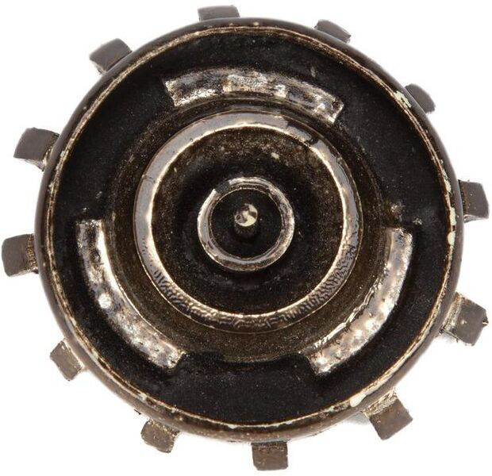

# Headjack - the base layer of cyberspace

Headjack is an [open state database](https://twitter.com/balajis/status/1123092897664880640) designed for [web-scale](introduction/web_scale.md) social media (in the billions of users) that addresses the most fundamental pieces of the puzzle: identity, connections, names and [content addressability](addressing/addressing.md) with stable & readable paths resembling [URNs](https://en.wikipedia.org/wiki/Uniform_Resource_Name) (instead of hashes) all packaged in a credibly neutral economically self-sustaining blockchain. It is [aiming](introduction/ambition.md) to disaggregate the giants and end network effect monopolies & data silos by aligning incentives and striking the right balance of tradeoffs - there will be no mass adoption without retaining the comforts and UX of Web2 that we've become so accustomed to.

Web3 is often associated with user ownership of networks/services/data, governance, NFTs & micropayments, and while all of them will play a part in it, the main aspect is the distribution of power around identity and [making it sovereign](https://twitter.com/balajis/status/1162401646258749441) - the metaverse is about connected entities that interact with information under a common global namespace and surf the web through competing interfaces & views that present & filter commonly addressable data in any way imaginable.

    

