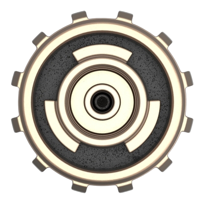

# Headjack - the base layer of cyberspace

<!-- <object width=100% data="images/Untitled-2022-06-08-1154.svg"></object> -->

<!-- 
 -->
<!-- add # before include for the preprocessor to work -->
<!-- {{include images/Untitled-2022-06-08-1154.svg}} -->
<!-- 
 -->
<!-- have to manually remove the size of the svg tag from the file after each export -->
<!-- also should replace href="https:// with href=" after each export -->
<!-- https://github.com/rust-lang/mdBook/issues/773 -->

Headjack is a blockchain that links sovereign identities to content at [web-scale](principles.md#web-scale-blockspace--the-unix-philosophy). Key points:

- Creation is fundamentally different from transfers and exchange of value - the design space around trust & data availability for media and identity is different from finance.

<!-- 
It is not about less or more trust but about better trust.

Headjack is about better trust - not trustlessness

creational - not transactional

# Motto: <s>TRUSTLESS</s> ***BETTER TRUST***

Headjack does sequencing of events.

Breaking apart identity and media allows for better incentives

it does not deal with storage and neither with routing - any kind of routing can be implemented on top of it with the advantage of addressing content in bulk or by source (publisher or creator)

 -->

- Following the [UNIX philosophy](https://en.wikipedia.org/wiki/Unix_philosophy) - in Headjack identity is simply an identifier (unique number) and anything orthogonal (KYC, profiles, privacy) can be layered on top of it.

- It solves single sign-on and allows for user experience similar to Web2 through [hierarchical authorization management](identity.md) - keypairs are not required by default and even those with keys bound to their accounts may choose to not explicitly sign every interaction.

- Consensus is reached on the absolute bare minimum - the history of authorizations, names, keys & off-chain content anchors (merkle roots) - the simplest mental model for developers.

- Headjack can support **billions** of accounts and link **unlimited** amounts of off-chain activity to them. The [entire web](principles.md#web-scale-blockspace--the-unix-philosophy) can be rebuilt on top of it - a claim that is [easily provable](numbers.md).

- [Content addressing](addressing.md) is with persistent & human-readable URIs (instead of hashes) - the link between identity and data is cryptographically provable even if keys & names have changed.

- It doesn't deal with off-chain data storage and retrievability - those are separate problems and Headjack simply lets entities point to ways for others to retrieve addressable content.

<!-- - The move from the current [host-centric](problems_with_the_web.md#the-host-centric-web) web towards [data-centric](host_vs_data_centric.md) addressing represents a paradigm shift around data ownership & access - an architectural reset of the internet. -->

# Book structure

- **What is Headjack** - How the protocol technically works and how things like applications, services, DMs, social graphs, preferences, etc. could be implemented - the building blocks necessary to recreate anything from Web2 and beyond.

<!-- how it compares with other projects -->

- **Why Headjack** - What's broken with the web and a blueprint of what could be possible - services, business models, infrastructure, algorithms, markets, metaverse, etc.

- **Implementation of Headjack** - A detailed specification of the implementation.

# What is Headjack

<!-- The following sub-chapters convey the idea (**what**) and a high-level view of how it works: -->
1. [Guiding principles & design goals](principles.md)
1. [Identity & authorization](identity.md)
1. [Messages](messages.md)
1. [Account preferences & graphs](account_preferences.md)
1. [Content addressing](addressing.md)
    1. [Host vs data-centric](host_vs_data_centric.md)
    1. [Blobs & persistent URIs](blobs_and_uris.md)
    1. [Names, paths, & more](names_and_paths.md)
1. [Storage & retrievability of data](store_and_retrieve.md)
1. [Blocks, state & proofs, oh my!](blocks_state_proofs.md)
1. [Throughput numbers (scaling)](numbers.md)
1. [How to think about Headjack](how_to_think_about_it.md)

    

Named after the [data port at the back of the head](https://matrix.fandom.com/wiki/Headjack) of synthetically-grown humans in the Matrix.

<!-- https://www.youtube.com/watch?v=DoUQhYDz-Ys -->
