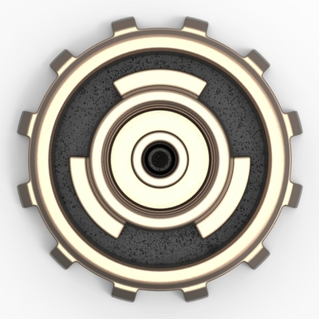

# Headjack (WIP) - the base layer of cyberspace

Headjack is an [open state database](https://twitter.com/balajis/status/1123092897664880640) designed for [web-scale](introduction/web_scale.md) social media (in the billions of users) that addresses the most fundamental pieces of the puzzle: identity, connections, names and [content addressability](introduction/addressing.md) with stable & readable paths resembling [URNs](https://en.wikipedia.org/wiki/Uniform_Resource_Name) (instead of hashes) all packaged in a credibly neutral & self-sustaining blockchain. It is [aiming](introduction/ambition.md) to disaggregate the giants and end network effect monopolies & data silos by aligning incentives and striking the right balance of tradeoffs. It is engineered from first principles - building up from the data to support billions of users and a [customer obsession](https://twitter.com/arvanaghi/status/1537519858233008128) for the best UX - there will be no mass adoption without retaining the comforts and UX of Web2 that we've become so accustomed to.

The following sub-chapters convey the idea (what):
- [On-chain vs off-chain](introduction/on_off_chain.md)
- [Core idea](introduction/core_idea.md)
- [Content addressing](introduction/addressing.md)
- [Web-scale & UX](introduction/web_scale.md)
- [Competition](introduction/competition.md)
- [The ambition](introduction/ambition.md)

But the vision would be incomplete without the subsequent [why](motivation/why.md) and [how](blockchain.md).

    

Inspired by the [data port at the back of the head](https://matrix.fandom.com/wiki/Headjack) of synthetically-grown humans in the Matrix.
