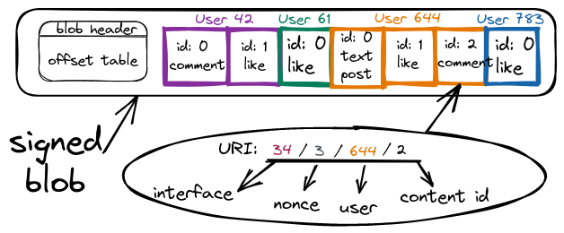

# Persistent & provable [URIs](https://en.wikipedia.org/wiki/Uniform_Resource_Identifier)

Each account has an associated auto-increment counter (nonce) for every time they submit an anchor for off-chain content. So if an interface has submitted 2 times already, then the next submission will be with `nonce == 3`. The blockchain keeps a mapping in its state for each previous nonce value to the block number when it changed so that `<interface_id>/<nonce>` can be translated to which block has the Merkle root anchor & [IPFS CID](https://docs.ipfs.io/concepts/content-addressing/) for the blob that corresponds to that nonce for that account. The 2 can be extracted from the historic block.
<!-- (the 2 could also be cached directly in the state) -->

Once a blob is fetched through the [IPFS CID](https://docs.ipfs.io/concepts/content-addressing/) (hash) we can address specific events by utilizing the offset index in the blob header so a URI such as `<interface_id>/<nonce>/<user_id>/<content_id>` can point to a specific post, comment or even reaction (activity is grouped by users). The content ID for a specific user is usually a small single-digit number and is necessary only if there has been more than 1 interaction by that user through that interface for the given nonce (maybe rare).

The blockchain can be queried if the interface was allowed to post content on behalf of the user through on-chain authorization (probably initiated by an [IDM](../implementation/ecosystem/IDM.md)) when that specific block was published in order to determine if the activity is authentic - the state keeps information for each account such as since what block number a given interface was authorized to post on behalf of a user (and until when - all ranges). Users may avoid using IDMs and explicitly sign their actions in which case their data will be accompanied by signatures within the data blobs and the only check required will be for the user keypair used for the specific block number. To recap - to prove the authenticity of any event:
- First check if the data is actually part of an anchored blob with a [Merkle proof](https://medium.com/crypto-0-nite/merkle-proofs-explained-6dd429623dc5) to a block.
- Then check if the user actually submitted the event:
    - Either if at that point the interface was authorized to post on behalf of the user which would require a Merkle proof for a part of the blockchain state (authorization ranges).
    - Or by checking for an explicit signature & the public key of that account at that time which would also require a Merkle proof for a part of the blockchain state (account key history).

---

Most of the cryptography checks will be happening instantly as blobs are published & ingested by interface infrastructure & stored in more optimal database formats for content to be later directly served. Users will always be able to request an on-chain proof for any event and the Merkle proofs will probably be regenerated on the fly to avoid storing them. 
Note that there can be many different & valid Merkle proofs for the same URI from different blockchain states at different block heights.

This is what makes URIs persistent - as long as someone hosts the content it will always be identifiable with the original URI from when it was posted using Merkle proofs & the blockchain (either a specific URI + a Merkle proof or the entire blob should be stored). The [following chapter](names_and_paths.md) shows how names in the URI paths are persistent too (even if user/interface names change ownership at some point).

Users should be able to check the URI of content even if created through a different interface and ideally the origin should be displayed by default - acting as attribution for other platforms.

Edits & updates to content come as [messages](../implementation/ecosystem/messages.md) with new unique URIs that reference the older message URIs and it is up to interfaces to properly display the context that there have been changes and perhaps the ability to view the old or automatically redirect to the latest. "Forks" are possible but they represent interface failure to detect that an old version is being edited.

# How to retrieve blobs & content for a URI

There are multiple ways to retrieve blobs & content for specific URIs from the past:
- The original [IPFS CID](https://docs.ipfs.io/concepts/content-addressing/) might still be retrievable from the original interface account that posted it or any other that has pinned the data.
- The user account might be using an archival service for all their activity and they can point to that archival service on-chain in their account for others to retrieve their messages.
- Other well-known players without a direct on-chain connection to the interface/user in a URI could be asked if they have the content:
    - Infrastructure companies that do the heavy lifting for interfaces and store everything.
    - The analog of the [Internet Archive](https://en.wikipedia.org/wiki/Internet_Archive) in this ecosystem also stores everything.
- IPFS can be forked & reused with the following change: instead of delivering content based on the [CID](https://docs.ipfs.tech/concepts/content-addressing/) hash it can deliver the data + the necessary merkle proofs based on the hash of Headjack URIs (they are unique) - any individual off-chain message that's been anchored would be retrievable as long as someone is hosting it in the new p2p network (which will need bootstrapping - could be part of Headjack nodes). However, this won't be very performant due to the granular nature of individual messages with a URI and the use of a global [DHT](https://en.wikipedia.org/wiki/Distributed_hash_table).

---

Interface accounts can point on-chain to a traditional host which should be used to display content published through them. As you'll see in the next chapter interface names can also resemble traditional domain names so it will be possible to copy-paste such URIs directly into your browser as long as they own the same domain in the traditional [DNS](https://en.wikipedia.org/wiki/Domain_Name_System) and they should be able to serve a webpage displaying the specific piece of content.

<!--
# On proof permanence

One thing to consider is if a user revokes the authorization of an interface to post on their behalf retroactively - not just going forward but also invalidating all anchored content & follow/unfollow events for the last couple of days through that interface. This would mean that cached Merkle proofs for such invalidated content will no longer be valid and the latest state of the blockchain will refuse to produce new such proofs, but the cached proofs could mislead someone. Retroactive revocation can happen only up to `X` days to limit the scope of changes to cached proofs & what infrastructure would need to handle but still give enough time for anyone to react in case an interface has posted fraudulent activity on their behalf - a **mostly theoretical concern**. Proofs for blocks older than `X` days are therefore considered permanent.
-->
