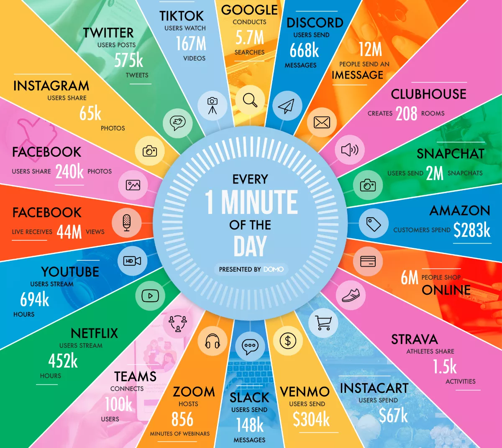
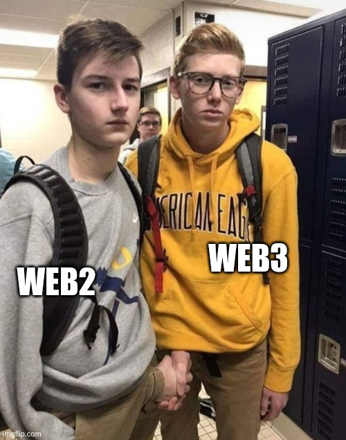

# Web-scale & UX

People grossly underestimate the size of the web and the type of infrastructure that's required - what is going on within a single minute of 2021 is [<ins>truly mind-boggling</ins>](https://www.techspot.com/news/91513-visualizing-minute-internet-2021.html) (this is an incomplete picture).

<!--  -->

<!-- infographic generated from these guys:
https://www.domo.com/learn/infographic/data-never-sleeps-9 -->

Here are some [twitter](https://www.internetlivestats.com/twitter-statistics/), [google](https://www.internetlivestats.com/google-search-statistics/) and [other](https://www.internetlivestats.com/) statistics from a **decade** ago. A peek behind what it takes to run Twitter is a good case in point: [1](http://highscalability.com/blog/2009/10/13/why-are-facebook-digg-and-twitter-so-hard-to-scale.html), [2](http://highscalability.com/blog/2013/7/8/the-architecture-twitter-uses-to-deal-with-150m-active-users.html), [3](https://blog.twitter.com/engineering/en_us/topics/infrastructure/2016/the-infrastructure-behind-twitter-efficiency-and-optimization), [4](https://blog.twitter.com/engineering/en_us/topics/infrastructure/2017/the-infrastructure-behind-twitter-scale), [5](https://blog.twitter.com/engineering/en_us/topics/infrastructure/2021/processing-billions-of-events-in-real-time-at-twitter-). All of this infrastructure is not just about handling enormous amounts of data but also about great UX & responsiveness: `"Latency is not an option anymore"` - Amazon [found](https://www.gigaspaces.com/blog/amazon-found-every-100ms-of-latency-cost-them-1-in-sales) that every 100ms of latency cost them 1% in sales. Google [found](http://glinden.blogspot.com/2006/11/marissa-mayer-at-web-20.html) an extra 500ms in search page generation time dropped traffic by 20% - 16 years ago - our irritable nature probably hasn't changed.

It is highly improbable that the masses (and even most crypto natives) would tolerate services that are much worse (slow, limited & cumbersome) and [most of the competing attempts for decentralizing media](competition.md) are nowhere close. We need to be realistic and focus on the essence - Headjack decentralizes only the most important part of monopolies - the identity & interest graphs and thus leveling the playing field for competition. It accomplishes this by compact graph representation and avoiding the need for keypairs & signatures by default through an on-chain authorization mechanism while maintaining the optionality for anyone to be fully self-sovereign & explicit - acting as a base layer for competing & interoperable services. It also facilitates data-centric addressing of content under a global namespace which further disincentivizes hoarding data in silos. But Web2 isn't going anywhere - [`"market dynamics and the fundamental forces of centralization"`](https://moxie.org/2022/01/07/web3-first-impressions.html) dictate that the best services will be running on huge server racks in data centers with sophisticated caches & batch processing infrastructure behind familiar UX. The difference will be that users will be able to cryptographically prove content and will be able to leave any of these interfaces for better ones if their offering degrades.

Anyone would still be able to run software locally, browse the ecosystem, and fetch content & interactions from entities they've subscribed to (although quite bandwidth-intensive), but their experience will be extremely limited in that they won't be able to run any sort of query/filtration/feed algorithm at scale nor aggregate the activity of billions of people in real-time.
