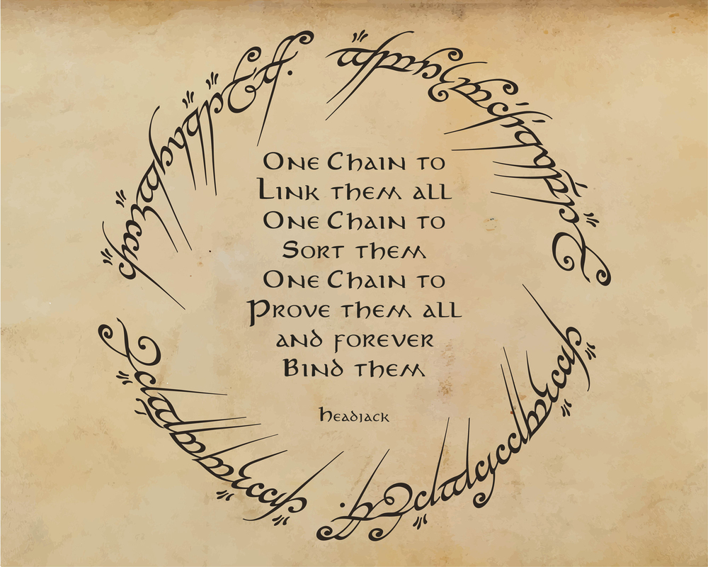

# Goals, mission & ambition

<!-- toc -->

Evolution is 99.9% memetic at this point & accelerating exponentially. If finance is the [market for promises](https://anthonyleezhang.substack.com/p/the-market-for-promises), then media is the battleground of ideas and is just as fundamental.

At the root of our greatest challenges are [coordination failures](https://slatestarcodex.com/2014/07/30/meditations-on-moloch/). We are like an ant colony suffering from multiple personality disorder - trapped in multipolar traps, segregated into fabricated factions, oblivious to game theory/markets/economics/history, plagued by short-sightedness & nihilism, playing status games, and running exponential processes in a finite world.

The ability to cooperate flexibly in large numbers has led us to an evolutionary advantage - first through stories and then [markets, clocks](https://www.ribbonfarm.com/2019/02/28/markets-are-eating-the-world/
) & [bits](https://a16z.com/2011/08/20/why-software-is-eating-the-world/). Any mechanism that makes those more efficient will benefit the species. If the internet is the information super highway, blockchains are the cooperation super highways and can play a major role in upgrading our systems of trust. We're just neurons but we can bootstrap the global collective consciousness through trust & coordination - the hivemind.

https://twitter.com/sreeramkannan/status/1573832256577224705

> "The medium is the message" - [Marshall McLuhan](https://en.wikipedia.org/wiki/The_medium_is_the_message) proposes that a communication medium itself, not the messages it carries, should be the primary focus of study.

# Goals

Headjack wants to:

- [distribute power](https://twitter.com/balajis/status/1554228316181127169) and let people have a [choice](possibilities.md#forking-media--communities) - identity should belong to no one
- rebuild & scale up trust through [authenticity](authenticity.md) and build the [ledger of record](https://twitter.com/balajis/status/1459140902144729088)
- revive the [semantic web](possibilities.md#the-semantic-web-aka-the-original-web3), [deduplicate content & enable traceability](authenticity.md#deduplicating-documents--traceability)
- improve transparency - ["Sunlight is the best disinfectant"](https://en.wiktionary.org/wiki/sunlight_is_the_best_disinfectant)
    - [virality, feeds & algorithms](problems_with_the_web.md#black-boxes--algorithmic-bias) needs to be politically & content-neutral
- break the [vertical integration](problems_with_the_web.md#vertical-integration-vs-specialization--competition) through interoperability & markets - allow for specialization
    - lower the barrier to entry for innovation - the design space is limitless
    - enable alternative business models - the monopolistic ad economy is a paperclip maximizer with huge cultural repercussions
- [enable](possibilities.md#query--plot-anything) super users to separate signal from noise through open data & better tooling
- empower storytellers by [improving books and publications](possibilities.md#the-future-of-publishing-knowledge--learning)
- make infrastructure more resilient through [redundancy](possibilities.md#redundancy-scaling--topological-flexibility) and p2p content-addressing
- slay [Moloch](https://slatestarcodex.com/2014/07/30/meditations-on-moloch/) - the god of coordination failures & multipolar traps

> "Even a billion dollars of capital cannot compete with a project having a soul." - [@VitalikButerin](https://vitalik.ca/general/2020/12/28/endnotes.html)

<!-- # Mission: <u><i>Free data from the host-centric model by linking it to sovereign identity at scale.</i></u> -->

# Mission: <u><i>Unbundle media & end the host-centric model by linking data to identity at scale.</i></u>

<!-- > "Our mission is to organize the world's information and make it universally accessible and useful." - [Google](https://about.google/) -->

    

<!-- linking data to identity without keys at scale
unbundling monopolies, decentralizing media & rearchitecting the web
Headjack
Users & devs
https://imgflip.com/memegenerator/144961820/Trojan-Horse -->

# Ambition

Web3 is often associated with user ownership of networks/services/data, governance, NFTs & micropayments, and while all of them will play a part in it, the main aspect is the distribution of power around identity and [making it sovereign](https://twitter.com/balajis/status/1162401646258749441).

<!-- 

It is an informational gravity well with a strong network effect that would suck all data to be cryptographically anchored to it

Headjack has an ecosystem effect - a product network effect, and identity is at the core of it. Case Study: Dropbox vs. Google Drive
https://blog.niraj.io/the-ecosystem-effect

-->

<!-- TODO: browser in the driver/filesystem/OS analogy? -->

[IPFS](https://en.wikipedia.org/wiki/InterPlanetary_File_System), [Filecoin](https://en.wikipedia.org/wiki/Filecoin), [Sia](https://sia.tech/) & [Arweave](https://arwiki.wiki/) are the drivers, Headjack is the filesystem, and the collection of applications & services built on top will be the global OS. Moving to a data-centric model where everything is addressable under a common global namespace would force applications to be [interoperable](https://balajis.com/yes-you-may-need-a-blockchain/).

> "Composability is to software as compounding interest is to finance" - [@cdixon](https://twitter.com/cdixon/status/1451703067213066244)

Headjack [definitively](https://boxkitemachine.net/posts/zero-to-one-peter-thiel-definite-vs-indefinite-thinking/) aims to be the backbone of the entire public web - the [ledger of record](https://twitter.com/balajis/status/1459140902144729088) where all content is cryptographically anchored and totally ordered. The confluence of human-readable & persistent addressing, indexing, identity, names, and the interest graph results in a winner-take-all network effect with unprecedented gravity that can organize the world's data - [`@naval: "The internet creates 1 giant aggregator for everything"`](https://youtu.be/3qHkcs3kG44?t=3527). It can succeed in completely decentralizing [DNS](https://en.wikipedia.org/wiki/Domain_Name_System) and disaggregating traditional platforms such as Twitter, Reddit, YouTube & Instagram through unbundling, reconstruction & interoperability on top of Headjack's building blocks by mixing and matching various presentation layers, architectures, business models, content moderation policies, etc. [`"The whole is greater than the sum of its parts."`](https://www.goodreads.com/quotes/20103-the-whole-is-greater-than-the-sum-of-its-parts)

Headjack is the [15th and final](https://xkcd.com/927/) standard for decentralized identity and media - just because it's a lot of work doesn't mean we shouldn't be building on the right foundation. It is the supermassive digital gravity well and is going after the entire web as the coordination substrate of [cyberspace](https://www.eff.org/cyberspace-independence).

The outcome is binary - **`success`** or **`failure`** and is worth trying despite the odds.

<!--
One Chain to
Link them all
One Chain to
Sort them
One Chain to
Prove them all
and forever
Bind them

Headjack
-->

<!-- 
In a society with faltering institutions, rotted from within and mistrusted from without, the chance to finally replace our banks and internet giants (not to even delve into politics) with a new set of characters is too tempting to resist.

Few tech giants of the past have ever been unseated from their dominance via competition alone: Microsoft never lost the desktop, Google never lost search, Twitter has never lost the public square, Amazon will never lose e-commerce, and Apple will never lose mobile devices. The only way to get out from under those weary giants is creating a new playing field and absolutely dominating it before they figure out what’s going on.
https://www.thepullrequest.com/p/everything-is-an-ad-network -->
