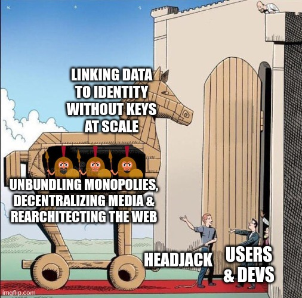
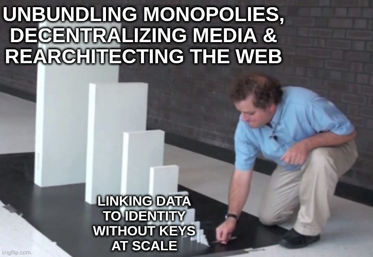

# Why Headjack

<!--  -->

<!-- linking data to identity without keys at scale
unbundling monopolies, decentralizing media & rearchitecting the web
Headjack
Users & devs
https://imgflip.com/memegenerator/144961820/Trojan-Horse
https://imgflip.com/memegenerator/162372564/Domino-Effect -->

The web is broken on many fronts - this chapter explores many problematic aspects and how they can be completely solved or at least improved. Headjack's paradigm is an architectural reset of the web & opens doors to things which weren't possible before.

1. [Problems with the current web](problems_with_the_web.md)
1. [Today's information ecology](information_ecology.md)
1. [Event streams & data legos](data_legos.md)
1. [The ledger of record](ledger_of_record.md)
1. [Improved infrastructure](improved_infrastructure.md)
1. [Knowledge management](knowledge_management.md)
1. [Algorithms, feeds & aggregation](algorithms_feeds_aggregation.md)
1. [Business models](business_models.md)
1. [Startup case study](startup_case_study.md)
1. [Concerns with Headjack](concerns.md)
1. [What really is Headjack](what_really_is_headjack.md)

> "Millions saw the apple fall, but Newton was the one who asked why." - [Bernard Baruch](https://www.brainyquote.com/quotes/bernard_baruch_122011)

https://www.google.com/search?q=start+with+why

https://www.google.com/search?q=the+golden+circle

> "One of the things I've always found is that **you've got to start with the customer experience and work backwards for the technology.**" - [Steve Jobs](https://www.youtube.com/watch?v=916Ye9XmIjI)

<iframe style="position: absolute;top: 0;left: 0;width: 100%;height: 100%;" src="https://www.youtube.com/embed/916Ye9XmIjI" title="YouTube video player" frameborder="0" allow="accelerometer; autoplay; clipboard-write; encrypted-media; gyroscope; picture-in-picture" allowfullscreen></iframe>

<!-- > "Ideology scales like software." - [@balajis](https://twitter.com/balajis/status/1604055568851038209) -->

<!--
Managing information as a sub-chapter name?

The building blocks of media are:
- data tied to identities
- preferences (which are also data)
- the public/private spectrum for data
- credentials & attestations
- the public/private spectrum

-->
