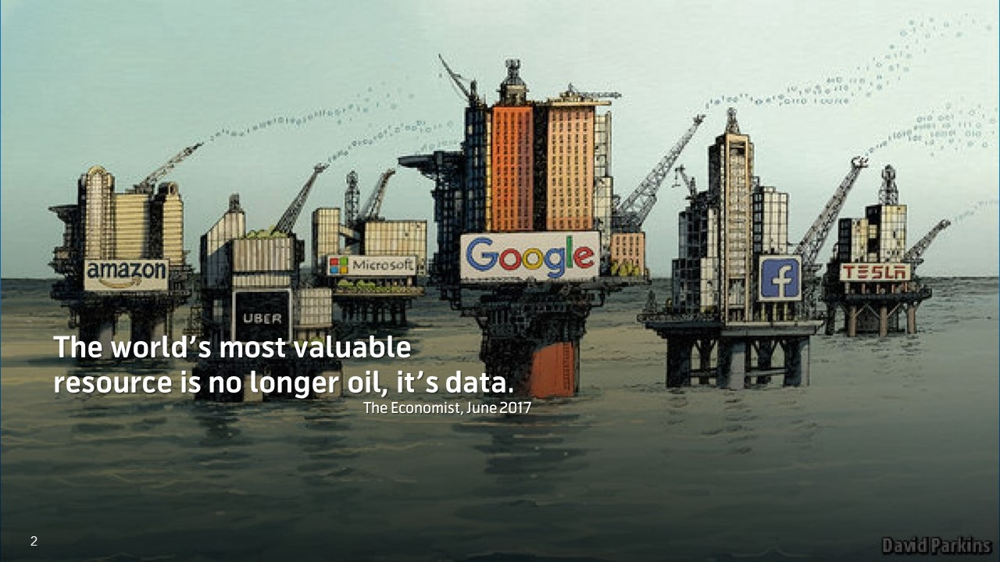

# Problems with the current web

This is a non-exhaustive list of some of the most obvious problems.

## The host-centric web

One major problem of the current internet architecture is that documents are host-certified and communication happens through the [end-to-end principle](https://en.wikipedia.org/wiki/End-to-end_principle) - we refer to data by location instead of contents. The consequences are explained in the [host-centric](../introduction/host_centric.md) page (contrast that to [data-centric](../introduction/data_centric.md)).

## Black boxes & algorithmic bias

The recommendation algorithms & the interest graph are the architecture of virality - the dynamics of amplification & interaction dictate how ideas surface, propagate, compound & evolve. The people writing the algorithmic feeds are the most powerful in the world - [@naval](https://youtu.be/3qHkcs3kG44?t=3616).

Ephemeral experiences such as search suggestions & results leave no trace and it's extremely hard to prove bias as [Dr. Robert Epstein](https://en.wikipedia.org/wiki/Robert_Epstein#Contributions_to_Internet_Studies) would [attest](https://open.spotify.com/episode/4q0cNkAHQQMBTu4NmeNW7E) - there is 0 accountability.

> "But we believe the issue of advertising causes enough mixed incentives that it is crucial to have a competitive search engine that is transparent and in the academic realm." - [the original Google search engine whitepaper](https://perma.cc/8GDJ-K6AX)

Does such a search engine exist today? Competition & a lower barrier to entry are direly needed.

The explicit user preferences such as subscriptions & the interest graph (following/connections) are routinely discounted in our feeds in favor of algorithm recommendations - platforms optimize for engagement & attention and not for utility & value to end users. We all respond to outrage & enjoy the occasional viral cat video but we should be able to tune & filter what gets shown to us. Have you ever heard a YouTuber tell you to hit the notification bell in addition to subscribing?

<!-- addictive social media - toxic -->

## Vertical integration vs specialization & competition

Platforms do almost everything in-house in a closed way as providing access to third-party companies to their data to solve specific problems is hard due to complications around data privacy/regulation and the need to safeguard their competitive advantages & trade secrets.

This leads to:
- lack of cooperation, interoperability, duplicated effort & stifled innovation
- competition for scarce talent which leads to sub-par solutions
- company bloat & inefficiencies
    - companies are harder to manage as they are way bigger than what they could be
    - bigger size demands higher revenue - pricing out many business models
- differences in functionality between platforms => complexity for users

Contrast that to open protocols & exportable data where anyone can specialize, innovate & provide the best possible service for a specific vertical & sell it to others. The move from [host-centric](../introduction/host_centric.md) to [data-centric](../introduction/data_centric.md) addressing and open blockchains enable [interoperability](https://balajis.com/yes-you-may-need-a-blockchain/) and composability.

## Growth, network effects & monopolies

Social media platforms are growth-at-all-costs stories because the goal is to achieve a network effect first and become a monopoly with a [MOAT](https://www.investopedia.com/ask/answers/05/economicmoat.asp) at which point the user [value extraction](https://twitter.com/cdixon/status/1473859531343949824) and cannibalization of ecosystems built on top of APIs can ramp up ([1](https://www.siliconrepublic.com/enterprise/twitter-apis-ending), [2](https://nordicapis.com/twitter-10-year-struggle-with-developer-relations/), [3](https://techcrunch.com/2015/05/06/meerkat-founder-on-getting-the-kill-call-from-twitter/), [4](https://techcrunch.com/2018/04/02/instagram-api-limit/), [5](https://mashable.com/article/gmail-ifttt-shutdown-google)). At that point innovation is less necessary (+ is harder due to inertia) and even the quality of service may degrade. User data is the most valuable commodity and scale enables the best AI models & efficiency of value extraction in the advertising model which comes with a slew of problems & perverse incentives.

    

Users are usually locked-in and effectively have no [voice and exit](https://twitter.com/balajis/status/1548725591687303168) either because:
- the network effects are insurmountable for incumbents and there are no alternatives
- or if they leave for an alternative service they'd lose all their connections, audience & reputation and would have to start from scratch

## Centralized & fragmented identity/preferences

Convenience & simplicity sought by users has lead to extreme levels of centralization of identity in just a few centralized players with network effects & [single sign-on](https://en.wikipedia.org/wiki/Single_sign-on) functionality.

> "as of 2018 the consolidation of power and control over the social web by a few large corporations seems unparalleled" - [Decentralizing the Social Web](https://hal.inria.fr/hal-01966561/document)

But despite the concentration of SSO services a lot of identity-related activity is fragmented between platforms due to the lack of standards & interoperability: settings/preferences, [direct messages](https://twitter.com/jonwu_/status/1524886818725847040), bookmarks, playlists, progress bars, etc.

> "Identity on the internet today is fragmented across many centralized services, each with its own set of user data. Signing up for a new service requires making a brand new identity and re-entering all of your information. This is not only tedious but also means that a user’s identity is going to be inconsistent between services because they are not always going to update key information on every single service every time that something changes." - [source](https://blog.sia.tech/skyid-how-to-make-decentralized-identity-using-skynet-2b282682f5b3)

[Linktree](https://en.wikipedia.org/wiki/Linktree) is just a bandaid for today’s fragmentation of identity ([valued at 1.3B$](https://techcrunch.com/2022/03/16/linktree-link-in-bio-series-c-valuation/)) - it is a symptom.

Contrast that to a world with interoperable & exportable identity/data:

> “each time we go from one social network to another we do not need to restate who we are, what our interests are, or who we know” - [Decentralizing the Social Web](https://hal.inria.fr/hal-01966561/document)

## The cold start problem for media startups

The barrier to entry for most types of media platforms is very high:
- kickstarting a network effect & attracting a critical mass is very difficult
- need to reinvent the wheel & [vertically integrate](#vertical-integration-vs-specialization--competition) many aspects instead of composing a service from already existing solutions

And thus few companies are started and ever fewer are successful - leading to little innovation, slow progress & sub-par services.

Check out the [startup case study](startup_case_study.md) expanding on why it would be easier with Headjack.

## Infrastructure centralization

Google is way more than just a search engine even though the majority of their revenue comes from advertising - they control large percentages of the plumbing of the web - key choke points such as submarine cables, routing, data centers, browsers, DNS, etc. [`David Vorick`](https://twitter.com/DavidVorick) puts this perfectly into perspective in [`The Worrying Depth and Scope of Censorship on the Internet`](https://blog.sia.tech/the-worrying-depth-and-scope-of-censorship-on-the-internet-ffd4bc5a5486) - some quotes:

> "If Google decides they don’t like you, then for 65% of the world you simply stop existing. You have no recourse.
The terrifying thing about this is that Google is not an elected entity. Google has turned themselves into unelected regulators of the Internet, and they are held accountable only to their own share price."

> "As our economy and services become more deeply intertwined, an increasing number of players have more influence and ability to de-platform a greater number of businesses and users. And these requirements compound against each other. If one service provider is particularly opinionated and quick to de-platform, everybody else is forced to give them a large amount of breathing room and become more oppressive towards their users to avoid potential conflict."

> "This does not scale. The end result will be a global monoculture where everybody is afraid to take risks or break the status quo because nobody can afford to upset even a single of the hundreds of services that they depend on. Our culture gets established and defined by giants like Facebook and Google rather than users and creators, because only Facebook and Google have the resources to bully everyone else into allowing changes to happen."

> "The only way to avoid this endgame is to demand infrastructure that remains neutral. At the scale of today’s Internet and global economy, infrastructure that does not remain neutral will inevitably turn on its users and coerce them into a set of moral standards that are both arbitrary and enforced without consent."

## Cultural fragmentation, filter bubbles & echo chambers

The same document may be published through different platforms and because of the host-certified web of today it will get multiple different URLs. Discussion around it becomes fragmented & shallow in the different platforms with separate comment sections and there isn't a way to de-duplicate & unify it. This facilitates polarization as separate echo chambers can form without seeing the opinion of other types of people.

<!-- Alienating large parts of the population & pushing them to alternative closed platforms is not a net benefit. -->

> "Echo chambers are intellectual oppression - as opposed to idea labs where ideas are treated as experiments." - [Tim Urban](https://www.youtube.com/watch?v=ivDwzBYsED4)

Instead imagine being able to view the entire discussion around a specific event by tracing & aggregating all of the re-publications, references & re-tweets & quotes of it from anywhere and applying any type of filter to that.

That is what interoperable identity, content-addressing & broadcasted data enables - we can connect and de-duplicate everything and allow anyone to build tools around that - constructing a much bigger graph that what Google have created for themselves.

## Moderation & censorship

This is an incredibly hairy topic with many aspects - here are just a few of them:

- No clear rules for moderation & censorship - the terms of service are ambiguous and an ever moving goal post. Platform accountability is practically non-existent:
    - account reach can be down-regulated through opaque techniques like [shadow banning](https://shadowban.yuzurisa.com/)
    - accounts can be removed subjectively (case in point: earlier Twitter accounts tracking Nancy Pelosi's public stock trades)
- There is no way for users to "fork" a Reddit community if they no longer agree with the way moderation is happening - they have to recreate a new subreddit from scratch.
- There is no market for solving certain types of spam such as financial scams - Twitter & YouTube are riddled with templatized messages and their internal [vertically integrated](#vertical-integration-vs-specialization--competition) teams are unable to deal with yet another problem in a world-class manner. In an open system such as e-mail the competition & innovation for solving spam has been tremendous.

## Problems with specific platforms

A non-exhaustive list of additional problems (beyond what's already listed) with some platforms:

- YouTube:
    - there is no longer a down vote count & like/dislike ratio
    - subscriptions are by now almost meaningless without the notification bell icon
    - the comment section is just an afterthought - they don't care about it
        - the presentation is extremely basic & limiting
        - you cannot even link to a specific comment with a URL
        - financial scams in comments are abundant - moderation is non-existent

- Twitter:
    - we can't even sort the tweets of someone based on engagement
    - we pin threads of threads on our profiles and sequence them with X/YY numbers
    - cannot sort quotes/replies of a tweet based on engagement/age
    - no unrolled thread view option even though it's a no-brainer at this point
    - filtering & tuning what is shown in lists is nonexistent
        - lists don't show replies that are not to accounts in that list
        - can't display likes in lists
    - we [can't see other people's feeds](https://twitter.com/waitbutwhy/status/1502846781150822402) (although there's this [third-party app](https://vicariously.io/))
    - no way to opt-out of recommendations in the main feed for topics you don't care about or unrelated activity such as `X received a reply from someone you don't follow`
    - find the beginning of [this thread](https://twitter.com/lopp/status/1531668215541145601) - is that readable & usable? There should be an alternative Reddit-style interface

<!-- tweets & comments without tagging is primitive and inefficient -->
