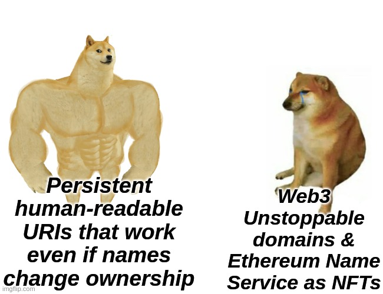

# Names & paths

Headjack is also a name registry - accounts can own a handle and be identified with it. There have been other attempts to decentralize [DNS](https://en.wikipedia.org/wiki/Domain_Name_System) such as [Namecoin](https://en.wikipedia.org/wiki/Namecoin) and [Handshake](https://handshake.org/) but a much stronger network effect is necessary in order to succeed. Headjack is a confluence of multiple interrelated things (identity, names, authorization & addressing) and has the potential to truly decentralize DNS. For specifics around the details (constraints, subdomains, auctions, distribution, hoarding, leasing, etc.) please refer to [their dedicated page](handles.md). In this chapter:

<!-- toc -->

# Names in URIs

Users and applications don't need a name and can operate as an integer index just fine, but the preferred case will be with handles. Names can change ownership but the blockchain will be able to translate `<application_name>/<nonce>/<user_name>/<content_id>` with strings into the canonical integer form discussed [previously](uris.md) by substituting the application & user names with account IDs.

Every name has an associated auto-increment nonce (just like account IDs) for every time they submit an anchor for off-chain content and the blockchain records maps of `<name>/<nonce>` to `<id>/<nonce>` which can then be used to resolve the URI as discussed in the [previous chapter](uris.md).

But we need to be able to translate not just the application name but also the user name which may have changed ownership at any point - for that the blockchain keeps track of the account ID ownership of every name historically as ranges (from block X to block Y name N was owned by account A) so when we determine the block number for a given data blob we'd be able to check to which account ID does a name in a URI correspond to at that time.

<!-- Additionally the user name <=> account ID mapping at the time of the blob could be embedded within the blob header (along with proofs) so that fewer queries are necessary to the blockchain. -->

And thus we're able to have URIs such as `twitter.com/55212/johnny/3` to identify any event by any actor - all we'd need to do is a few lookups and we'll be able to use Merkle proofs for any piece of content to prove authenticity. Most URIs could even omit the 4th part because probably there won't be more than 1 action by a user for a given batch by an application.

Note that the canonical form (numbers instead of names) of `twitter.com/55212/johnny/3` could be something like `42/783/523/3` where only the last number would be the same and the nonce would most likely be different. Also `twitter.com` might no longer be owned by account `42` but what matters is that the blockchain can correctly determine who owned it at nonce `55212`. Multiple names can be owned by an account but their nonces for one event will probably be different.

# What to ask the blockchain about a URI

To recap: we can ask the following questions about this URI: `twitter.com/55212/johnny/3`:

1. To which application account ID & nonce does `twitter.com/55212` correspond?
2. To which block does the applicationID/nonce map correspond?
3. What is the [IPFS CID](https://docs.ipfs.io/concepts/content-addressing/) & Merkle root of the anchored blob at that block?
4. What account ID does `johnny` correspond to in the block where this blob was anchored?
5. Once we download the blob or just the blob header (using the IPFS CID or any other means):
    1. We can ask the offset table where within the blob is `johnny`'s content № `3`?
    2. Once we fetch the actual data & depending on whether it is explicitly signed or not:
        1. either if the application was authorized to post on behalf of `johnny` at that time,
        2. or if the signature matches the keypair that's been bound to `johnny`'s account at the time of the anchored block.

# Web3 URIs interoperable in Web2

Application accounts can point on-chain to a host with an IP address which can be used to display content published through them. Application names can also resemble traditional domain names so it will be possible to copy-paste such URIs directly into your browser and as long as they own the same domain in the traditional [DNS](https://en.wikipedia.org/wiki/Domain_Name_System) they should be able to serve a webpage displaying the piece of content - enabling seamless interoperability during the transition from one paradigm to the other.

# Content titles in URIs

Most Web3 platforms [suffer from unreadable URIs](https://twitter.com/hasufl/status/1537388439259291649) but we've done a lot better - note the brevity and lack of hashes & hexadecimal symbols (`0xf56a0...`) - in fact, this is as good as it gets...

**Or is it?!** What about headlines of articles - can we have them included as well - something like `twitter.com/55212/johnny/3/how-I-went-from-vegan-to-keto-and-back-again`? Absolutely! The string is not at all necessary to resolve the piece of content (just like in StackOverflow where the database key for a question is just a number (example: [question 4](https://stackoverflow.com/questions/4)) but the page router always changes the URL when loading the page to include the title too). [Message types](messages.md) for posts with titles will have a dedicated field which will get included in the content hash and thus spoofing the title will be rejected by conforming applications as it would be a trivial check.

    

<!-- Web3 URIs
full of hashes:

https://mirror.xyz/0xE4f6
46F0Be4fF5ce185540F
5366295f91d75b65D/-xp
mr7ceHmi5Hqsl7zRtig9p
h_dtCvWjZOoWOVN0bcg

Persistent
Headjack URIs:

https://someapp.com
/527/johnny/3/how-I-
went-from-vegan-to-
keto-and-back-again

https://imgflip.com/memegenerator/Drake-Hotline-Bling -->

# Addressing within content

Different schemas could be used for addressing within pieces of content (like a paragraph from an article or a clip from audio/video - without losing the context of the whole) and message types could have by default associated on-chain schemas (or the schema of choice could be embedded within the header of the message). For example, when `medium.com/12475/elvis/0/learn-to-code/121/66` is being loaded the associated schema will be looked up depending on the type of message (in this case - an article) and used to interpret the last part (`121/66`) which could mean a character selection with an offset from the start and length. The embedded schema could be overridden by explicitly stating which one to use within the URI. As an example, `medium.com/12475/elvis/0/learn-to-code/schema/42/121/187` could mean `"use on-chain schema number 42"` which could interpret the last part (`121/187`) as start offset and end offset instead of start & length - resulting in the same selection as before. Even [individual pages & paragraphs of books](https://twitter.com/dwr/status/1544001073844731904) should be referencable in such a manner and could be composed of multiple separate posts - and this is just scratching the surface!

For big types of content (audio/video) the message could be broken down into chunks so that users can load only the message header and then depending on the schema used and the addressing within the content - only the necessary chunks could be requested.

<!-- 

    

 -->

<!-- Persistent
human-readable
URIs that work
even if names
change ownership

Web3
Unstoppable
domains &
Ethereum Name
Service as NFTs

https://imgflip.com/memegenerator/Buff-Doge-vs-Cheems -->
