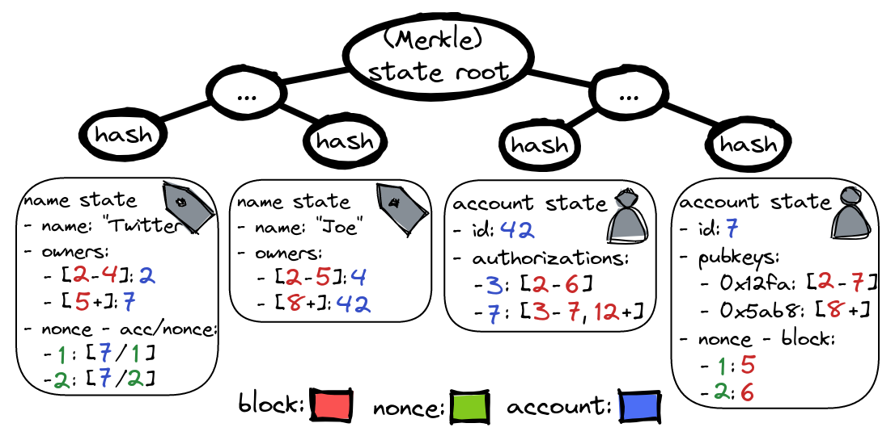

# Throughput & scalability

Everyone claims to be scalable, but here we'll prove that Headjack can handle billions of accounts and anchor unlimited amounts of off-chain content tied to identity with simple napkin math.

<!-- toc -->

<!-- measuring performance, throughput & latency is hard but here we will provide a simplistic view
https://a16zcrypto.com/why-blockchain-performance-is-hard-to-measure/ -->

<!-- We believe a credible path to billions and worldwide adoption is necessary as part of the story -->

# How big is a Headjack transaction

Applications post anchors to off-chain content with an IPFS CID hash and a merkle root. IDMs also anchor off-chain content (mainly user preferences & updates to social graph), but they also post authorizations to other accounts (applications) to post on behalf of users as integer pairs.

So the fields for a transaction by an application/IDM (which will be the majority) are:
- version: `4 bytes`
- signature: [`65 bytes`](https://ethvigil.com/docs/eth_sign_example_code/#recovering-the-message-signer-in-the-smart-contract)
- blob IPFS address: [`32 bytes`](https://proto.school/anatomy-of-a-cid/01)
- blob merkle root: [`32 bytes`](https://www.mycryptopedia.com/merkle-tree-merkle-root-explained/)
- nonce: `4 bytes` auto-increment integer associated with the account - to prevent reordering of anchored off-chain blobs (which would mess up internal addressing based on that nonce)
- value: `4 bytes` amount of native token paid to validators for transaction inclusion

So far that is `141 bytes` which almost every transaction by an application or IDM contains. IDMs also submit a list of authorizations (or revocations) as integer pairs. For example, 1000 accounts authorizing 15 different applications to post on their behalf would be 1000 integer pairs. Assuming 8 byte integers (up to 2^64) that would be 8 * 2 * 1000 = 16k bytes.

# Naive scenario

The initial version will target block bandwidth of up to 100 kb/s. This is not a problem for [ ZK validiums](https://twitter.com/eshita/status/1546911451125649408) as there are already DA solutions that offer [10 mb/s or even much more](https://twitter.com/apolynya/status/1517137629334056960).

Assuming:
- 1 MB block size & 10 second block time (100 kb/s of block bandwidth)
- 1000 applications posting in every block
- 100 IDMs authorizing as much users as possible - filling the remaining block space
- no on-chain actions such as keypair & name changes, account creation & direct interaction with the chain by end users

We get:
- 1100 actors (1000 applications + 100 IDMs) that post in every block at least `141` bytes for their transactions, which is `155100` bytes
- the remaining `893476` bytes (1048576 (1MB) - 155100) can be filled with authorizations and since an authorization is `16` bytes (8 * 2) that would be 55842 authorizations/revocations every 10 seconds or 5584 authorizations/revocations per second
- for 1 billion accounts that would be 0.557 authorizations/revocations per person per day which is actually quite good - people on average do way less [single sign-ons](https://en.wikipedia.org/wiki/Single_sign-on) per day

|completely different goals - comparing the 2 protocols just to put things into perspective                                                                       | Headjack                            | Ethereum                                                                      |
|-----------------------------------------------------------------------|-------------------------------------|-------------------------------------------------------------------------------|
| block size                                                            | 1 MB                                | [ ~80 kb ]( https://etherscan.io/chart/blocksize )                            |
| block time                                                            | 10 seconds                          | [ ~13 seconds ]( https://ycharts.com/indicators/ethereum_average_block_time ) |
| blockchain bandwidth per second                                                  | 100 kb/s (x16 more than Ethereum)   | ~6.15 kb/s                                                                    |
| blockchain bandwidth per day                                                     | 8640 mb/d                           | ~528 mb/d                                                                     |
| transactions/authorizations per second                                | 5584 APS                               | [ ~14 TPS ]( https://blockchair.com/ethereum/charts/transactions-per-second ) |
| transactions/authorizations per day                                   | 482,457,600 APS                          | 1,209,600                                                                       |
| transactions/authorizations per person per day for 1 billion accounts | 0.482 (x400 more than Ethereum) | 0.0012096                                                                     |

<!-- Ethereum
- transactions per block: ~180
- single transaction size on average including calldata: 300-700 bytes -->

# Realistic scenario

The naive scenario does not include on-chain actions for specific accounts such as:
- keypair changes (new pubkey (32 bytes) + signature (65 bytes) if there is an older key)
- account creation (if done by an IDM then this is just a few bytes - no pubkey)
- name registration & ownership changes (see the [dedicated page](handles.md) for more details)
- updating account fields such as a URI pointing towards an off-chain account directory (which could point to archived posts) or pointing to another account index for such services
- signed transactions by individual accounts that want to directly interact with the chain
    - authorizing an IDM, rotating keys, or even publishing off-chain content as an application

However, the realistic scenario will not be far from the naive because:
- Only a % of all accounts will have keypairs (even though 100% could) and will make just a few signed actions per year - leaving most block throughput for authorizations through IDMs.
- Large % of accounts will rarely even be authorizing new applications - many people don't sign in to new services through [SSO](https://en.wikipedia.org/wiki/Single_sign-on) every single day. There could also be 2 types of log-ins: passive (viewing only - nothing on-chain) and authorized (allowing services to post on behalf of users).
- Many applications that don't generate a lot of off-chain activity will publish less often than on every block in order to minimize on-chain block space costs.
- The chain throughput can be further optimized & scaled by multiple orders of magnitude.

# Optimizations & scaling

- Throughput of 100 kb/s is just the start & can easily go to 1-10 mb/s as a ZK rollup.
- The chain & state can be trivially sharded - there aren't problems such as fracturing liquidity or preventing composability because accounts don't care about each other - they mostly contain authorization block numbers & keypair history.
- Integer indexes that only need 4 bytes can be compressed/batched together - it'll take many years to go beyond 4 billion accounts so the actual throughput is **2x** of what is listed here.
- A fee market can develop that tunes the cost of different actions so that actors don't just pay for on-chain bytes - the ways the system is used can be guided through incentives.
- Other optimizations not listed here - this is just the starting point.

# State growth

Headjack's main value proposition is keeping historical records of the sequence of authorizations, key changes & off-chain content anchors and being able to generate proofs for any specific piece of off-chain content.

TODO: finish this

https://ethereum.stackexchange.com/questions/268/ethereum-block-architecture

numbers - state - one difference from other cryptos is that this one is append-only and could be designed to be easier on memory access patterns

One difference with other blockchains is that accounts in Headjack are numbers and thus the state tree could be different.

on eth state growth:
https://twitter.com/SalomonCrypto/status/1587983584471633921
https://hackmd.io/@vbuterin/state_size_management

All on-chain changes just append data to one of the few attributes of:
- accounts:
    - public keys: a map of keys and block height integer ranges (non-overlapping)
        <!-- - could be a different data structure -->
    - authorizations: a map of indexes and arrays of block height integer ranges
    - nonces: an array that maps autoincrement indexes to block numbers
        - appended only when publishing off-chain content (usually an application/IDM)
- names:
    - owners: a map of owner indexes and block height integer ranges (non-overlapping)
    - nonces: an array that maps autoincrement indexes to account index & nonce pairs
        - appended only when publishing off-chain content (usually an application/IDM)

TODO: should IPFS hashes & merkle roots be saved in the state?
    - no?

<!-- 

The growth of the chain and the state will differ by a few things:

One difference between Headjack and financial blockchains is that they don't force historical records into the state whereas that is the main value proposition of Headjack.

This is a solution that is provably possible and better and can only get better in time with further innovation and scaling

The goal is to avoid congestion and provide enough bandwidth in a predictable way for web scale

This could be a concern when Headjack takes over the world - if blocks are 10 mb once every 10 seconds the chain would grow by 86 gb/day. However, 

The processing of the state machine is minimal - orders of magnitude less complexity & compute compared to generalized smart contract platforms

The state growth will be slower than the blockchain growth because:

- an on-chain authorization is a pair of integers while only 1 integer goes into the state

goal: no congestion

a tiny core on which we have consensus can be used to cryptographically anchor & link unlimited amounts of data - the entire web - a few terabytes (tiny is relative - compared to the data) of materialized blockchain state including the absolute bare minimum of historic.

- state doesn't need to store the merkle roots & IPFS hashes - merkle proofs can contain block numbers & block hashes -->

TODO: light clients? in addition to merkle proofs for inclusion of content they would need merkle proofs for the state of which applications a user has authorized to post on their behalf in a given block

<!-- 

Reducing merkle proof sizes with Verkle Tries
"It’s a constant size proof regardless of the width."
https://members.delphidigital.io/reports/the-hitchhikers-guide-to-ethereum
Guide to the Ethereum Roadmap | Jon Charbonneau of Delphi Digital
https://www.youtube.com/watch?v=xuLyZaty9iI
vector commitments (Merkle proofs)
https://blog.ethereum.org/2021/12/02/verkle-tree-structure/
https://www.youtube.com/watch?v=RGJOQHzg3UQ
https://vitalik.ca/general/2021/06/18/verkle.html+

Stateless Ethereum: How Verkle Trees Make Ethereum Lean and Mean
https://www.youtube.com/watch?v=Q7rStTKwuYs

 -->

# Off-chain content

There are no limits for off-chain content as it is all just anchored with merkle roots - it could be as high as hundreds of terabytes per second. There isn't a more minimal design that can link unbounded amounts of off-chain data to billions of identities that can change keys & names and yet still provide the guarantees & mental model simplicity of Headjack - it achieves consensus on the absolute bare minimum.

<!-- validium

This design for a specialized blockchain can scale practically as much as necessary due to the compactness of service messages and the triviality of sharding the blockchain as there would be close to 0 cross-shard communication (`"X follows Y"` only affects `X`) and that is [provable with easy to grasp napkin math](numbers.md).

data availability guarantees don't need to be as strong as for finance - it won't be fatal to revert a few blocks of activity if data is unavailable -->

<!--
If handles are permanent to shards then their allocation to shards can be managed in the beacon chain and it can be consulted when following urls to content - so that the shard idx doesn't have to be in the urls
-->