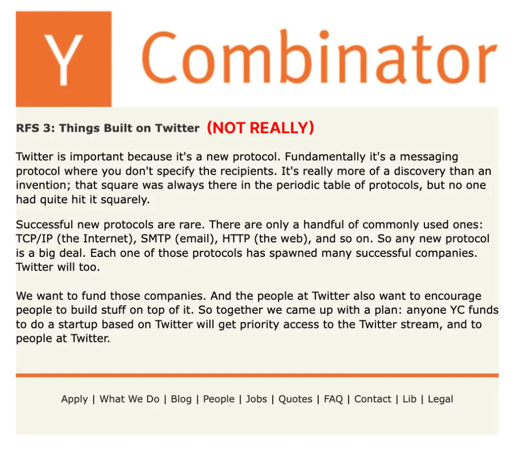

<!--
TODO: mention the lack of authenticity as a major problem

TODO: Surveillance capitalism
-->

# Problems with the current web

> "The internet changed the topology of human communication, with existing social platforms as a mere proof-of-concepts." - ["Social Web 3" by Zee Prime Capital](https://zeeprime.capital/social-web-3)

The current host-centric web is just a local maximum due to gradient descent. Some problems:

<!-- toc -->

# The host-centric web

One major problem of the current [host-centric](host_vs_data_centric.md#todays-web-host-centric) internet architecture is that documents are host-certified - we refer to data by location instead of contents, but that leads to link rot & content drift. Information is fragile without an ecosystem of identity, reputation, references, context & liability - our digital history lacks a solid foundation. We can't expect everyone to be like [@balajis](https://twitter.com/balajis) - linking to articles from the Internet Archive ([Example](https://balajis.com/synthesis/): look what `"Prussian"` in that text is [pointing to](https://archive.ph/O2D45)) - this doesn't scale, data is still not self-authenticating and is reliant on a central point of failure. The internet is a [collective hallucination](https://cyber.harvard.edu/sites/default/files/2019-06/2019-06_zittrainIP.pdf) and is rotting. Everything we publish is a [sand mandala](https://en.wikipedia.org/wiki/Sand_mandala) and its just a matter of time for it to go away. Some great quotes:

> "More than 98% of the information on the web is lost within 20 years" - [a16z Podcast](https://a16z.com/2020/07/13/a16z-podcast-preserving-digital-history-how-to-close-the-webs-memory-hole/)

> "The problem is that the foundations are shifting sands, and we need something that has significantly more integrity at the bottom layer, we can't just bolt [URNs](https://en.wikipedia.org/wiki/Uniform_Resource_Name) on as an afterthought. Some organizations are able to maintain persistent data over time, but it is in spite of the technology, not because of it." - [tgbugs](https://news.ycombinator.com/item?id=27691442)

> "Society can’t understand itself if it can’t be honest with itself, and it can’t be honest with itself if it can only live in the present moment." - [source](https://www.theatlantic.com/technology/archive/2021/06/the-internet-is-a-collective-hallucination/619320/)

> "People tend to overlook the decay of the modern web, when in fact these numbers are extraordinary—they represent a comprehensive breakdown in the chain of custody for facts." - [source](https://www.theatlantic.com/technology/archive/2021/06/the-internet-is-a-collective-hallucination/619320/)

> "If a Pulitzer-finalist 34-part series of investigative journalism can vanish from the web, anything can." - [source](https://www.theatlantic.com/technology/archive/2015/10/raiders-of-the-lost-web/409210/)

# Lack of composability & interoperability

<!--

> "Asset titles, licenses, and certificates can't live on the internet easily in a truly meaningful and native way. If you do put them online, there’s very little one can do to ensure they are authentic or valid, especially if you want them to remain authentic across platforms without building special-purpose APIs and integrations." - [source](https://mirror.xyz/0xE4f646F0Be4fF5ce185540F5366295f91d75b65D/-xpmr7ceHmi5Hqsl7zRtig9ph_dtCvWjZOoWOVN0bcg)

composability

> "Problem: The data for {X} is under the total control of company {X}. If a user wants to migrate to a new service, they can’t bring their history with them in a way that retains its legitimacy. Company {X} doesn’t want to let them, and even if they did, it wouldn’t be easy to do this at scale in a way so {X} doesn’t maintain total control. See: Twitter API being public with companies built on it, only to be shut down by Twitter." - [source](https://mirror.xyz/0xE4f646F0Be4fF5ce185540F5366295f91d75b65D/-xpmr7ceHmi5Hqsl7zRtig9ph_dtCvWjZOoWOVN0bcg)

> "I think it might make the world more efficient if we were able to instantly verify the authenticity of assets, licenses, and certificates, without the need for every issuer to run massive APIs and authentication services. All one needs to do to ensure the authenticity of an asset is verify the identity and history of the issuer" - [source](https://mirror.xyz/0xE4f646F0Be4fF5ce185540F5366295f91d75b65D/-xpmr7ceHmi5Hqsl7zRtig9ph_dtCvWjZOoWOVN0bcg)

https://mirror.xyz/0xE4f646F0Be4fF5ce185540F5366295f91d75b65D/-xpmr7ceHmi5Hqsl7zRtig9ph_dtCvWjZOoWOVN0bcg

-->

# Black boxes & algorithmic bias

The recommendation algorithms & the social graph are the architecture of virality - the dynamics of amplification & interaction dictate how ideas surface, propagate, compound & evolve. The people writing the algorithmic feeds are the most powerful in the world - [@naval](https://youtu.be/3qHkcs3kG44?t=3616).

Ephemeral experiences such as search suggestions & results leave no trace and it's extremely hard to prove bias as [Dr. Robert Epstein](https://en.wikipedia.org/wiki/Robert_Epstein#Contributions_to_Internet_Studies) would [attest](https://open.spotify.com/episode/4q0cNkAHQQMBTu4NmeNW7E) - there is 0 accountability.

> "But we believe the issue of advertising causes enough mixed incentives that it is crucial to have a competitive search engine that is transparent and in the academic realm." - [the original Google search engine whitepaper](https://perma.cc/8GDJ-K6AX)

Does such a search engine exist today? Competition & a lower barrier to entry are direly needed.

The explicit user preferences such as subscriptions & the social graph (following/connections) are routinely discounted in our feeds in favor of algorithm recommendations - platforms optimize for engagement & attention and not for utility & value to end users. We all respond to outrage & enjoy the occasional viral cat video but we should be able to tune & filter what gets shown to us. Have you ever heard a YouTuber tell you to hit the notification bell in addition to subscribing?

> "I'm in an ongoing relationship with a moody, sensitive, grudge-holding, and generally crazy girlfriend called the Twitter algorithm. Everything will be going fine and then suddenly I'm getting the cold-shoulder and I don't even really know what I did and just have to wait it out." - [Tim Urban](https://twitter.com/waitbutwhy/status/1506755880578166788)

<!-- addictive social media - toxic -->
<!-- 
The topic about algorithms and their influence on society is enormous and this chapter cannot do it justice - refer to Tristan Harris's work
https://www.youtube.com/watch?v=7EbPIdyd3I0

we have a totally warped view of reality

we are at a position where the more we use social media, the worse we get at estimating what the other side believes

Algorithms are tuned for nutpicking - surfacing the nuttiest things
https://www.urbandictionary.com/define.php?term=nutpicking

Arms race between social media companies

Journalists routinely write about events from social media - it is fundamentally entrenched in our society and it affects everyone - even those that do not use it.

misinformation & disinformation

If We Don't Fix Sensemaking, We Won't Survive
https://www.youtube.com/watch?v=ya_p4RIorXw

> "Babel is not a story about tribalism. It’s a story about the fragmentation of everything." - [Why the past 10 years of american life have been uniquely stupid](https://www.theatlantic.com/magazine/archive/2022/05/social-media-democracy-trust-babel/629369/)

broken media
culture war, algorithms, audience capture, misaligned incentives, lack of accountability

long form media is rife with misinformation - in an open system we could better tag and discuss it

we should be able to see all referenced facts & entities in long-form media - much easier to check for disinfo

vote on comments to other posts if they are relevant
https://prnt.sc/9-8QV1LoKPc7

the inability to refer specifically to documents or parts of them linked to their source has made the internet a breeding ground for misinformation
https://www.youtube.com/watch?v=u3TPxQao3m0&list=PLPslWoHNC5x3noyezZ79BlkvGV1XK3ubf

audience capture

It’s an unorganized mess of information

The cat is out of the bag

https://www.wsj.com/articles/the-facebook-files-11631713039

Misinformation is a plague in videos without context

the health of reporting on the web through video is appaling - decentralization and democratization are powerful but without the means to interleave everything into a shared ledger of record and actually have some accountability it all becomes an informational mess. But YouTube doesn't optimize for that - not at all.

> "technology increases the efficiency of manufacturing consent in the same way it increases the efficiency of manufacturing everything else" - [Meditations on Moloch](https://slatestarcodex.com/2014/07/30/meditations-on-moloch/)

-->

# Vertical integration vs market & competition

Platforms do almost everything in-house in a closed way as providing access to third-party companies to their data to solve specific problems is hard due to complications around data privacy/regulation and the need to safeguard their competitive advantages & trade secrets.

This leads to:
- lack of cooperation, interoperability, duplicated effort & stifled innovation
- competition for scarce talent which leads to sub-par solutions
- company bloat & inefficiencies
    - companies are harder to manage as they are way bigger than what they could be
    - bigger size demands higher revenue - pricing out many business models
- differences in functionality between platforms => complexity for users

Contrast that to open protocols & exportable data where anyone can specialize, innovate & provide the best possible service for a specific vertical & sell it to others. The move from [host to data-centric](host_vs_data_centric.md) addressing and open blockchains enable [interoperability](https://balajis.com/yes-you-may-need-a-blockchain/) and composability.

# Growth, network effects & monopolies

Social media platforms are growth-at-all-costs stories because the goal is to achieve a network effect first and become a monopoly with a [MOAT](https://www.investopedia.com/ask/answers/05/economicmoat.asp) at which point the user [value extraction](https://twitter.com/cdixon/status/1473859531343949824) and cannibalization of ecosystems built on top of APIs can ramp up ([1](https://www.siliconrepublic.com/enterprise/twitter-apis-ending), [2](https://nordicapis.com/twitter-10-year-struggle-with-developer-relations/), [3](https://techcrunch.com/2015/05/06/meerkat-founder-on-getting-the-kill-call-from-twitter/), [4](https://techcrunch.com/2018/04/02/instagram-api-limit/), [5](https://mashable.com/article/gmail-ifttt-shutdown-google)). At that point innovation is less necessary (+ is harder due to inertia) and even the quality of service may degrade. User data is the most valuable commodity and scale enables the best AI models & efficiency of value extraction in the advertising model which comes with a slew of problems & perverse incentives.

    

<!-- https://www.economist.com/leaders/2017/05/06/the-worlds-most-valuable-resource-is-no-longer-oil-but-data -->

Users are usually locked-in and effectively have no [voice and exit](https://twitter.com/balajis/status/1548725591687303168) either because:
- the network effects are insurmountable for incumbents and there are no alternatives
- or if they leave for an alternative service they'd lose all their connections, audience & reputation and would have to start from scratch

> "I think it might be reasonable to believe that single monolithic companies shouldn’t have monopolies on certain data that practically guarantees user lock-in. And that the internet might be better if some data were made completely open and available to any developer who wants to build on it while ensuring that the data can’t be edited by anyone that isn’t supposed to be able to edit it." - [source](https://mirror.xyz/0xE4f646F0Be4fF5ce185540F5366295f91d75b65D/-xpmr7ceHmi5Hqsl7zRtig9ph_dtCvWjZOoWOVN0bcg)

> "Twitter was supposed to be a protocol allowing anyone to build products and services on top of it that drive value back to the parent company and investors. But it wasn’t a real protocol. It only pretended to be. As soon as the people behind the scenes changed their minds about what they wanted Twitter to be, the “protocol” side of Twitter got shut down. While this ruined a lot of businesses built on top of it at the time, it was perfectly predictable. Before web3, it was near impossible to build real application-specific protocols on the internet. And counter to the beliefs of the biggest web3 critics, web3 does allow you to build real, open, and neutral protocols." - [source](https://mirror.xyz/0xE4f646F0Be4fF5ce185540F5366295f91d75b65D/-xpmr7ceHmi5Hqsl7zRtig9ph_dtCvWjZOoWOVN0bcg)

# Centralized & fragmented identity/preferences

Convenience & simplicity sought by users has lead to extreme levels of centralization of identity in just a few centralized players with network effects & [single sign-on](https://en.wikipedia.org/wiki/Single_sign-on) functionality.

> "as of 2018 the consolidation of power and control over the social web by a few large corporations seems unparalleled" - [Decentralizing the Social Web](https://hal.inria.fr/hal-01966561/document)

But despite the concentration of SSO services a lot of identity-related activity is fragmented between platforms due to the lack of standards & interoperability: settings/preferences, [direct messages](https://twitter.com/jonwu_/status/1524886818725847040), bookmarks, playlists, progress bars, etc.

> "Identity on the internet today is fragmented across many centralized services, each with its own set of user data. Signing up for a new service requires making a brand new identity and re-entering all of your information. This is not only tedious but also means that a user’s identity is going to be inconsistent between services because they are not always going to update key information on every single service every time that something changes." - [source](https://blog.sia.tech/skyid-how-to-make-decentralized-identity-using-skynet-2b282682f5b3)

[Linktree](https://en.wikipedia.org/wiki/Linktree) is just a bandaid for today’s fragmentation of identity ([valued at 1.3B$](https://techcrunch.com/2022/03/16/linktree-link-in-bio-series-c-valuation/)) - it is a symptom.

Contrast that to a world with interoperable & exportable identity/data:

> “each time we go from one social network to another we do not need to restate who we are, what our interests are, or who we know” - [Decentralizing the Social Web](https://hal.inria.fr/hal-01966561/document)

# The cold start problem for startups

The barrier to entry for most types of platforms is very high:
- kickstarting a network effect & attracting a critical mass is very difficult
- need to reinvent the wheel & [vertically integrate](#vertical-integration-vs-specialization--competition) many aspects instead of composing a service from already existing solutions

And thus few companies are started and even fewer are successful - leading to little innovation, slow progress & sub-par services.

<!-- TODO: data network effects -->

Check out the [startup case study](startup_case_study.md) expanding on why it would be easier with Headjack.

# Infrastructure centralization

Google is way more than just a search engine even though the majority of their revenue comes from advertising - they control large percentages of the plumbing of the web - key choke points such as submarine cables, routing, data centers, browsers, DNS, etc. [`David Vorick`](https://twitter.com/DavidVorick) puts this perfectly into perspective in [`The Worrying Depth and Scope of Censorship on the Internet`](https://blog.sia.tech/the-worrying-depth-and-scope-of-censorship-on-the-internet-ffd4bc5a5486) - some quotes:

> "If Google decides they don’t like you, then for 65% of the world you simply stop existing. You have no recourse.
The terrifying thing about this is that Google is not an elected entity. Google has turned themselves into unelected regulators of the Internet, and they are held accountable only to their own share price."

> "As our economy and services become more deeply intertwined, an increasing number of players have more influence and ability to de-platform a greater number of businesses and users. And these requirements compound against each other. If one service provider is particularly opinionated and quick to de-platform, everybody else is forced to give them a large amount of breathing room and become more oppressive towards their users to avoid potential conflict."

> "This does not scale. The end result will be a global monoculture where everybody is afraid to take risks or break the status quo because nobody can afford to upset even a single of the hundreds of services that they depend on. Our culture gets established and defined by giants like Facebook and Google rather than users and creators, because only Facebook and Google have the resources to bully everyone else into allowing changes to happen."

> "The only way to avoid this endgame is to demand infrastructure that remains neutral. At the scale of today’s Internet and global economy, infrastructure that does not remain neutral will inevitably turn on its users and coerce them into a set of moral standards that are both arbitrary and enforced without consent."

# Cultural fragmentation & filter bubbles

The same document may be published through different platforms and because of the host-certified web of today it will get multiple different URLs. Discussion around it becomes fragmented & shallow in the different platforms with separate comment sections and there isn't a way to de-duplicate & unify it. This facilitates polarization as separate echo chambers can form without seeing the opinion of other types of people.

<!-- Alienating large parts of the population & pushing them to alternative closed platforms is not a net benefit. -->

> "Echo chambers are intellectual oppression - as opposed to idea labs where ideas are treated as experiments." - [Tim Urban](https://www.youtube.com/watch?v=ivDwzBYsED4)

Instead imagine being able to view the entire discussion around a specific event by tracing & aggregating all of the re-publications, references & re-tweets & quotes of it from anywhere and applying any type of filter to that.

That is what interoperable identity, content-addressing & broadcasted data enables - we can connect and de-duplicate everything and allow anyone to build tools around that - constructing a much bigger graph that what Google have created for themselves.

# Moderation & censorship

This is an incredibly hairy topic with many aspects - here are just a few of them:

- No clear rules for moderation & censorship - the terms of service are ambiguous and an ever moving goal post. Platform accountability is practically non-existent:
    - account reach can be down-regulated through opaque techniques like [shadow banning](https://shadowban.yuzurisa.com/)
    - accounts can be removed subjectively (case in point: earlier Twitter accounts tracking Nancy Pelosi's public stock trades)
- There is no way for users to "fork" a Reddit community if they no longer agree with the way moderation is happening - they have to recreate a new subreddit from scratch.
- There is no market for solving certain types of spam such as financial scams - Twitter & YouTube are riddled with templatized messages and their internal [vertically integrated](#vertical-integration-vs-specialization--competition) teams are unable to deal with yet another problem in a world-class manner. In an open system such as e-mail the competition & innovation for solving spam has been tremendous.

# Problems with specific platforms

A non-exhaustive list of additional problems (beyond what's already listed) with some platforms:

- YouTube:
    - there is no longer a down vote count & like/dislike ratio
    - subscriptions are by now almost meaningless without the notification bell icon
    - the comment section is just an afterthought - they don't care about it
        - the presentation is extremely basic & limiting
        - you cannot even link to a specific comment with a URL
        - financial scams in comments are abundant - moderation is non-existent
- Twitter:
    - we can't even sort the tweets of someone based on engagement
    - we pin threads of threads on our profiles and sequence them with X/YY numbers
    - cannot sort quotes/replies of a tweet based on engagement/age
    - no unrolled thread view option even though it's a no-brainer at this point
    - filtering & tuning what is shown in lists is nonexistent
        - lists don't show replies that are not to accounts in that list
        - can't display likes in lists
    - we [can't see other people's feeds](https://twitter.com/waitbutwhy/status/1502846781150822402) (although there's this [third-party app](https://vicariously.io/))
    - no way to opt-out of recommendations in the main feed for topics you don't care about or unrelated activity such as `X received a reply from someone you don't follow`
    - find the beginning of [this thread](https://twitter.com/lopp/status/1531668215541145601) - is that readable & usable? There should be an alternative Reddit-style application

<!-- tweets & comments without tagging is primitive and inefficient -->

when twitter decide engagement is low they shove down your throat nonsense algorithmic "recent tweets" notifications you can't turn off - that's what it has devolved into. "See less often" from the dropdown menu does nothing.

> "Unfortunately, you cannot turn off recent tweets. This is because the feature drives up “user engagement”, which is a key metric that shareholders pay attention to." - [source](https://thisinterestsme.com/recommended-tweets/)

