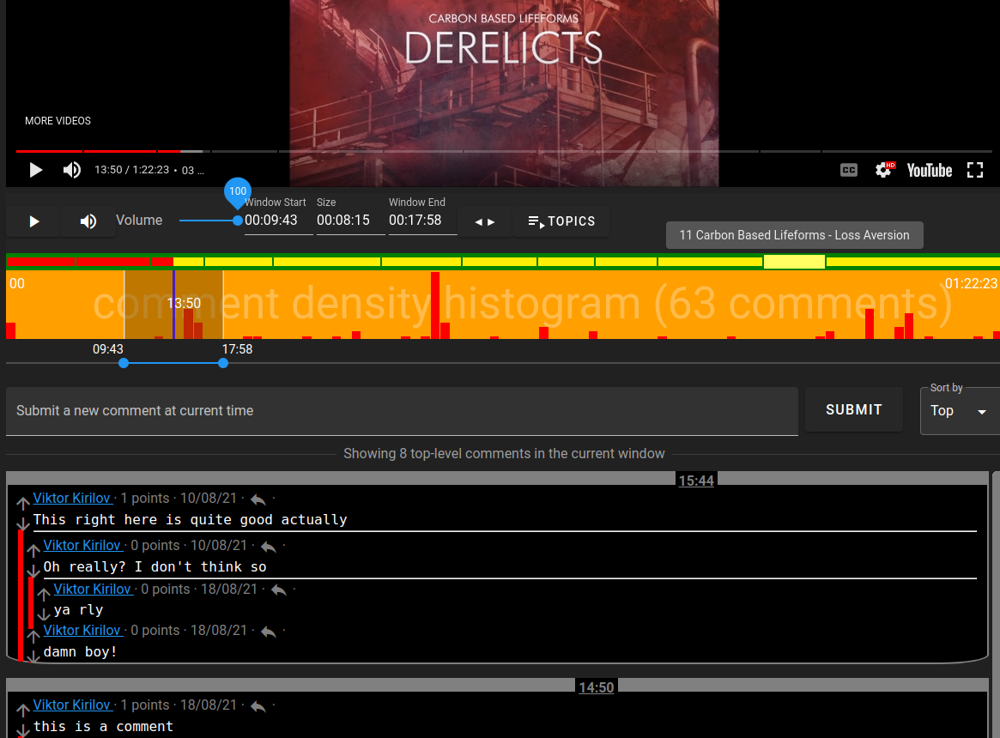

# Startup case study

**Problem statement**: Long-form media is already the present (& future) and audio/video are preferred over text by many. We should be able to comment & annotate it at specific points in time on the timeline.

But not like SoundCloud where [tiny overlapping rectangles](https://soundcloud.com/liluzivert/for-fun-prod-by-beatsbyjeff) with profile pictures are rendered on the timeline that you can just hover with the cursor to see the comment nor like YouTube where you can write a timestamp (`hh:mm:ss`) in a comment which becomes a clickable link that fast-forwards the player and then fighting it out with the other 20 000 comments in the single linear vertically scrollable section of a 3 hour long podcast and hoping to be noticed - both are horribly insufficient and unusable. For both of them comments are just an afterthought - it is extremely hard to discuss specific parts of long-form media & for good localized signal to actually surface & be noticed.

---

Instead why not just show a histogram of where most of the comments are and provide a resizable window as an additional widget on the timeline (in addition to the progress cursor) which can filter comments & annotations based on the range and display the threads below Reddit-style with sorting & filtration options? Here's a screenshot of precisely that (ignore the colors & bad style):

The ultimate audio/video player can offer a lot more than just a comment histogram - it has the potential to be a vibrant social experience like any other:
- 1-click repositioning & resizing of the filter window to timestamp ranges for different topics plotted as horizontal bars (already done)
- sharing links to specific ranges - as clips, but without losing the context
    - many channels re-upload clips from longer videos - this should instead be a simple "retweet" of the original material with a range as a parameter
- different types of comments: annotations, questions, personal (hidden) notes
- search field for within the comments that are in the current filter window
- crowdsourced annotations (tagging resources/events/concepts/entities)
- plotting/toggling different types of histograms (not just comment density):
    - plotting different types of reactions
    - where other users spend most of their time
    - where the user has already played the episode
    - comments that have more than X upvotes or up/down ratio
    - where the most controversy or facts requiring a crowdsourced check are
    - highlighting comments that match the current search filter/query/regex

Here's an [older video](https://www.youtube.com/watch?v=xsJvFr9v7Nk) showcasing this UI (can't resize the window with the mouse yet).

# Challenges in the current web2 world

How would this work as a web2 company?

- For it to provide value it would need many users commenting on the same video or otherwise there will be no histogram and the whole interface will be pointless. It needs a network effect.

- Discoverability is hard - it would require that users actively share links to it on other platforms.

- What if YouTube/Spotify cut it off & disallows embedding their players & using the APIs?

- Unclear if it should try to be its own platform or just a (browser) plugin to other platforms:
    - The platform way is more ambitious but requires a ton more work & [vertical integration](problems.md#vertical-integration-vs-specialization--competition): direct messages, a social graph, notifications, a feed & recommendation systems, etc. Would it need to compete with YouTube & Spotify at some point? The likely [outcome](images/startup_failure_outcome.jpg).
    - The plugin way is a much more limited experience. How would users share links to comments & timeline ranges to others that don't have the plugin installed? How will users be notified for comments & replies? You'd be completely beholden to the platforms.

# How Headjack's paradigm fosters innovation

Contrast that to a web built around Headjack:

- The amount of work for this UI would be minimal - reusing components already present:
    - Identity & [single sign-on](https://en.wikipedia.org/wiki/Single_sign-on), DMs, notifications, progress bars, preferences & connections will all be handled by [IDMs](IDM.md).
    - The heavy lifting (processing & indexing all broadcasted events, perhaps moderation & even ad serving) will be handled by infrastructure services which will charge the interface just the right amount for the sets of API calls & indexes that it needs - pay-as-you-go. There will be different competing infrastructure providers and interfaces will be able to migrate to the one with the best service or it may even utilize multiple ones at the same time - offering users the choice which indexes & filters to use.
    - The costs & team required to implement this UI will be minimal and - focus is on delivering value to users. This will lower the barrier to entry and unlock better UX & functionality - many more niche needs will be addressed.

- Interface discoverability - the moment someone with a following posts a comment through it that comment would immediately be visible to their audience on interfaces like Twitter and the URI for the comment will contain the name of the interface that was used for its generation - serving as client attribution & advertisement of the alternative interface. No need for influencers to explicitly share `"hey! check out this platform where I made a comment and make sure to follow me there"` to their audience - it'll be automatic & implicit.

- No risk of platforms cutting access to their APIs to third-party apps & changing their [ToS](https://en.wikipedia.org/wiki/Terms_of_service) because in this ecosystem everything is a third-party app around unified identity and data is no longer host-certified - addressing is [data-centric](data_centric.md). There are no [MOATs](https://www.investopedia.com/ask/answers/05/economicmoat.asp) & lock-in - everyone focuses on their niche and competes on competency & offering the best possible service.
