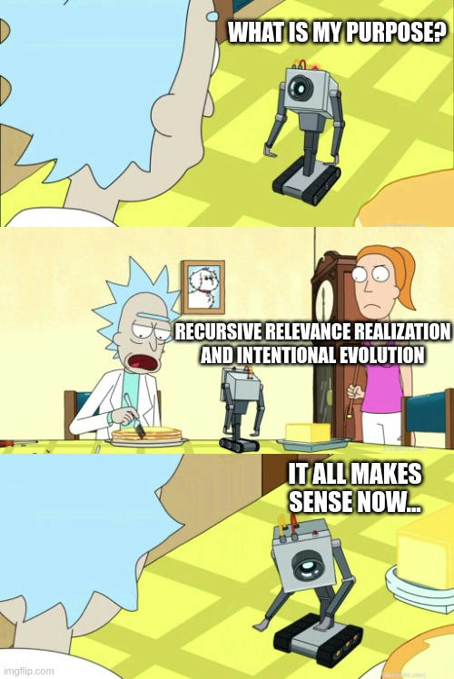

    

<!-- He has high cooperation,
contribution, accountability,
competency & altruism score
https://imgflip.com/memegenerator/289357455/Girls-gossiping -->

    

<!-- Internalize & account for
all the externalities !!!
https://imgflip.com/memegenerator/1216800/all-the-things -->

    

<!-- what is my purpose?
recursive relevance realization
and intentional evolution
it all makes
sense now...
https://imgflip.com/memegenerator/151945243/what-is-my-purpose -->

tribe diffusion - ending the bipolar political divide

credentials?
https://twitter.com/eriktorenberg/status/1217590443468185600

COMPLEX ADAPTIVE SYSTEMS !!!
embracing complexity

Gamification

bayesian thinking/living

deconstructing media down to the claim level

informational metabolism, cybernetics & the OODA loop

Distributed internal management

evolutionary activism

reward systems - the god protocol

The fairness protocol - transparency, accountability, skin in the game, inquiry

Metasystem transition - the emergence, through evolution, of a higher level of organization or control.
    https://en.wikipedia.org/wiki/Metasystem_transition
    https://upload.wikimedia.org/wikipedia/commons/9/92/Major_Evolutionary_Transitions_digital.jpg

connectionism

"PageRank for the 21st century (and beyond)"
"The alignment protocol/superstructure"

An operating system for humanity in the 21st century (and beyond)

meaning
https://www.psychologytoday.com/us/blog/mind-in-the-machine/202212/the-psychological-benefits-finding-your-cosmic-purpose
https://www.psychologytoday.com/us/blog/mind-in-the-machine/202006/could-cosmic-religion-unite-divided-nation

- cryptohistory - in can't be evil?
- your digital footprint
    - ...
    - ...
- giant global graph
    - pull that up jamie
    - semantic web
        - document-centric to data-centric - linked data instead of linked documents
    - the metaverse
- organizing information
    - provenance, deduplication & authenticity
    - language
    - structured data
    - clips?
    - debate maps & "subreddits" for any node/edge/entity/event/concept/statement
- aggregation & computable context
    - verifiable credentials and attestations
    - voting & liquid democracy
    - anonymity
    - aggregation
    - models & multiple points of view
    - fact databases & oracles
    - multidimensional wikipedia - MULTIPEDIA
    - communities
    - labeling, tagging, moderation - who watches the watchmen
        community notes?
    - calculemus
    - reputation systems - or computable context
    - Aggregate sentiment - the big picture
    - computation and storage as the limiting factor
- attention is all you have
    - attention, awareness and consciousness
    - "attention is the cursor of consciousness" - by Jim Rutt
    - relevance realization
    - our collective attention model
    - ability to limit yourself digitally - time restricted consumption? notifications?
    - availability cascades !!!
    - the current thing
        https://eriktorenberg.substack.com/i/57968918/are-current-things-true
    - algorithms & incentives
    - weights & parameters of recommendation algorithms
    - (broadcast) media & manipulation
    - mindspace as a resource
    - visualizing our attention - vascularization, the law of flow, sankey diagram
        https://underthrow.substack.com/p/the-law-of-flow-is-everywhere
        https://www.ncbi.nlm.nih.gov/pmc/articles/PMC2871904/
- collective intelligence

    coherence !!!

    COMPLEX ADAPTIVE SYSTEMS

    - all intelligence is collective intelligence
    - cybernetics & control theory & feedback loops
    - the global connectome
    - values, goals & lists
        - ranking (& top 10 lists)
    - science
    - prediction markets, reputation & futarchy, social capital
        - what people have been getting wrong about prediction markets is making them financial instead of purely reputational - career & finances are downstream from reputation. Financialization is hard to generalize and also excludes many people and requires oracles and a ton more infrastructure to generalize. This is the future of resumes
    - sankey diagram everything - cui bono-ify everything in regards to money and connections
    - reward circuits - reimagining status, dopamine, multidimensional status
    - spreadsheets - Layered multi-governance
    - data driven - plot everything on charts
    - querying & sociology - done by anyone, LLMs
- alignment ??? the third attractor ???
    - shit is fucked up and stuff
    - Epistemological bankruptcy
    - Regulation without regulators
    - immune system
    - sensemaking
    - developing the prefrontal cortex (plannig, delayed gratification) of the global brain
    - AGI & the alignment problem
    - the third attractor
    - the global brain
    - mental evolution
    - an integrated society - we are all part of something greater
    - overshoot
        https://www.youtube.com/watch?v=LQTuDttP2Yg
    - redefining prestige
    - a shared grand narrative
- the superapp
    - home page & feeds
    - augmented reality
        https://joshcarpenter.ca/composable-3d-web/
- can't be evil
- business models
- startup case study
- The Metaverse manual: a How-to guide
- what really is headjack
    - narrow waist
    - 100 ways to describe Headjack

- infrastructure stuff?
- economics & startups & competition? startup case study as part of that? "the competitive landscape"

<!-- toc -->

██████████████████████████████████████████████████████████████████
# infinite possibilities
# Giant global graph - open data
██████████████████████████████████████████████████████████████████

Sociology and how anyone can do it - picture: mirror
We can all do what sociologists do

we should be able to express "I care about deforestation and the Amazon rainforest" and set up filters for notifications for events regarding that

GitHub stars are effectively likes on repositories
Example: github stars - what if anyone could develop filters for the stars of people with advanced criteria? Different trending dashboads?

██████████████████████████████████████████████████████████████████
# The superapp
██████████████████████████████████████████████████████████████████

> "Buying Twitter is an accelerant to creating X, the everything app" - [Elon Musk](https://twitter.com/elonmusk/status/1577428272056389633)

Elon Musk gets it - network effects are a crucial part

UIs should be drag/drop composable & layoutable - in the superapp

imagine being able to organize the world as folders of bookmarks on a desktop, through which you start interacting with the information however you wish (to the limits of what's available ofc)

Everything is optimized for engagement - “share something” - what if we could change the layout of controls?

we can crowdsource the default view/layout for a given entity in the superapp - with the option to override how we'd want to see it

Elon Musk's vision for the X app pales in comparison to the potential of the superapp

think of the the superapp as a browser

what if your home page was like a desktop?

"The superapp is a browser with a configurable/dockable layout"

> "True super apps are more akin to an operating system than any Western app" - [a16z: What is a Super App? - Connie Chan](https://a16z.com/2022/12/16/super-app-definition-guide/?utm_medium=email&utm_source=newsletter&mkt_tok=MzgyLUpaQi03OTgAAAGJQMdh1n4aMbHdtay_ewCk1kpxnMzQW3u6X4kjIBkQJvTywO1ZZR7C1EzeoBFZCUCKYlmCbu2lwlrl2jRvPWa0HIQSTpr4KmZxzGynKkzLJg#:~:text=True%20super%20apps%20are%20more%20akin%20to%20an%20operating%20system%20than%20any%20Western%20app)

the super app of superapps section
the superapp - the command center - as a chapter & what the gateway would be - what would the browser in the browser be like
the way to crowdsource the global superapp through which we could do anything is to decentralize identity, end the host-centric model & allow for a market to emerge for any type of index
The superapp section should go in "what really is"
we can turn the web into a personal computer for the public information
the superapp is the "how would you like to spend your attention" superapp

██████████████████████████████████████████████████████████████████
# Moderation
██████████████████████████████████████████████████████████████████

Account suspension is too much - perhaps it should be limitations - not removal and not even having access to your DMs

force vs opt-in choice

freedom of speech vs freedom of reach
can't be evil

curators of communities can literally whitelist accounts & types of accounts and compete on the best possible discourse - we can let the moderators run the thing and make a buck while doing so - and compete!

spam protection: we can see the source of accounts that are often labeled as spam - if they are coming from a specific IDM (because it's much cheaper to create new accounts from an IDM)
fighting spam - in this system every event has provable provenance of who sent it and who their IDM is - we can track & label/exclude/punish IDMs that are the originators of spam - this is much better than the crude ways email fought spam - by blacklisting IP ranges and all that

applications can decide which sets of filters are allowed for viewing media through them, in order for advertisers to be happy

██████████████████████████████████████████████████████████████████
# Infrastructure centralization
██████████████████████████████████████████████████████████████████

> "Somehow people got comfortable with allowing a single public corporation being able to man-in-the-middle the entire Internet." - [`David Vorick`](https://twitter.com/DavidVorick/status/1375572267933913093)

Google is way more than just a search engine even though the majority of their revenue comes from advertising - they control large percentages of the plumbing of the web - key choke points such as submarine cables, routing, data centers, browsers, DNS, etc. [`David Vorick`](https://twitter.com/DavidVorick) puts this perfectly into perspective in [`The Worrying Depth and Scope of Censorship on the Internet`](https://blog.sia.tech/the-worrying-depth-and-scope-of-censorship-on-the-internet-ffd4bc5a5486) - some quotes:

> "If Google decides they don’t like you, then for 65% of the world you simply stop existing. You have no recourse.
The terrifying thing about this is that Google is not an elected entity. Google has turned themselves into unelected regulators of the Internet, and they are held accountable only to their own share price."

> "As our economy and services become more deeply intertwined, an increasing number of players have more influence and ability to de-platform a greater number of businesses and users. And these requirements compound against each other. If one service provider is particularly opinionated and quick to de-platform, everybody else is forced to give them a large amount of breathing room and become more oppressive towards their users to avoid potential conflict."

> "This does not scale. The end result will be a global monoculture where everybody is afraid to take risks or break the status quo because nobody can afford to upset even a single of the hundreds of services that they depend on. Our culture gets established and defined by giants like Facebook and Google rather than users and creators, because only Facebook and Google have the resources to bully everyone else into allowing changes to happen."

> "The only way to avoid this endgame is to demand infrastructure that remains neutral. At the scale of today’s Internet and global economy, infrastructure that does not remain neutral will inevitably turn on its users and coerce them into a set of moral standards that are both arbitrary and enforced without consent."

<!-- TODO: AWS & other cloud providers are also big & influential -->

# Improved infrastructure

Tying data to identity and making it freely available & outside of silos through content-centric addressing enables a lot of composability, functionality & innovation.

<!-- toc -->

TODO:

infrastructure - no need for a robots.txt file anymore - they were initially introduced because of [a badly-behaved web crawler that inadvertently caused a denial-of-service attack](https://en.wikipedia.org/wiki/Robots.txt#:~:text=a%20badly%2Dbehaved%20web%20crawler%20that%20inadvertently%20caused%20a%20denial%2Dof%2Dservice%20attack)
https://en.wikipedia.org/wiki/Robots.txt
sitemaps are also not necessary - they are used to inform crawlers when specific pages were last updated & how often they change, but that's obsolete in a push environment
https://en.wikipedia.org/wiki/Sitemaps
EDIT: actually sitemaps are only partially outdated - what about pages that are not reachable at all? that's when sitemaps are also useful - to explicitly mention them

for search engines to rank modern dynamic & single page apps they need to render them server-side - this can be skipped if data is decoupled from presentation and if the ranking engine is simply listening for document updates. They also currently cache the entire pages - just like an archival service. Massive benefits in a push vs a pull system for crawlers & indexers

focus more on the separation of actual data and the presentation layer for archiving?

PUT THIS IN ARCHIVABILITY
we should do better than having the spouses of people who have passed away having to login & post in order to avoid the deletion of a historically important account
https://twitter.com/halfin/status/1603847718039744512

archivability section - the tweets no longer saved stuff
https://www.npr.org/sections/thetwo-way/2017/12/26/573609499/library-of-congress-will-no-longer-archive-every-tweet

TODO: move this to cryptohistory?

# Code as addressable data

Frontend code served by applications can be published and have its own URI. Updates to it would happen by broadcasting the next version along with a new URI and then pointing on-chain to it as the latest to use for viewing media. This way presentation layers could be cached locally and in a distributed way with proofs for authenticity - improving redundancy, latency, and throughput. Checking for a newer version would be a small query to the chain if there is a new URI - version control for frontends. This can work even for more dynamic applications that serve different versions depending on region/locale or which are A/B testing - the dynamic part could be served from a centralized host while smaller chunks of code could be referenced through URIs.

TODO: this wouldn't be necessary
https://twitter.com/armada_infra/status/1584942215217836032

# Better and more competitive [search engines](https://scribe.rip/p/what-every-software-engineer-should-know-about-search-27d1df99f80d)

- Building indexes would be greatly simplified as they will be plugged to the global message bus and update only on events (push) - instead of periodic batch crawling of the public web (pull). <!-- The history of changes will be granular, precise, complete, structured & authenticated. -->
- Message schemas will improve the indexing & information extraction from dynamic websites. The [semantic web](knowledge_management.md#the-semantic-web-aka-the-original-web3) will also greatly empower search engines & unlock [powerful queries](knowledge_management.md#query--plot-anything).
- The move to data-centric addressing and the desegregation of data will lead to a lot less duplicates and more rich & precise context around any event/message.
- Currently ephemeral experiences (search suggestions) leave no trace and it's extremely hard to prove bias (aks [Dr. Robert Epstein](https://en.wikipedia.org/wiki/Robert_Epstein#Contributions_to_Internet_Studies)) - competition & a lower barrier to entry are direly needed.
- Search engine sophistication would span the full spectrum - from data center scale to those that you can run locally at home, or the specialized - [The Future of Search Is Boutique](https://future.a16z.com/the-future-of-search-is-boutique).

# Optimal archiving (like the [Internet Archive](https://en.wikipedia.org/wiki/Internet_Archive))

the internet archive is incredibly inefficient because of the web of documents - not of data

- Actively polling all websites on earth periodically & to check for changes and save snapshots won't be necessary - instead it will just watch & save all incoming events and have a complete history without any redundant data & inefficiencies.
- By [decoupling content & presentation HTML](TODO.md#code-as-addressable-data) only the essential could be saved. Applications can signal a change with a new message type in what they serve to browsers for presentation & rendering of content which the archival service could save throughout time as well to provide the historical views. Data duplication in snapshots can be driven to 0.
- Content that is no longer accessible through the original application that published it and is not archived by the user that posted it (but hasn't been explicitly deleted) would still be accessible by anyone with the same persistent URIs when querying an archival service.

# Redundancy, scaling & topological flexibility

[Data-centric addressing](host_vs_data_centric.md) with self-authenticating data allows for distributed & [resilient to DDoS attacks](https://decrypt.co/107293/taiwan-turns-to-ipfs-tech-to-thwart-cyberattacks-from-china) architectures that span the entire globe with horizontal scaling & [store-and-forward](https://en.wikipedia.org/wiki/Store_and_forward) caches. Computed views such as indexes, graphs & aggregate metrics (counts) can also be made addressable, distributed & cached with either optimistic authenticity (trust by default but with a way to recreate them and check for equivalence) or even have a proof with [verifiable computation](https://en.wikipedia.org/wiki/Verifiable_computing). Furthermore, there are [at least a few points to query](store_and_retrieve.md#how-to-retrieve-data-for-a-random-uri) for the data of a URI.

# Specific platforms

A non-exhaustive list of additional problems (beyond what's already listed) with some platforms:

- YouTube:
    - there is no longer a down vote count & like/dislike ratio
    - subscriptions are by now almost meaningless without the notification bell icon
    - the comment section is just an afterthought - they don't care about it
        - the presentation is extremely basic & limiting
        - you cannot even link to a specific comment with a URL
        - financial scams in comments are abundant - moderation is non-existent
- Twitter:
    - we can't even sort the tweets of someone based on engagement
    - we pin threads of threads on our profiles and sequence them with X/YY numbers
    - cannot sort quotes/replies of a tweet based on engagement/age
    - no unrolled thread view option even though it's a no-brainer at this point
    - filtering & tuning what is shown in lists is nonexistent
        - lists don't show replies that are not to accounts in that list
        - can't display likes in lists
    - we [can't see other people's feeds](https://twitter.com/waitbutwhy/status/1502846781150822402) (although there's this [third-party app](https://vicariously.io/))
    - no way to opt-out of recommendations in the main feed for topics you don't care about or unrelated activity such as `X received a reply from someone you don't follow`
    - find the beginning of [this thread](https://twitter.com/lopp/status/1531668215541145601) - is that readable & usable? There should be an alternative Reddit-style application

Twitter should have added this feature years ago: "follow" a thread (w/o having to comment as a hack way to do this).

<!-- How about remembering how far along the chronological feed you've seen? -->

<!-- tweets & comments without tagging is primitive and inefficient -->
